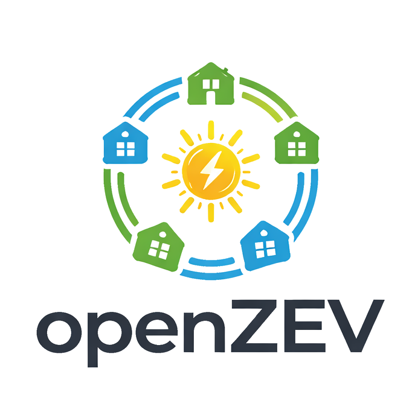
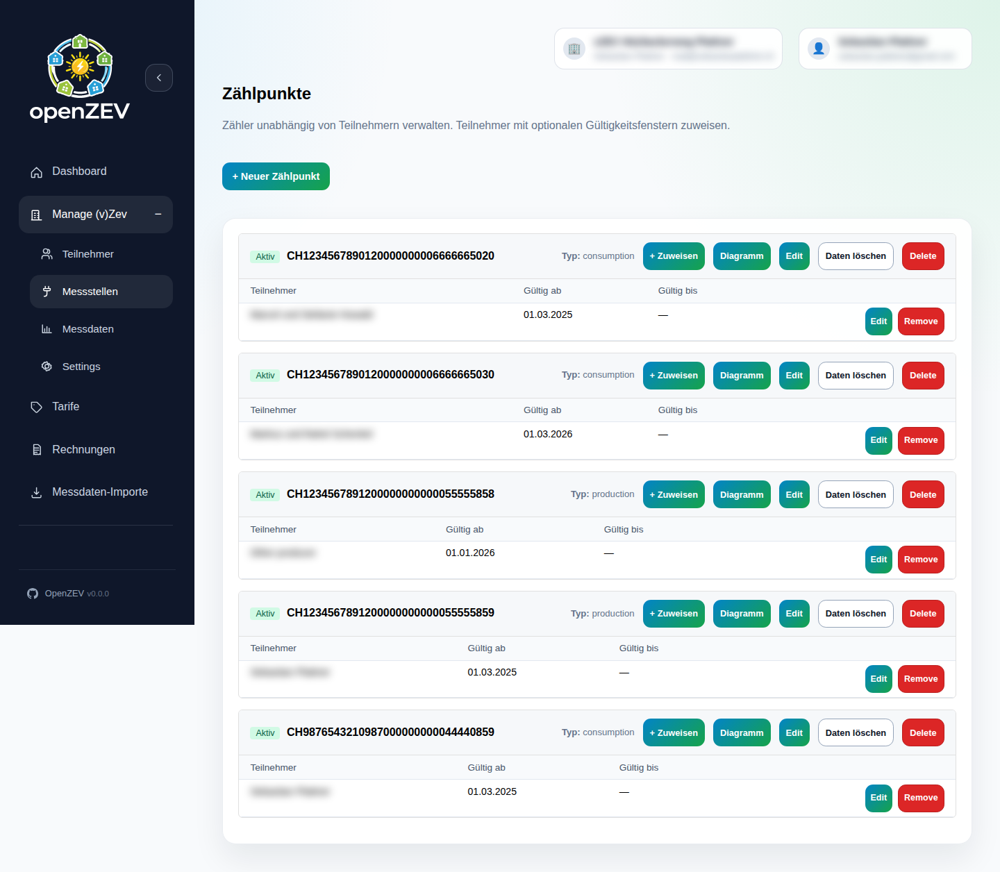
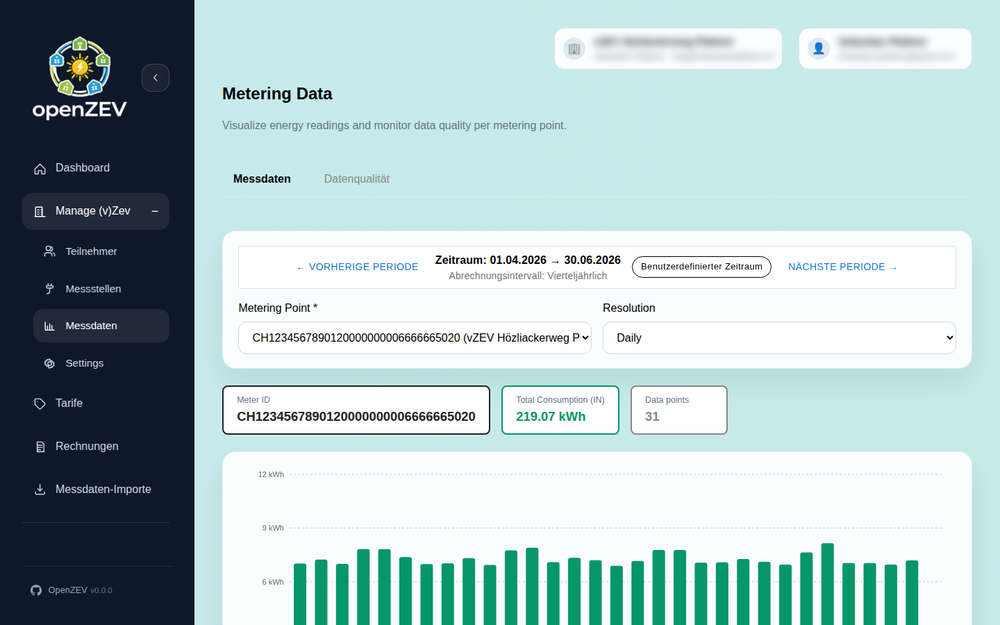
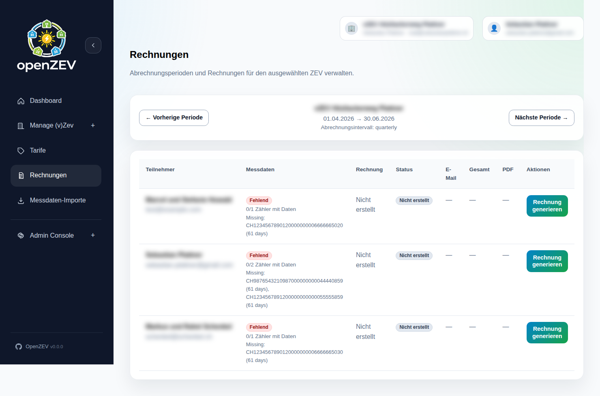
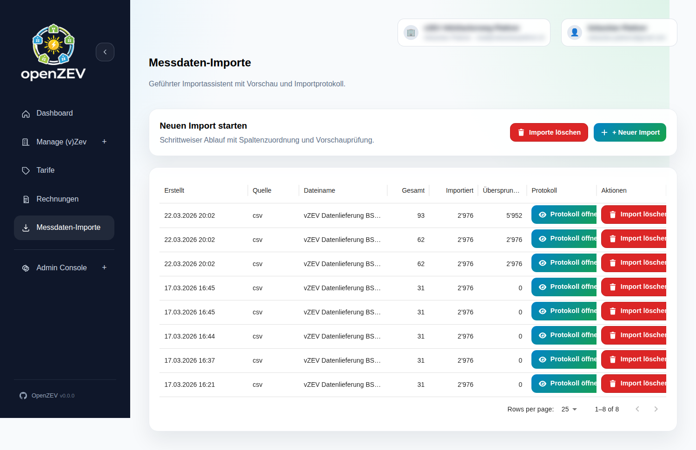

# OpenZEV

Open source platform for operating and billing (v)ZEV energy communities.



OpenZEV gives operators one place to manage participants, metering points, tariffs, imports, and invoicing. It is built to support day-to-day operations from data import to payment tracking with role-based access for admins, owners, and participants.

## Disclaimer

- Built for personal use and self-hosting tinkerers who enjoy running their own stack.
- Shipped as-is, with no warranty (yes, even when it looks great in the dashboard).
- Please double-check your data and billing outputs: we do not take responsibility for incorrect imports, calculations, invoices, or invoicing workflows.
- Built with generous AI assistance, right down to the specs, ADRs, and user docs. Some choices may therefore look a little unconventional, or fall short of the practices a more experienced team would apply today. That is not accidental: this project is optimized for learning, experimentation, and running my own private ZEV, not for enterprise-grade process perfection.

## Product Overview

- Built for Swiss ZEV/vZEV operating models
- End-to-end workflow from metering import to paid invoice
- Transparent invoice lifecycle with clear status tracking
- Open and extensible architecture for long-term adoption

## Main Features

### Community & User Management

- Manage ZEVs with clear role boundaries (`admin`, `zev_owner`, `participant`)
- Keep participant and metering point data organized
- Configure ZEV details, billing preferences, and invoice email templates
- Use role-aware dashboards for operational visibility

### Metering & Imports

- Import metering data from CSV/Excel with configurable column mapping
- Support SDAT-CH imports for utility-oriented workflows
- Validate with import preview and detailed import protocol
- Analyze consumption and production via chart views

### Tariffs & Billing

- Configure tariffs and tariff periods per ZEV
- Run timestamp-level billing allocation and calculations
- Process invoices through draft/approved/sent/paid/cancelled states
- Generate Swiss-ready PDF invoices with QR bill support

### Invoice Communication

- Send invoice emails asynchronously for reliable delivery
- Track email history and retry failed sends
- Customize invoice email templates per ZEV with sensible defaults

### Product Experience

- Multilingual frontend (EN/DE/FR/IT)
- Built-in API docs via Swagger and ReDoc
- Admin overview with operational metrics and status insights

## Screenshots

### Login


### Dashboard


Overview of KPIs, invoice status, and operational health.

### Metering Points



### Metering Data



### Invoices



Invoice lifecycle management, PDF generation, and email tracking.

### Metering Import Wizard



Step-by-step import flow with mapping, preview, and validation feedback.

## Architecture & Stack

- Backend: Django, Django REST Framework, SimpleJWT
- Frontend: React, TypeScript, Vite, React Query, i18next
- Async jobs: Celery with Redis broker
- Database: SQLite (default), PostgreSQL, MariaDB via `DATABASE_URL`
- Runtime/deploy: Docker and docker compose

## User Documentation

All end-user documentation has been moved to `docs/user-guide/` and organized by workflow.

- User guide index: [docs/user-guide/README.md](docs/user-guide/README.md)
- Energy allocation and billing details: [docs/user-guide/08-billing-allocation-explained.md](docs/user-guide/08-billing-allocation-explained.md)

## Quick Start (Docker)

Recommended default: keep frontend, backend, and worker separated for cleaner scaling and easier operations.

```bash
docker compose up -d --build
```

To start the stack and seed a reusable demo environment in one command:

```bash
scripts/start-demo-environment.sh
```

Services:

- Frontend: <http://localhost:8080>
- Backend API: <http://localhost:8001>
- PostgreSQL: localhost:5432
- Redis: localhost:6379

To stop:

```bash
docker compose down
```

## Optional: Fullstack Container Mode

If you prefer a single application container (frontend + backend together), use:

```bash
docker compose -f docker-compose.fullstack.yml up -d --build
```

In this mode:

- `app` serves the frontend and proxies API requests to Django inside the same container.
- `worker`, `db`, and `redis` remain separate services.
- Frontend URL: <http://localhost:8080>

To stop:

```bash
docker compose -f docker-compose.fullstack.yml down
```

## Helm Installation (Kubernetes)

OpenZEV also ships as a Helm chart in `charts/openzev`.

What the chart deploys:

- Frontend deployment + service
- Backend deployment + service
- Celery worker deployment
- Ingress
- PVC for `/app/media`

What the chart does not deploy:

- PostgreSQL
- Redis

You must provide reachable external database and Redis endpoints.

### Install from published Helm repo

```bash
helm repo add openzev https://splattner.github.io/openzev
helm repo update
helm install openzev openzev/openzev -n openzev --create-namespace
```

### Install from local chart

```bash
helm upgrade --install openzev ./charts/openzev -n openzev --create-namespace
```

### Example values for external services and secrets

```yaml
database:
  existingSecret:
    name: openzev-db-secret
    key: DATABASE_URL

redis:
  url: redis://redis.example.svc.cluster.local:6379/0

secretKey:
  existingSecret:
    name: openzev-django-secret
    key: SECRET_KEY

email:
  backend: django.core.mail.backends.smtp.EmailBackend
  host: smtp.example.com
  port: 587
  useTls: true
  hostUser: openzev@example.com
  defaultFromEmail: openzev@example.com
  frontendUrl: https://openzev.example.com
  existingSecret:
    name: openzev-mail-secret
    key: EMAIL_HOST_PASSWORD

ingress:
  enabled: true
  className: nginx
  hosts:
    - host: openzev.example.com
      frontendPaths:
        - /
      backendPaths:
        - /api
        - /admin
```

Apply values file:

```bash
helm upgrade --install openzev openzev/openzev -n openzev --create-namespace -f values-prod.yaml
```

## Prebuilt Container Images

Prebuilt images are published to GitHub Container Registry (GHCR), the current image names are:

- `ghcr.io/splattner/openzev-backend`
- `ghcr.io/splattner/openzev-frontend`
- `ghcr.io/splattner/openzev-fullstack`

Available image variants:

- `openzev-backend`: Django API application
- `openzev-frontend`: static frontend served with Nginx
- `openzev-fullstack`: frontend assets + backend in one container for simpler test deployments

Available tags:

- Release tags such as `v1.2.3`
- `latest` for the newest published release
- `main` for the newest build from the `main` branch
- `main-<short-sha>` for a specific `main` branch commit build

### Stability Note for `main` Images

Images tagged `main` are intended for testing and preview deployments before a formal release.

- They are rebuilt on every commit pushed to `main`
- They may contain unfinished changes or breaking behavior
- They should be considered unstable and not be treated like a versioned release artifact

If you need reproducible deployments, prefer a release tag such as `v1.2.3` instead of `main`.

### SBOMs and Signatures

- Release images are published with signed container manifests and signed SBOM attestations
- `main` branch images are also pushed, signed, and accompanied by generated SBOMs
- Release SBOM files are attached to the GitHub release
- `main` branch SBOM files are uploaded as workflow artifacts in the `Container Build Check` workflow run
- SBOM verification is performed through the signed attestation bound to the image, not through a separate detached signature on the raw `.spdx.json` file

### Verify an Image Signature

Install `cosign` locally, then verify an image with GitHub OIDC keyless signatures:

```bash
cosign verify \
  --certificate-identity-regexp "https://github.com/splattner/openzev/.github/workflows/.*" \
  --certificate-oidc-issuer "https://token.actions.githubusercontent.com" \
  ghcr.io/splattner/openzev-backend:main
```

For a release image, replace the tag with the release version, for example `:v1.2.3`.

### Verify the SBOM Attestation

You can verify the signed SBOM attestation attached to an image:

```bash
cosign verify-attestation \
  --certificate-identity-regexp "https://github.com/splattner/openzev/.github/workflows/.*" \
  --certificate-oidc-issuer "https://token.actions.githubusercontent.com" \
  --type spdxjson \
  ghcr.io/splattner/openzev-backend:main
```

To inspect the attested predicate after verification, add `| jq '.payload | @base64d | fromjson'` or download the generated `.spdx.json` artifact directly from the workflow or release.

## Local Development Setup

### 1) Backend

```bash
cd backend
cp .env.example .env
python -m venv ../.venv
source ../.venv/bin/activate
pip install -r requirements.txt
python manage.py migrate
python manage.py runserver
```

Optional admin user:

```bash
python manage.py createsuperuser
```

### 2) Frontend

```bash
cd frontend
cp .env.example .env
npm install
npm run dev
```

Frontend dev URL: <http://localhost:5173>

### 3) Celery worker (required for async emails)

```bash
cd backend
source ../.venv/bin/activate
celery -A config worker -l info
```

## Seed Data & Demo Accounts

Use seeded data for quick local testing of flows.

```bash
cd backend
source ../.venv/bin/activate
python manage.py seed_demo
```

Seeded demo users:

- Admin: `admin@openzev.local` / `admin1234`
- ZEV Owner: `owner@openzev.local` / `owner1234`
- Participant: `anna.consumer@openzev.local` / `participant1234`
- Participant: `ben.consumer@openzev.local` / `participant1234`

The seed command also creates a sample ZEV, metering points, tariffs, and 15-minute interval readings for Q1 and Q2 2026.

## API & Developer Docs

- Swagger UI: <http://localhost:8001/api/docs/>
- ReDoc: <http://localhost:8001/api/redoc/>
- Base API prefix: `/api/v1/`

## Development Notes

- Default local database uses SQLite; production should use PostgreSQL or MariaDB.
- Async email features require Redis + Celery worker running.
- Use `.env.example` as baseline for environment configuration.
- Keep migrations up to date when changing models:

```bash
cd backend
source ../.venv/bin/activate
python manage.py makemigrations
python manage.py migrate
```

- Run backend tests from repository root:

```bash
pytest
```

- Build frontend before release:

```bash
cd frontend
npm run build
```

## Development Process: Specs and ADRs

OpenZEV uses **feature specifications** and **architecture decision records** to document and communicate larger changes.

### Feature Specifications (`docs/specs/`)

A spec is required for changes that are large, risky, or cross-cutting—especially when they affect:

- API behavior or response shape
- Billing or tariff calculation logic
- Invoice workflow states or permissions
- Data model or migrations
- Async jobs, retries, or delivery guarantees
- Security, auditability, or role/ZEV-scope enforcement

A spec is usually **not** needed for small bugfixes, copy updates, or isolated UI polish.

**To create a spec:**

1. Copy `docs/specs/TEMPLATE.md` to a new file named `YYYY-MM-short-title.md` (e.g., `2026-04-invoice-retry-backoff.md`)
2. Fill in the problem, scope, contracts, risks, rollout, and acceptance criteria
3. Link related ADRs and issues
4. Reference the spec in your pull request
5. Update the spec if implementation decisions change

**Baseline specs** document the major product capabilities:

- `2026-03-community-and-access.md` — user roles, permissions, ZEV scoping
- `2026-03-metering-point-management.md` — metering point lifecycle, validity, assignment
- `2026-03-metering-import-and-quality.md` — imports, validation, data quality
- `2026-03-tariffs-and-billing-engine.md` — tariff configuration and energy allocation
- `2026-03-invoice-lifecycle-and-communication.md` — invoice states, email delivery
- `2026-03-admin-governance-and-settings.md` — admin settings, VAT, templates

Update baseline specs when their capabilities are significantly changed.

### Architecture Decision Records (`docs/adr/`)

An ADR documents a significant architectural or design decision that will have long-term consequences.

Use an ADR when the decision is:

- High-impact (affects multiple systems)
- Important to future maintainers (not obvious why the choice was made)
- Worth revisiting in code review or during refactor discussions

Examples: role/scope enforcement model, timestamp-level billing allocation, timezone policy.

**To create an ADR:**

1. Copy `docs/adr/TEMPLATE.md` to a new file named `NNNN-short-slug.md` (follow the existing numbering)
2. Fill in context, decision, consequences, and alternatives
3. Reference the ADR in related specs and PRs
4. Update the index in `docs/adr/README.md`

### In Pull Requests

Link both specs and ADRs in your PR using the provided `.github/PULL_REQUEST_TEMPLATE.md`:

```markdown
## Linked spec
- Spec: docs/specs/2026-04-feature-name.md
- ADR (if architecture decision changed): docs/adr/0009-...

If this PR is small and does not need a spec, explain why (e.g., isolated bugfix, no API or workflow impact).
```

For more details, see `docs/specs/README.md` and `docs/adr/README.md`.

## Release Workflow (GitHub)

- Conventional Commit style is enforced for PR titles.
- Release Please manages SemVer tagging and changelog generation.
- Pull requests run lint/check/test and container build checks without pushing images.
- Commits pushed to `main` build and publish preview images to GitHub Container Registry, generate SBOMs, and sign images plus SBOM attestations.
- Published releases build and push versioned container images to GitHub Container Registry:
  - `ghcr.io/<owner>/openzev-backend`
  - `ghcr.io/<owner>/openzev-frontend`
  - `ghcr.io/<owner>/openzev-fullstack`
- Release image pipeline generates SBOMs, signs images with Cosign (keyless OIDC), attests SBOMs, and uploads SBOM files as release assets.
- Renovate is configured to keep npm/pip/GitHub Action dependencies up to date.
