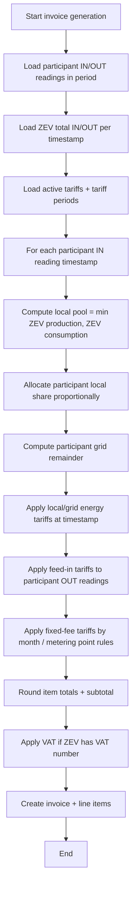

# OpenZEV

Open source platform for operating and billing (v)ZEV energy communities.


OpenZEV gives operators one place to manage participants, metering points, tariffs, imports, and invoicing. It is built to support day-to-day operations from data import to payment tracking with role-based access for admins, owners, and participants.

## Disclaimer

- Built for personal use and self-hosting tinkerers who enjoy running their own stack.
- Shipped as-is, with no warranty (yes, even when it looks great in the dashboard).
- Please double-check your data and billing outputs: we do not take responsibility for incorrect imports, calculations, invoices, or invoicing workflows.
- 100% vibe coded.

## Product Overview

- Built for Swiss ZEV/vZEV operating models
- End-to-end workflow from metering import to paid invoice
- Transparent invoice lifecycle with clear status tracking
- Open and extensible architecture for long-term adoption

## Main Features

### Community & User Management

- Manage ZEVs with clear role boundaries (`admin`, `zev_owner`, `participant`)
- Keep participant and metering point data organized
- Use role-aware dashboards for operational visibility

### Metering & ImportsConfiguration of ZEV details, billing preferences, and invoice email templates

- Import metering data from CSV/Excel with configurable column mapping
- Support SDAT-CH imports for utility-oriented workflows
- Validate with import preview and detailed import protocol
- Analyze consumption and production via chart views

### Tariffs & Billing

- Configure tariffs and tariff periods per ZEV
- Run timestamp-level billing allocation and calculations
- Process invoices through draft/approved/sent/paid/cancelled states
- Generate Swiss-ready PDF invoices with QR bill support

### Invoice Communication

- Send invoice emails asynchronously for reliable delivery
- Track email history and retry failed sends
- Customize invoice email templates per ZEV with sensible defaults

### Product Experience

- Multilingual frontend (EN/DE/FR/IT)
- Built-in API docs via Swagger and ReDoc
- Admin overview with operational metrics and status insights

## Screenshots

### Login


### Dashboard


Overview of KPIs, invoice status, and operational health.

### Metering Points


### Metering Data


### Invoices


Invoice lifecycle management, PDF generation, and email tracking.

### Metering Import Wizard


Step-by-step import flow with mapping, preview, and validation feedback.

## Architecture & Stack

- Backend: Django, Django REST Framework, SimpleJWT
- Frontend: React, TypeScript, Vite, React Query, i18next
- Async jobs: Celery with Redis broker
- Database: SQLite (default), PostgreSQL, MariaDB via `DATABASE_URL`
- Runtime/deploy: Docker and docker compose

## How Participant Energy Allocation & Billing Works

This section describes the exact billing logic used by the invoice engine so contributors can reason about correctness.

### 1) Inputs used for one invoice

For a participant and billing period, OpenZEV loads:

- Participant consumption readings (`IN`) from participant metering points of type `consumption` or `bidirectional`
- Participant feed-in readings (`OUT`) from participant metering points of type `production` or `bidirectional`
- ZEV-wide totals per timestamp (all participants):
  - total ZEV consumption (`IN`)
  - total ZEV production (`OUT`)
- Active tariffs for the participant’s ZEV (energy tariffs and fixed-fee tariffs)

### 2) Timestamp-level local vs. grid split

Allocation is done per reading timestamp (not only period totals).

At each timestamp $t$:

In plain language:

- **Local pool** is the part of energy that can be covered inside the ZEV at that moment, without using the external grid. It is limited by whichever is smaller: current ZEV production or current ZEV demand.
- **Participant local energy** is this participant's fair share of that local pool for the same timestamp. If the participant consumes 20% of total ZEV demand at that moment, they receive 20% of the local pool (never more than their own consumption).
- **Participant grid energy** is the remaining part of the participant's consumption that cannot be covered by the local pool and therefore comes from the external grid.

Why the local pool is the smaller of production and demand:

- If the ZEV produces less than it consumes (e.g., production `15`, demand `25`), only `15` can be matched locally and `10` must come from the grid.
- If the ZEV produces more than it consumes (e.g., production `30`, demand `20`), only `20` can be matched locally because only `20` is actually needed at that timestamp.

So local pool is the overlap between available local supply and actual local demand at the same moment. Mathematically, that overlap is exactly the minimum.

Analogy: imagine one shared pie per timestamp — production is how much pie is baked, demand is how many slices people want; the locally shared pie is only the overlapping part, never more than what is baked and never more than what is requested.

- $C_p(t)$ = participant consumption
- $C_z(t)$ = total ZEV consumption
- $P_z(t)$ = total ZEV production
- local pool: $L(t) = \min(P_z(t), C_z(t))$

Participant local energy at timestamp $t$:

$$
E_{local,p}(t) =
\begin{cases}
\min\left(C_p(t),\; L(t) \cdot \frac{C_p(t)}{C_z(t)}\right), & C_z(t) > 0 \\
0, & C_z(t)=0
\end{cases}
$$

Participant grid energy at timestamp $t$:

$$
E_{grid,p}(t) = C_p(t) - E_{local,p}(t)
$$

**Physics vs billing allocation (important):**

- Physically at a single timestamp, if a participant is net exporter (own production > own consumption), they do not need imported energy at that moment.
- Billing in a ZEV, however, is an allocation model over measured timestamps and community rules, not a trace of individual electrons.
- Therefore, the same participant can export at one timestamp and still have local/grid billed consumption at other timestamps (for example evening demand when own PV is low).

Period totals are the sum over all timestamps in the invoice period.

### 3) Tariff application

Energy tariffs are applied per timestamp and per energy type:

- `local` tariffs are applied to $E_{local,p}(t)$
- `grid` tariffs are applied to $E_{grid,p}(t)$
- `feed_in` tariffs are applied to participant feed-in readings (`OUT`)

Tariff period selection supports flat and time-of-use periods (HT/NT). If no explicit period matches, the first period is used as fallback.

### 4) Fixed-fee tariff behavior

For non-energy tariffs:

- `monthly_fee`: charged per intersecting month in the invoice period
- `yearly_fee`: monthly installment (`fixed_price_chf / 12`) per intersecting month
- `per_metering_point_monthly_fee`: charged per active metering point per intersecting month
- `per_metering_point_yearly_fee`: (`fixed_price_chf / 12`) per active metering point per intersecting month

Negative fixed prices are represented as credit invoice items.

### 5) Rounding, VAT, and totals

- Energy quantities are stored at 4 decimals (`0.0001` kWh)
- Unit prices for invoice items are represented at 5 decimals
- Item totals and subtotal are rounded to CHF cents (`0.01`)
- VAT is applied only when the ZEV has a VAT number configured
- The VAT rate is selected from Admin VAT settings by validity range (`valid_from`/`valid_to`) using the invoice period end date
- If no VAT rate is active for that date, VAT defaults to `0%`

Final invoice total:

$$
  ext{total\_chf} = \text{subtotal\_chf} + \text{vat\_chf}
$$

### Billing Flow Diagram



Implementation reference: `backend/invoices/engine.py` (`generate_invoice`).

### Short Worked Example

Assume one timestamp in the billing period with:

- Participant consumption: $C_p=10.0$ kWh
- Total ZEV consumption: $C_z=25.0$ kWh
- Total ZEV production: $P_z=15.0$ kWh

1) Local pool:

$$
L = \min(P_z, C_z) = \min(15, 25) = 15\ \text{kWh}
$$

1) Participant local share:

$$
E_{local,p} = L \cdot \frac{C_p}{C_z} = 15 \cdot \frac{10}{25} = 6.0\ \text{kWh}
$$

1) Participant grid share:

$$
E_{grid,p} = C_p - E_{local,p} = 10.0 - 6.0 = 4.0\ \text{kWh}
$$

1) Pricing example:

- Local tariff: CHF `0.10`/kWh → CHF `0.60`
- Grid tariff: CHF `0.30`/kWh → CHF `1.20`

Subtotal: CHF `1.80`

1) VAT handling:

- Without VAT number on the ZEV: VAT = `0.00`, total = CHF `1.80`
- With VAT number on the ZEV (8.1%): VAT = CHF `0.15`, total = CHF `1.95`

All invoice item totals are rounded to CHF cents.

### Two-Timestamp Example (Period Aggregation)

Now assume two timestamps in the same invoice period:

- `t1`: participant consumes `8.0` kWh, ZEV consumes `20.0` kWh, ZEV produces `10.0` kWh
- `t2`: participant consumes `6.0` kWh, ZEV consumes `12.0` kWh, ZEV produces `3.0` kWh

Local allocation per timestamp:

- `t1` local pool = `min(10, 20) = 10`, participant local = `10 * (8/20) = 4.0`, grid = `8.0 - 4.0 = 4.0`
- `t2` local pool = `min(3, 12) = 3`, participant local = `3 * (6/12) = 1.5`, grid = `6.0 - 1.5 = 4.5`

Period totals:

- Total local energy = `4.0 + 1.5 = 5.5` kWh
- Total grid energy = `4.0 + 4.5 = 8.5` kWh

With tariffs `local=0.10` CHF/kWh and `grid=0.30` CHF/kWh:

- Local amount = `5.5 * 0.10 = CHF 0.55`
- Grid amount = `8.5 * 0.30 = CHF 2.55`
- Subtotal = `CHF 3.10`

If VAT applies (8.1%):

- VAT = `3.10 * 0.081 = 0.2511`, rounded to `CHF 0.25`
- Total = `CHF 3.35`

### Feed-In Credits (Participant Perspective)

If a participant has production readings (`OUT`), these are billed as feed-in credits:

- Feed-in energy is measured at timestamp level from participant production meters
- Matching `feed_in` tariffs are applied per timestamp
- Feed-in amounts reduce the invoice subtotal (credit / negative line item)

Simple example:

- Feed-in energy = `12.0` kWh
- Feed-in tariff = `0.08` CHF/kWh
- Credit amount = `-0.96` CHF (deducted from subtotal)

### Participant Trust & Transparency Checklist

Every participant should be able to verify their invoice with these checks:

1. **Period check**: invoice period matches the expected billing window.
2. **Energy split check**: `local_kwh + grid_kwh` equals total consumed energy for the period.
3. **Tariff check**: unit prices on line items match published ZEV tariffs for that period.
4. **Credit check**: feed-in and other credits appear as negative amounts.
5. **Rounding check**: line totals and VAT are rounded to CHF cents.
6. **Total check**: subtotal + VAT equals the final invoice total.

Operationally, this is also why OpenZEV keeps:

- raw meter readings,
- explicit invoice line items (quantity, unit price, amount),
- and full invoice status history (draft → approved → sent → paid/cancelled).

These records make invoice amounts auditable and reproducible.

## Quick Start (Docker)

Recommended default: keep frontend, backend, and worker separated for cleaner scaling and easier operations.

```bash
docker compose up -d --build
```

Services:

- Frontend: <http://localhost:8080>
- Backend API: <http://localhost:8000>
- PostgreSQL: localhost:5432
- Redis: localhost:6379

To stop:

```bash
docker compose down
```

## Optional: Fullstack Container Mode

If you prefer a single application container (frontend + backend together), use:

```bash
docker compose -f docker-compose.fullstack.yml up -d --build
```

In this mode:

- `app` serves the frontend and proxies API requests to Django inside the same container.
- `worker`, `db`, and `redis` remain separate services.
- Frontend URL: <http://localhost:8080>

To stop:

```bash
docker compose -f docker-compose.fullstack.yml down
```

## Prebuilt Container Images

Prebuilt images are published to GitHub Container Registry (GHCR), the current image names are:

- `ghcr.io/splattner/openzev-backend`
- `ghcr.io/splattner/openzev-frontend`
- `ghcr.io/splattner/openzev-fullstack`

Available image variants:

- `openzev-backend`: Django API application
- `openzev-frontend`: static frontend served with Nginx
- `openzev-fullstack`: frontend assets + backend in one container for simpler test deployments

Available tags:

- Release tags such as `v1.2.3`
- `latest` for the newest published release
- `main` for the newest build from the `main` branch
- `main-<short-sha>` for a specific `main` branch commit build

### Stability Note for `main` Images

Images tagged `main` are intended for testing and preview deployments before a formal release.

- They are rebuilt on every commit pushed to `main`
- They may contain unfinished changes or breaking behavior
- They should be considered unstable and not be treated like a versioned release artifact

If you need reproducible deployments, prefer a release tag such as `v1.2.3` instead of `main`.

### SBOMs and Signatures

- Release images are published with signed container manifests and signed SBOM attestations
- `main` branch images are also pushed, signed, and accompanied by generated SBOMs
- Release SBOM files are attached to the GitHub release
- `main` branch SBOM files are uploaded as workflow artifacts in the `Container Build Check` workflow run
- SBOM verification is performed through the signed attestation bound to the image, not through a separate detached signature on the raw `.spdx.json` file

### Verify an Image Signature

Install `cosign` locally, then verify an image with GitHub OIDC keyless signatures:

```bash
cosign verify \
  --certificate-identity-regexp "https://github.com/splattner/openzev/.github/workflows/.*" \
  --certificate-oidc-issuer "https://token.actions.githubusercontent.com" \
  ghcr.io/splattner/openzev-backend:main
```

For a release image, replace the tag with the release version, for example `:v1.2.3`.

### Verify the SBOM Attestation

You can verify the signed SBOM attestation attached to an image:

```bash
cosign verify-attestation \
  --certificate-identity-regexp "https://github.com/splattner/openzev/.github/workflows/.*" \
  --certificate-oidc-issuer "https://token.actions.githubusercontent.com" \
  --type spdxjson \
  ghcr.io/splattner/openzev-backend:main
```

To inspect the attested predicate after verification, add `| jq '.payload | @base64d | fromjson'` or download the generated `.spdx.json` artifact directly from the workflow or release.

## Local Development Setup

### 1) Backend

```bash
cd backend
cp .env.example .env
python -m venv ../.venv
source ../.venv/bin/activate
pip install -r requirements.txt
python manage.py migrate
python manage.py runserver
```

Optional admin user:

```bash
python manage.py createsuperuser
```

### 2) Frontend

```bash
cd frontend
cp .env.example .env
npm install
npm run dev
```

Frontend dev URL: <http://localhost:5173>

### 3) Celery worker (required for async emails)

```bash
cd backend
source ../.venv/bin/activate
celery -A config worker -l info
```

## Seed Data & Demo Accounts

Use seeded data for quick local testing of flows.

```bash
cd backend
source ../.venv/bin/activate
python manage.py seed_demo
```

Seeded demo users:

- Admin: `admin` / `admin1234`
- ZEV Owner: `zev_owner` / `owner1234`
- Participant: `alice` / `alice1234`
- Participant: `bob` / `bob1234`

The seed command also creates sample ZEV data, participants, metering points, tariffs, and readings.

## API & Developer Docs

- Swagger UI: <http://localhost:8000/api/docs/>
- ReDoc: <http://localhost:8000/api/redoc/>
- Base API prefix: `/api/v1/`

## Development Notes

- Default local database uses SQLite; production should use PostgreSQL or MariaDB.
- Async email features require Redis + Celery worker running.
- Use `.env.example` as baseline for environment configuration.
- Keep migrations up to date when changing models:

```bash
cd backend
source ../.venv/bin/activate
python manage.py makemigrations
python manage.py migrate
```

- Run backend tests from repository root:

```bash
pytest
```

- Build frontend before release:

```bash
cd frontend
npm run build
```

## Release Workflow (GitHub)

- Conventional Commit style is enforced for PR titles.
- Release Please manages SemVer tagging and changelog generation.
- Pull requests run lint/check/test and container build checks without pushing images.
- Commits pushed to `main` build and publish preview images to GitHub Container Registry, generate SBOMs, and sign images plus SBOM attestations.
- Published releases build and push versioned container images to GitHub Container Registry:
  - `ghcr.io/<owner>/openzev-backend`
  - `ghcr.io/<owner>/openzev-frontend`
  - `ghcr.io/<owner>/openzev-fullstack`
- Release image pipeline generates SBOMs, signs images with Cosign (keyless OIDC), attests SBOMs, and uploads SBOM files as release assets.
- Renovate is configured to keep npm/pip/GitHub Action dependencies up to date.
