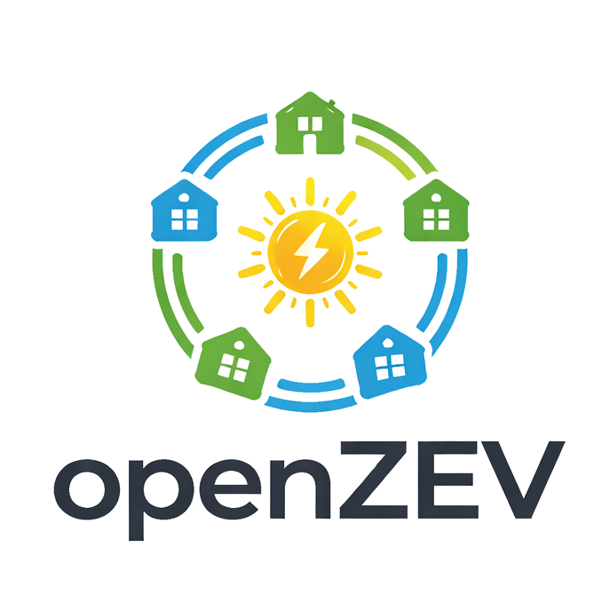
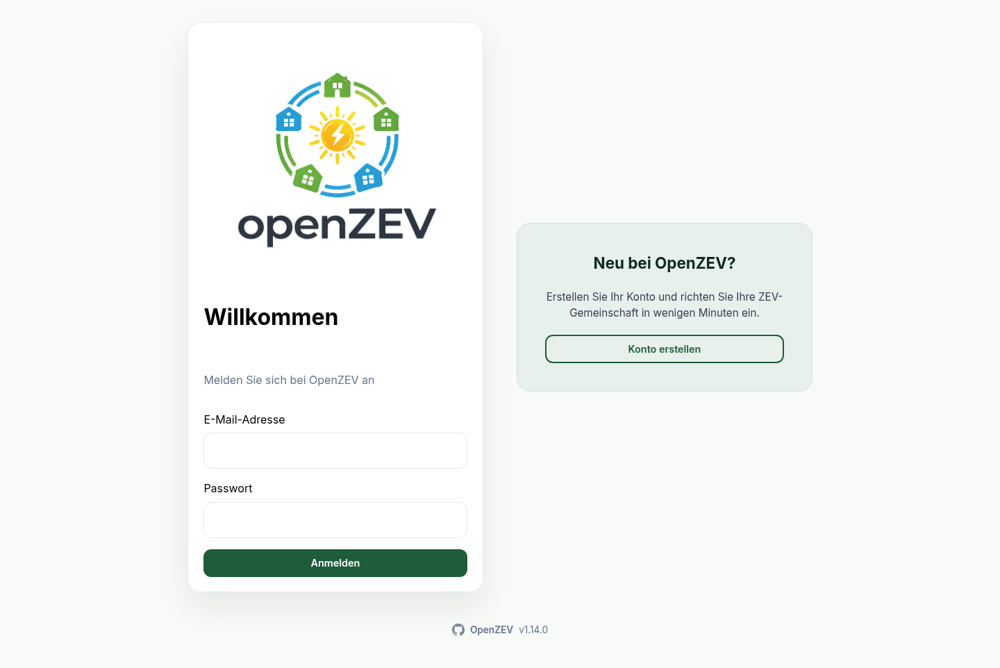
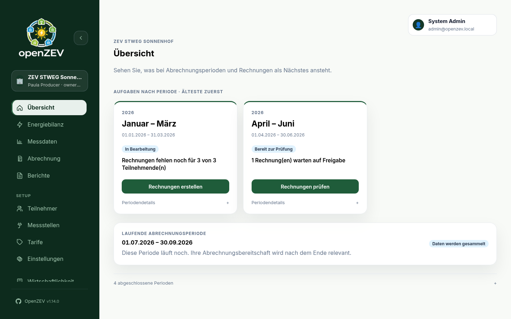
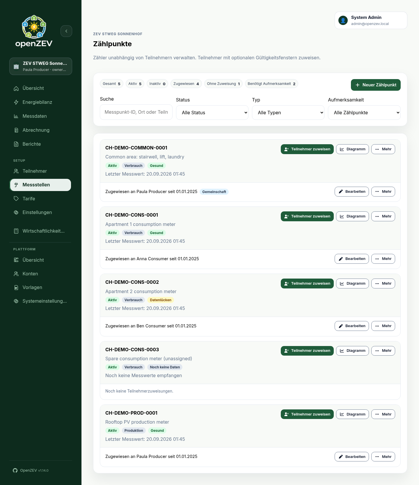
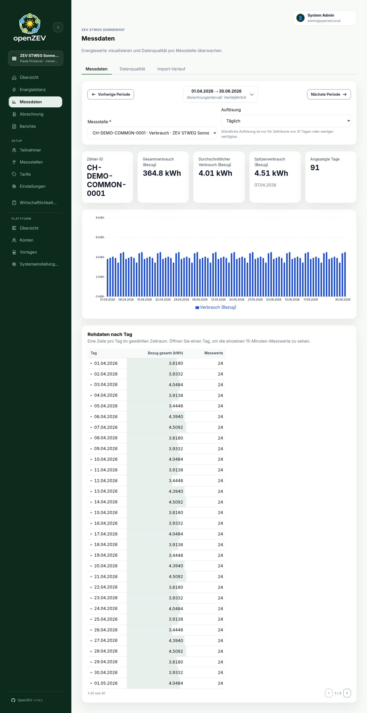
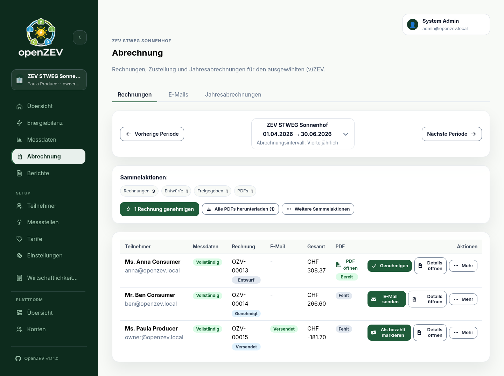
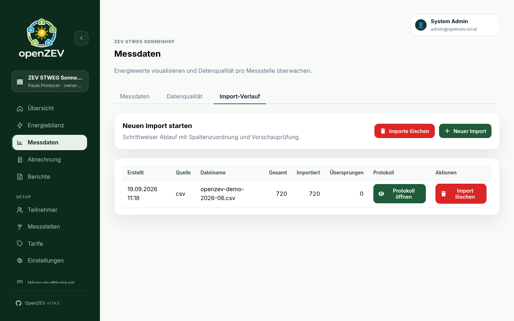

# OpenZEV

Open source platform for operating and billing (v)ZEV energy communities.



OpenZEV gives operators one place to manage participants, metering points, tariffs, imports, and invoicing for a vZEV or ZEV. It is built to support day-to-day operations from data import to payment tracking with role-based access for admins, owners, and participants.

## Disclaimer

- Built for personal use and self-hosting tinkerers who enjoy running their own stack.
- Shipped as-is, with no warranty (yes, even when it looks great in the dashboard).
- Please double-check your data and billing outputs: we do not take responsibility for incorrect imports, calculations, invoices, or invoicing workflows.
- Built with generous AI assistance, right down to the specs, ADRs, and user docs. Some choices may therefore look a little unconventional, or fall short of the practices a more experienced team would apply today. That is not accidental: this project is optimized for learning, experimentation, and running my own private ZEV, not for enterprise-grade process perfection.

## Product Overview

- Built for Swiss ZEV/vZEV operating models
- End-to-end workflow from metering import to paid invoice
- Transparent invoice lifecycle with clear status tracking
- Open and extensible architecture for long-term adoption

## Main Features

### Community & User Management

- Manage vZEV and ZEV communities with clear role boundaries (`admin`, `zev_owner`, `participant`, `guest`)
- Organize participants and metering points with validity-based assignments
- Configure ZEV details, billing intervals, and per-ZEV invoice email templates
- Role-aware dashboards: owner/admin operational views and participant self-service

### Metering & Imports

- Import metering data from CSV/Excel with configurable column mapping and two format profiles (point readings and daily 15-minute)
- Support SDAT-CH imports for utility-oriented workflows
- Preview-based validation with a per-row import protocol and data-quality status
- Analyze consumption and production via chart and profile views

### Tariffs & Billing

- Configure tariffs, tariff periods, and pricing per ZEV
- Run timestamp-level billing allocation with a per-timestamp local-pool split
- Process invoices through draft → approved → sent → paid → cancelled
- Generate Swiss-ready PDF/A-3b documents — invoices with QR-bill payment slip, plus annual statements and contract PDFs

### Planning & Feasibility

- Estimate vZEV savings, payback, ROI, and NPV before founding a community
- Model individual producers and consumers with a per-participant benefit split and energy-flow diagram
- Prefill a real ZEV's participants, measured self-consumption, and all-in tariffs as a starting point

### Invoice Communication

- Send invoice emails asynchronously for reliable delivery
- Track email history and retry failed sends
- Customize invoice email templates per ZEV with sensible defaults

### Product Experience

- Multilingual frontend (EN/DE/FR/IT)
- Built-in API docs via Swagger and ReDoc
- Admin overview with operational metrics and status insights

## Screenshots

### Login



### Dashboard



Overview of KPIs, invoice status, and operational health.

### Metering Points



### Metering Data



### Invoices



Invoice lifecycle management, PDF generation, and email tracking.

### Metering Import Wizard



Step-by-step import flow with mapping, preview, and validation feedback.

## Architecture & Stack

- Backend: Django, Django REST Framework, SimpleJWT
- Frontend: React, TypeScript, Vite, React Query, i18next
- Async jobs: Celery with Redis broker
- Database: SQLite (default), PostgreSQL, MariaDB via `DATABASE_URL`
- Runtime/deploy: Docker and docker compose

## User Documentation

All end-user documentation has been moved to `docs/user-guide/` and organized by workflow.

- User guide index: [docs/user-guide/README.md](docs/user-guide/README.md)
- Energy allocation and billing details: [docs/user-guide/08-billing-allocation-explained.md](docs/user-guide/08-billing-allocation-explained.md)
- vZEV feasibility calculator: [docs/user-guide/13-feasibility-calculator.md](docs/user-guide/13-feasibility-calculator.md)

## Quick Start (Docker)

Start the full stack and seed a reusable demo environment in one command:

```bash
scripts/start-demo-environment.sh
```

Or start the stack without demo data:

```bash
docker compose up -d --build
```

Stop it with:

```bash
docker compose down
```

Services: Frontend <http://localhost:8080> · Backend API <http://localhost:8001> · PostgreSQL localhost:5432 · Redis localhost:6379.

> **Upgrading from a stack started before this change:** the Postgres data
> directory is now pinned to `PGDATA=/var/lib/postgresql/data/pgdata` inside the
> `postgres_data` volume, and all three compose files mount that volume at the
> same path. Previously `docker-compose.yml` and `docker-compose.dev.yml`
> disagreed on the mount path, so the two stacks could not see each other's
> database. An existing volume holds its cluster at the old location, so the
> first start after this change initialises an empty one. Dump anything you want
> to keep first:
>
> ```bash
> docker compose up -d db
> docker compose exec db pg_dump -U openzev openzev > backup.sql
> docker compose down -v          # discards the old volume
> docker compose up -d --build
> docker compose exec -T db psql -U openzev openzev < backup.sql
> ```
>
> For demo data, `scripts/start-demo-environment.sh` reseeds from scratch and no
> dump is needed.

For a step-by-step walkthrough — roles, exploring each interface, demo accounts, and resetting demo data — see the [Getting Started guide](docs/user-guide/01-getting-started.md).

## Optional: Fullstack Container Mode

For a single application container (frontend + backend together), use:

```bash
docker compose -f docker-compose.fullstack.yml up -d --build
```

`app` serves the frontend and proxies API requests to Django inside the same container; `worker`, `db`, and `redis` stay separate. Frontend URL: <http://localhost:8080>. Stop with `docker compose -f docker-compose.fullstack.yml down`.

See the [Getting Started guide](docs/user-guide/01-getting-started.md#fullstack-container-mode-single-container) for details.

## Helm Installation (Kubernetes)

OpenZEV ships as a Helm chart in [`charts/openzev`](charts/openzev/README.md).

The chart deploys the frontend, backend, and a Celery worker, plus an Ingress and a PVC for `/app/media`. It does **not** deploy PostgreSQL or Redis — you must provide reachable external database and Redis endpoints.

```bash
helm repo add openzev https://splattner.github.io/openzev
helm repo update
helm install openzev openzev/openzev -n openzev --create-namespace
```

For install options and example values (external DB/Redis secrets, email, ingress), see the [Helm chart README](charts/openzev/README.md).

## Prebuilt Container Images

Prebuilt images are published to GitHub Container Registry (GHCR), the current image names are:

- `ghcr.io/splattner/openzev-backend`
- `ghcr.io/splattner/openzev-frontend`
- `ghcr.io/splattner/openzev-fullstack`

Available image variants:

- `openzev-backend`: Django API application
- `openzev-frontend`: static frontend served with Nginx
- `openzev-fullstack`: frontend assets + backend in one container for simpler test deployments

Available tags:

- Release tags such as `v1.2.3`
- `latest` for the newest published release
- `main` for the newest build from the `main` branch
- `main-<short-sha>` for a specific `main` branch commit build

### Stability Note for `main` Images

Images tagged `main` are intended for testing and preview deployments before a formal release.

- They are rebuilt on every commit pushed to `main`
- They may contain unfinished changes or breaking behavior
- They should be considered unstable and not be treated like a versioned release artifact

If you need reproducible deployments, prefer a release tag such as `v1.2.3` instead of `main`.

### SBOMs and Signatures

- Release images are published with signed container manifests and signed SBOM attestations
- `main` branch images are also pushed, signed, and accompanied by generated SBOMs
- Release SBOM files are attached to the GitHub release
- `main` branch SBOM files are uploaded as workflow artifacts in the `Container Build Check` workflow run
- SBOM verification is performed through the signed attestation bound to the image, not through a separate detached signature on the raw `.spdx.json` file

### Verify an Image Signature

Install `cosign` locally, then verify an image with GitHub OIDC keyless signatures:

```bash
cosign verify \
  --certificate-identity-regexp "https://github.com/splattner/openzev/.github/workflows/.*" \
  --certificate-oidc-issuer "https://token.actions.githubusercontent.com" \
  ghcr.io/splattner/openzev-backend:main
```

For a release image, replace the tag with the release version, for example `:v1.2.3`.

### Verify the SBOM Attestation

You can verify the signed SBOM attestation attached to an image:

```bash
cosign verify-attestation \
  --certificate-identity-regexp "https://github.com/splattner/openzev/.github/workflows/.*" \
  --certificate-oidc-issuer "https://token.actions.githubusercontent.com" \
  --type spdxjson \
  ghcr.io/splattner/openzev-backend:main
```

To inspect the attested predicate after verification, add `| jq '.payload | @base64d | fromjson'` or download the generated `.spdx.json` artifact directly from the workflow or release.

## Local Development Setup

### 1) Backend

```bash
cd backend
cp .env.example .env
python -m venv ../.venv
source ../.venv/bin/activate
pip install -r requirements.txt
python manage.py migrate
python manage.py runserver
```

Optional admin user:

```bash
python manage.py createsuperuser
```

### 2) Frontend

```bash
cd frontend
cp .env.example .env
npm install
npm run dev
```

Frontend dev URL: <http://localhost:5173>

> Cookie sessions require same-origin (or same-host reverse proxy, e.g. `VITE_API_BASE_URL=/api/v1`). Same-host different-port dev (`localhost:5173` → `localhost:8001`) works with `CORS_ALLOWED_ORIGINS`/`CSRF_TRUSTED_ORIGINS`. Truly cross-hostname (`app.example.com` → `api.example.com`) cannot be fixed by those settings alone — JS cannot read a cross-origin `csrftoken` cookie — use a same-origin reverse proxy.

### 3) Celery worker (required for async emails)

```bash
cd backend
source ../.venv/bin/activate
celery -A config worker -l info
```

## Seed Data & Demo Accounts

Use seeded data for quick local testing of flows.

```bash
cd backend
source ../.venv/bin/activate
python manage.py seed_demo
```

Seeded demo users:

- Admin: `admin@openzev.local` / `admin1234`
- ZEV Owner: `owner@openzev.local` / `owner1234`
- Participant: `anna.consumer@openzev.local` / `participant1234`
- Participant: `ben.consumer@openzev.local` / `participant1234`

The seed command also creates a sample ZEV, metering points, tariffs, and 15-minute interval readings from the previous quarter up to today.

## API & Developer Docs

- Swagger UI: <http://localhost:8001/api/docs/>
- ReDoc: <http://localhost:8001/api/redoc/>
- Base API prefix: `/api/v1/`

## Development Notes

- Without Docker, the backend defaults to SQLite (see `backend/.env.example`). Docker Compose uses PostgreSQL. MariaDB is also supported.
- Async tasks (invoice emails, PDF generation, geocoding) require Redis + Celery. Docker Compose includes both; for other setups, ensure they are running.
- Use `.env.example` as baseline for environment configuration.
- Keep migrations up to date when changing models:

```bash
cd backend
source ../.venv/bin/activate
python manage.py makemigrations
python manage.py migrate
```

- Run backend tests from repository root:

```bash
pytest
```

- Build frontend before release:

```bash
cd frontend
npm run build
```

## Development Process: Specs and ADRs

OpenZEV uses **feature specifications** and **architecture decision records**
(ADRs) to document and communicate larger changes. Both are linked from pull
requests when a change is significant or cross-cutting.

- **Specifications** (`docs/specs/`) — required for changes to API behavior,
  billing/tariff logic, invoice workflow, data models/migrations, async jobs, or
  security/role/ZEV-scope. Full process and the baseline-spec index:
  [`docs/specs/README.md`](docs/specs/README.md).
- **ADRs** (`docs/adr/`) — record high-impact architecture decisions with
  long-term consequences. Full process and the index:
  [`docs/adr/README.md`](docs/adr/README.md).
- **Agent guidance** — coding agents should follow the working agreements and
  spec-maintenance rules in [`AGENTS.md`](AGENTS.md).

For pull requests, link affected specs/ADRs using
`.github/PULL_REQUEST_TEMPLATE.md`.

## Release Workflow (GitHub)

Releases are automated via GitHub Actions (see `.github/workflows/`):

- PR titles must follow Conventional Commits; Release Please manages SemVer tagging and changelog generation.
- Pull requests run lint/check/test and container build checks without pushing images.
- Commits to `main` build, push, sign, and SBOM-attach preview images (tags `main`, `main-<sha>`).
- Published releases build and push versioned images to GHCR (see [Prebuilt Container Images](#prebuilt-container-images)).
- Renovate keeps npm/pip/GitHub Action dependencies up to date.
