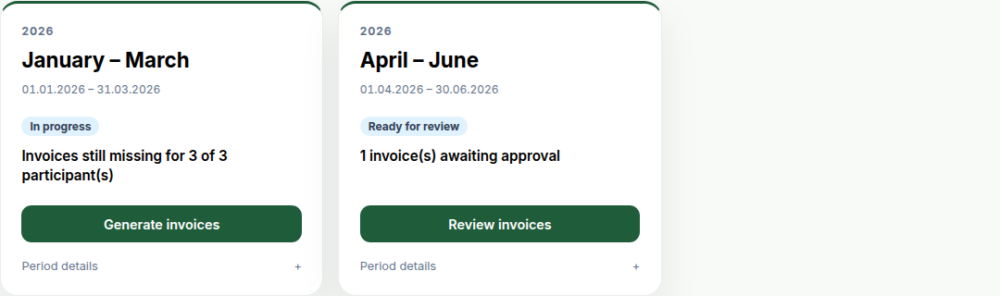

This release reorganizes the navigation around the work a billing run involves, adds a start page that says which period needs attention, and rebuilds both metering screens around finding the meter with a problem. It also corrects the VAT percentage on invoice PDFs — a manual step if you run a custom template.

### Navigation reorganized around everyday tasks

The sidebar is now a flat list of the things you do — **Overview**, **Energy balance**, **Metering**, **Billing**, **Reports** — with what you configure once under **Setup** and platform administration under **Platform**.

Screens that were separate nav entries are now tabs where they belong: **Metering** holds Metering Data, Data Quality and Import history, **Billing** holds Invoices, Emails and Annual statements, and the admin console collapses from eight entries into four hubs. Each tab is its own URL, and old links still resolve — see Upgrading.

Participants get a **My invoices** entry listing every invoice they have been sent.

### An Overview that says what to do next

The start page for admins and ZEV owners is now an Overview built around billing periods rather than charts:

Only periods with work left appear as cards, oldest first. The period still running is a single line — readiness is not actionable until it ends — and completed periods collapse behind a count you can expand. A caught-up community gets one line saying so.

Readiness runs from metering coverage through to payment, and never blocks you: a period with data-quality problems is flagged and still billable, because that call is yours. The energy charts that used to be here now live under **Energy balance**; participants keep their existing dashboard.

### Metering screens rebuilt around finding the problem

Under **Metering → Metering Data**, the metering-point selector gains **Whole ZEV total (all meters)**, summing every meter in the community into one series — until now the page could only chart one meter at a time. The stat cards add average and peak consumption per bar, the peak naming the day it fell on, and the meter dropdown shows each meter's type, state and community rather than a bare ID.

The **Raw Data by Day** table marks days that look wrong: an assignment holder but no energy, or a negative total. Opening a day also flags negative readings and duplicate timestamps, previously summed together and invisible. Day totals are shaded against the largest day in the period, and long periods paginate a month at a time. These are fixed checks, not statistical outlier detection.

On **Data Quality** the severity cards are now filters, columns sort worst-first, gap lists expand in place, and a meter ID links to its chart for the same period. **Setup → Metering Points** becomes identity-first cards carrying each meter's coverage, last reading and current holder — an unassigned meter records energy billed to nobody, previously invisible here.

Selections and filters on all three screens persist in the URL, and a period with no readings offers to jump to the range the meter does cover. The whole-ZEV total needs a community selected and has no raw-readings table — individual readings only mean something for one physical meter.

### Also new

- The metering-point list is filtered by community on the server rather than in the browser
- The chart's data-point count says what it counts: days, hours or months
- Email delivery history spans every period, not just the selected one, and can be opened per invoice
- A production meter's exported energy reads "Production" rather than "Feed-in"

### Fixes worth knowing about

- **Invoice PDFs printed the wrong VAT percentage.** Stored as a fraction, 0.0810 rendered as `0.1%` instead of `8.1%`. Only the label was wrong — subtotals, VAT amounts and totals were always correct. Stored PDFs keep the old label until regenerated.
- **The chart drew consumption and production in each other's colours**, so a bidirectional meter's chart could be read backwards. The same fix corrects day and hour labels, computed in UTC but printed locally, which could name the wrong day near midnight.
- **Data Quality hid meters with no readings at all** — never even as a red row, so a community could look fully covered while a meter sat silent. Its meter filter also did nothing when set.
- **Data Quality named today's assignment holder, not the period's**, so reviewing an earlier quarter could raise a gap with a participant who had not yet moved in.
- **Deleting a metering point did not say what it would destroy.** The confirmation named only the meter, though the delete cascades to every reading and the whole assignment history. It now states both counts first.
- **Hourly resolution over a long period could hang the browser** — a year is 8,760 bars. Hourly is now offered only for periods of 31 days or less.

### Under the hood

Readiness for every period comes from one bulk load rather than a query per period, so the Overview costs about the same for thirty periods as for three. The metering endpoints now reject a malformed `metering_point` or date with a 400 instead of raising a 500.

### Upgrading

No database migrations, configuration changes or deployment steps.

**Old URLs keep working.** Renamed routes redirect with the query string intact — `/invoices` to `/billing/invoices`, `/metering-data?tab=quality` to `/metering/quality` — so bookmarks and links in already-sent emails do not break. One exception: a participant with a `?tab=quality` bookmark lands on their start page, as Data Quality was never a participant screen.

One manual step, only if you run a **custom invoice PDF template**: the VAT label must use `{{ vat_rate_percent }}` rather than `{{ vat_rate }}` (the stored fraction), or reset the template to the default under **Platform → Templates**.

Scripts reading `data-quality-status` should expect more rows: metering points with no readings are now included, at 0% completeness.

<!-- release-notes-state
version: 1.12.0
source-pr: 616
triaged:
  629: section   # metering points: data health, last reading, holder-less meters
  630: section   # metering points: identity-first card redesign
  631: section   # metering points: filters in the URL
  659: also-new  # server-side ZEV scoping of the metering-point fetch
  661: section   # metering data: period persisted in the URL
  663: section   # metering data: empty state jumps to the meter's data range
  664: section   # metering data: meter dropdown shows type/state/ZEV
  665: section   # metering data: average and peak stat cards
  667: section   # data quality: clickable filters, sorting, expandable gaps, row-to-chart
  668: section   # metering data: anomaly flags on the raw table
  669: section   # metering data: whole-ZEV total
  670: section   # metering data: raw-table pagination and data bars
  678: section   # nav regroup phase 1 — flat nav, canonical routes + aliases
  679: section   # nav regroup phase 2 — readiness/attention API, Overview cards,
                 # participant /me/invoices, email delivery history
  680: section   # nav regroup phase 3 — billing/metering/admin hubs, invoice-first
                 # billing, Overview period cards. Merged 2026-09-10; the stack
                 # landed as three squash commits with main's tree identical to
                 # the reviewed phase-3 tip.
  615: fix       # VAT percentage on invoice PDFs
  628: fix       # metering points: silent cascade delete, wrong counts, dead-end assign button
  654: fix       # data quality: zero-reading meters hidden, meter filter ignored
  655: fix       # chart colour swap and UTC label drift
  656: fix       # hourly resolution capped to 31 days
  657: fix       # data quality: period holder, not today's
  658: fix       # production meter OUT labelled feed-in
  660: also-new  # bucket-count stat labelled by what it counts
  677: under-the-hood  # metering endpoints 400 instead of 500 on bad params
  681: omit      # fixed the whole-ZEV-total sentinel bug introduced by #669 in this
                 # same release — never reached a released version, nothing to tell
-->
