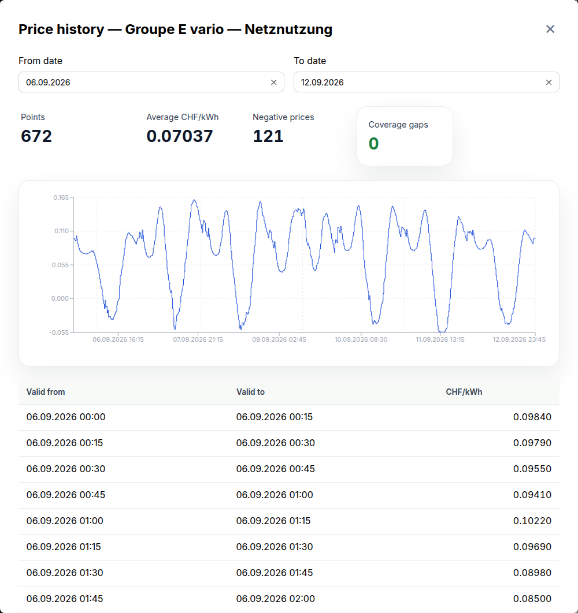

This release adds dynamic tariffs — an energy tariff priced from the grid operator's published series instead of fixed bands — and removes every password OpenZEV used to hand a participant, replacing it with a revocable sign-in link. Two things need a decision from you around the upgrade: every deployment now runs an additional Celery Beat container, and the feasibility calculator is switched off by default.

### Bill from a dynamic tariff

Under **Setup → Tariffs**, an energy tariff can now take a **Dynamic price source** instead of price bands. Give it an operator's price URL; OpenZEV detects the API version, lets you confirm the price component and product, and re-fetches every four hours from then on.

Prices are stored, not cached — operators keep little history themselves (Groupe E drops it after nine months, BKW none at all), so an unstored interval could never be recovered. **View prices** on a dynamic tariff shows what's on hand:

Where the series has no price for a reading, invoice generation refuses rather than billing it at zero — nothing partial is written, a bulk run reports it as that participant's failure, and readiness flags the gap before you even try.

Two limits: a dynamic tariff has no headline rate, so the tariff overview PDF and participation contract print the fetched series' average, footnoted as approximate; and the VSE importer won't guess a product name — Groupe E's `vario` and `double` differ materially — so an imported candidate arrives with a warning to pick one.

### Managing price sources

A source is shared across every community — one public endpoint is one set of public prices — so sources live under **Platform administration → Overview → Dynamic prices**, not inside a ZEV:

Admins can fetch on demand, backfill history, re-check capabilities, and rename a source. Clearing its prices is refused while a non-cancelled invoice overlaps a linked tariff, and it can't be deleted while any tariff still points at it.

### Suggest a grid operator from a postal code

**Setup → Settings** now takes a **Postal code** for the grid connection and suggests the grid operator from ElCom's register — 3,172 postal codes across 553 operators, resolved against a checked-in copy rather than a live lookup.

For the 448 operators with a machine-readable tariff address, it can also fill in the URL the import uses — only once a fetch confirms the address still serves a document, since these rot between an operator's re-upload and ElCom's refresh. Nothing is written without your click, and an existing URL is never overwritten.

### The feasibility calculator is off by default

The vZEV feasibility calculator, in the sidebar since 1.4.0, now sits behind a feature flag that ships off. After upgrading it disappears from navigation and its endpoints return 403 until an admin enables it under **System Settings → Feature Flags**, or you set `FEATURE_FEASIBILITY_CALCULATOR_ENABLED=true`.

### Participants sign in without a password

Under **Setup → Participants**, each participant shows whether they've been invited, are active, or had their link revoked, with **send**, **copy**, and **revoke** actions to match. The link signs them straight into their own account, works again next time until revoked, and no password is ever shown, typed, or emailed.

This replaces every password OpenZEV used to issue a participant — creation no longer shows one, and Accounts' **Create account** now returns a link instead. Unlinking an account there (**Platform administration → Accounts**) revokes its link too. The invitation email template, custom wording included, is gone; its replacement is editable again under **Platform administration → Templates → Onboarding Email**.

### Also new

- Your selected community is remembered on your account instead of in the browser, so it follows you between browsers and no longer carries over to the next person who logs in on a shared device.

### Fixes worth knowing about

- **One account's data could show up under another in the same browser tab.** Most cached queries aren't keyed by identity, and logging in, logging out, and starting or stopping impersonation left that cache untouched — a request still in flight for the outgoing account could resolve after the switch and populate a query the incoming account then read. Now cancelled and cleared at all four boundaries. Nothing was written to the database, but if you use impersonation or share a browser, figures on screen may have belonged to someone else.

### Under the hood

ADR 0018 records why a dynamic price series is stored globally rather than per ZEV, and why it is evidence rather than a cache — read it before changing either. `docs/specs/2026-09-dynamic-tariffs.md` covers the fetch, pricing and import paths end to end.

### Upgrading

**Every deployment now runs a Celery Beat scheduler**, and dynamic price refreshes will not happen without it. The Compose stacks gain a `beat` service and the Helm chart a single-replica Beat `Deployment`, enabled by default — keep `beat.replicaCount: 1`, since a second scheduler enqueues every periodic task twice per tick. No Beat shipped before this release, so the expired-OAuth-token and export-artifact sweeps also begin running on schedule for the first time.

Seven migrations, all additive, across five apps: **zev** (2) — postal code, and the onboarding-link table; **tariffs** (2) — the price-source tables and a protocol reshape, a no-op since those tables start empty; one each in **accounts** (preferred community), **audit** (the onboarding-link source), and **invoices** (deletes any customised invitation template).

**Removed:** `send-invitation` and `create-account`'s password fields, replaced by `send-onboarding-link` / `onboarding-link` / `revoke-onboarding-link` — update a script using the old `{username, temporary_password}` shape. Existing tariffs and accounts are otherwise unaffected; no downtime is expected.

<!-- release-notes-state
version: 1.13.0
source-pr: 696
triaged:
  699: section   # dynamic tariffs 1/3 — fetch and store the price series
  700: section   # dynamic tariffs 2/3 — price from the series, refuse gaps, readiness
  701: section   # dynamic tariffs 3/3 — importer support and the tariff-form picker
  705: section   # dynamic source management: manual wizard, price history, admin ops tab
  704: section   # Celery Beat in every stack + initial backfill. The Beat half is the
                 # Upgrading entry; the backfill half folds into the feature section
  691: section   # postal-code → grid operator + tariff URL suggestion (issue)
  695: section   # ...and its implementation PR
  697: section   # feasibility calculator behind an off-by-default flag
  689: also-new  # preferred community persisted per user, off browser storage
  698: fix       # query cache not cleared at session boundaries
  710: omit      # fixes #705's local-vs-UTC day window, and #705 has never been in a
                 # released version — nothing an upgrading operator can have hit
  693: omit      # docs: roadmap and spec index resync
  708: omit      # docs: manual dynamic sources, admin console, roadmap
  694: omit      # deps: zod 4.6.2
  707: omit      # deps: react-hook-form 7.88.0
  713: section   # participant onboarding link — replaces every password OpenZEV
                 # used to hand a participant; merged after the initial draft
  714: omit      # deps: zod 4.6.4

not-final:
  709: open      # feat(dynamic tariffs): frozen invoice evidence, shared pricing/storage.
                 # Draft, explicitly "not ready for review", may be split. If it lands
                 # before the cut, the "Bill from a dynamic tariff" section needs a
                 # paragraph on what an issued invoice freezes, and the storage/pricing
                 # change may add an Upgrading entry. Re-run `continue` if it merges.
-->
