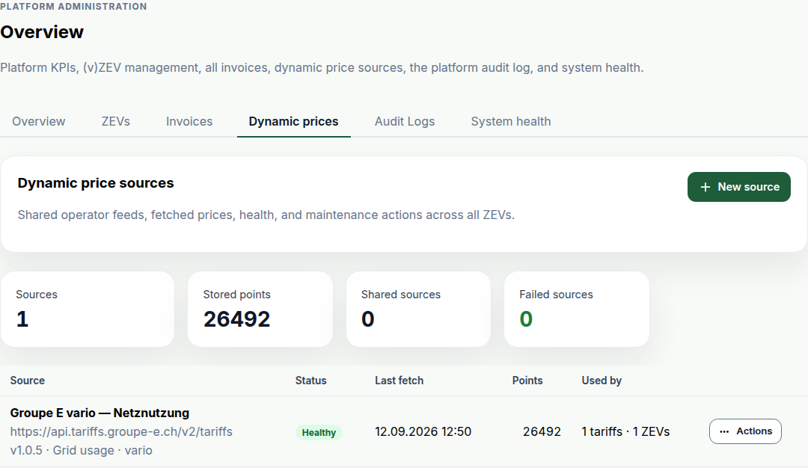

This release adds dynamic tariffs: an energy tariff priced from the grid operator's published series instead of fixed bands, billed at the reading's own timestamp. Two things need a decision from you around the upgrade — every deployment now runs an additional Celery Beat container, and the feasibility calculator is switched off by default.

### Bill from a dynamic tariff

Under **Setup → Tariffs**, an energy tariff can now take a **Dynamic price source** instead of price bands. Give the form an operator's price URL and OpenZEV reads it, works out which API version it speaks, lets you confirm the price component and product, and stores what comes back. From then on it re-fetches every four hours.

Prices are stored rather than cached, because operators keep little history of their own — Groupe E drops it after about nine months, BKW publishes none at all — so an interval nobody stored on the day could never be re-derived.

Where the series has no price for a reading, invoice generation refuses instead of billing that interval at zero. Nothing partial is written, a bulk run reports it as that one participant's failure, and billing readiness flags the gap before you attempt generation at all.

Two limits before you switch a tariff over. A dynamic tariff has no headline rate, so the tariff overview PDF and the participation contract print the average of the fetched series, footnoted as an approximation. And the VSE importer will not guess a product name — Groupe E's `vario` and `double` differ materially at the same instant — so an imported dynamic candidate arrives with a warning to pick one.

### Managing price sources

A source is shared across every community on the instance — one public endpoint is one set of public prices — so sources live under **Platform administration → Overview → Dynamic prices** rather than inside a ZEV:

Admins can fetch on demand, backfill whatever history the operator still has, re-check a source's capabilities and rename it. **View prices** on any dynamic tariff opens the fetched intervals for a date range, with the average, a count of negative prices, and any coverage gaps listed explicitly. Clearing a source's prices is refused while a non-cancelled invoice overlaps a linked tariff, and a source cannot be deleted while any tariff still points at it.

### Suggest a grid operator from a postal code

**Setup → Settings** now takes a **Postal code** for the grid connection and suggests the grid operator from ElCom's register — 3,172 postal codes across 553 operators, resolved against a checked-in copy rather than a live lookup.

For the 448 operators that publish a machine-readable tariff address, it can also fill in the tariff document URL the import uses — but only after a real fetch confirms the address still serves a document, because registered URLs rot between an operator's re-upload and ElCom's next refresh. Neither suggestion is written without you clicking to accept it, and an existing tariff URL is never overwritten.

### The feasibility calculator is off by default

The vZEV feasibility calculator, in the sidebar since 1.4.0, now sits behind a feature flag that ships off. After upgrading it disappears from navigation and its endpoints return 403 until an admin enables it under **System Settings → Feature Flags**, or you set `FEATURE_FEASIBILITY_CALCULATOR_ENABLED=true`.

### Also new

- Your selected community is remembered on your account instead of in the browser, so it follows you between browsers and no longer carries over to the next person who logs in on a shared device.

### Fixes worth knowing about

- **One account's data could show up under another in the same browser tab.** Most cached queries — invoices, metering data, dashboard summaries — are not keyed by user identity, and logging in, logging out, and starting or stopping impersonation all left that cache untouched. A request still in flight for the outgoing account could resolve after the switch and populate a query the incoming account then read. The cache is now cancelled and cleared at all four boundaries. Nothing was written to the database, but if you use impersonation or share a browser, figures read on screen may have belonged to the other account.

### Under the hood

ADR 0018 records why a dynamic price series is stored globally rather than per ZEV, and why it is evidence rather than a cache — read it before changing either. `docs/specs/2026-09-dynamic-tariffs.md` covers the fetch, pricing and import paths end to end.

### Upgrading

**Every deployment now runs a Celery Beat scheduler**, and dynamic price refreshes will not happen without it. The Compose stacks gain a `beat` service and the Helm chart a single-replica Beat `Deployment`, enabled by default. Keep `beat.replicaCount: 1` — the chart rejects anything else, since a second scheduler enqueues every periodic task twice per tick. No Beat shipped in any stack before this release, so the expired-OAuth-token and export-artifact sweeps also begin running on schedule for the first time.

Four migrations, all additive:

- `accounts.0014_user_preferred_zev` — the per-user preferred community
- `zev.0025_zev_postal_code` — the grid connection's postal code
- `tariffs.0012_dynamic_tariff_source` — source and price-point tables, plus the tariff's nullable link
- `tariffs.0013_generic_dynamic_api_versions` — reshapes the source's protocol fields; a no-op on an upgrading instance, since `0012` creates those tables empty

No downtime is expected. **No removals and no breaking API changes** — existing static tariffs bill exactly as before, and `Tariff.dynamic_source` is null on every row you already have.

<!-- release-notes-state
version: 1.13.0
source-pr: 696
triaged:
  699: section   # dynamic tariffs 1/3 — fetch and store the price series
  700: section   # dynamic tariffs 2/3 — price from the series, refuse gaps, readiness
  701: section   # dynamic tariffs 3/3 — importer support and the tariff-form picker
  705: section   # dynamic source management: manual wizard, price history, admin ops tab
  704: section   # Celery Beat in every stack + initial backfill. The Beat half is the
                 # Upgrading entry; the backfill half folds into the feature section
  691: section   # postal-code → grid operator + tariff URL suggestion (issue)
  695: section   # ...and its implementation PR
  697: section   # feasibility calculator behind an off-by-default flag
  689: also-new  # preferred community persisted per user, off browser storage
  698: fix       # query cache not cleared at session boundaries
  710: omit      # fixes #705's local-vs-UTC day window, and #705 has never been in a
                 # released version — nothing an upgrading operator can have hit
  693: omit      # docs: roadmap and spec index resync
  708: omit      # docs: manual dynamic sources, admin console, roadmap
  694: omit      # deps: zod 4.6.2
  707: omit      # deps: react-hook-form 7.88.0

not-final:
  709: open      # feat(dynamic tariffs): frozen invoice evidence, shared pricing/storage.
                 # Draft, explicitly "not ready for review", may be split. If it lands
                 # before the cut, the "Bill from a dynamic tariff" section needs a
                 # paragraph on what an issued invoice freezes, and the storage/pricing
                 # change may add an Upgrading entry. Re-run `continue` if it merges.
-->
