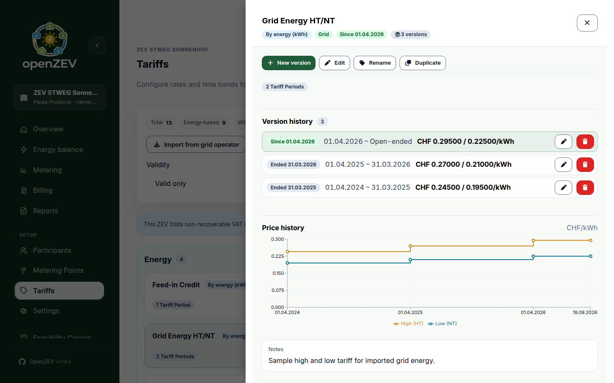

This release carries two invoice-delivery fixes worth applying promptly — one could send a participant the same invoice twice, the other could leave an invoice in the wrong status — installs the standard Swiss VAT history by default, and rebuilds how tariff details are viewed.

### Tariff details open in a side drawer

**View details** on **Setup → Tariffs** used to expand a card in place, pushing the rest of the list down the page. Details now open in a side drawer instead, with the list still readable behind it and the open card highlighted.

The open tariff and the version you are looking at live in the address bar, so a reload, the back button or a link pasted to a colleague all reopen the same view instead of dropping back to the bare list. Dynamic price history renders inline in the drawer rather than behind a further click into a modal.

Switching versions inside the drawer deliberately does not change the card behind it — a closed card always shows the active version, not whichever one you were last reading.

### Swiss VAT history is installed by default

A VAT-registered community on an instance where nobody had configured a VAT rate was billing **0% VAT**, silently: with no rate on file the billing engine falls back to zero rather than refusing.

A new data migration seeds the standard Swiss history — 7.7% for 2018 through 2023, 8.1% from 2024 onward — so a fresh or upgraded database can bill historical periods without configuring anything first. Rates remain editable under **System Settings → VAT**.

Anything you have already entered is preserved: a candidate rate is skipped entirely if any stored row overlaps it, so your own history wins over the defaults. A *partial* custom history is not completed for you, though — the periods it does not cover stay uncovered and need finishing by hand.

### Password sign-ins now appear in the audit log

OAuth sign-ins have always been recorded. Password sign-ins were not — so the audit log could not answer when an administrator last signed in, or whether anyone had been trying repeatedly to get in.

Both outcomes are now recorded. A successful sign-in records `auth.login` against the account; a failed one records `auth.login_failed` with the email or username that was attempted and no actor attached, because the caller proved nothing about who they were.

Failures stay deliberately undifferentiated: a wrong password, an unknown username and a disabled account produce the same generic response *and* the same audit entry. The log records what identifier was tried, never whether it exists — otherwise the audit trail becomes an account-enumeration oracle of its own.

A sign-in belongs to an account rather than to any one community, so these entries carry no ZEV and appear only in the platform-wide log under **Platform administration → Overview → Audit Logs**. A ZEV owner's own audit tab, which is scoped to their community, does not show them.

### Also new

- Numbers on screen now match the numbers on your documents. Screen display had Swiss apostrophe grouping (`CHF 1'234.50`) where the generated PDFs never did; grouping is gone, so both read `CHF 1234.50`. Dashboard stats, chart axes, tooltips and the feasibility calculator now share one set of formatters, and an unavailable value renders as `–` rather than `NaN`.
- Editing a tariff version that already has price bands now disables the dynamic-source picker and points you at **New version**, instead of accepting the choice and failing at save with a raw field error. The backend always refused this combination — switching a series between fixed and dynamic pricing happens at a version boundary.

### Fixes worth knowing about

- **A participant could receive the same invoice twice.** One error handler covered both the SMTP send and the bookkeeping after it, so a failure while recording a *successful* send looked identical to the send failing: the email was marked failed and the task retried, delivering a second copy. The **Retry email** action also looks for a failed record, so an operator could then send a third by hand. Only a genuine send failure now retries — **Billing → Emails** is the history to check if you have seen duplicates.
- **An invoice could end up in the wrong status.** Every workflow transition checked an already-loaded invoice and then wrote unconditionally, so two overlapping operations could each pass their own stale check and the second would quietly overwrite the first — cancelling an invoice that had just been paid, or resurrecting a cancelled one to `sent` when a slow email finally went out. Every transition now locks the row and decides against the committed status.

### Under the hood

ADR 0004 now records that the email task's retry guarantee covers the SMTP send only, not the bookkeeping around it — a delivered message is never re-sent to repair a failed side effect. CI gained a PostgreSQL-only step exercising the invoice workflow's row locking with real concurrent connections.

### Upgrading

One migration, `accounts.0015_seed_vat_rates`, which inserts the two standard VAT rates and skips any that would overlap rows you already have. Reverse is a deliberate no-op: without a provenance marker it cannot tell seeded rows from ones you later edited, so it keeps them.

**One behaviour change to plan for.** If your community is VAT-registered and no VAT rate was ever configured, invoices generated after this upgrade will carry VAT — 8.1% for periods from 2024 — where they previously carried none. That is the correction, but it lands on your next billing run. Invoices already issued are untouched.

No configuration changes, and nothing removed.

<!-- release-notes-state
version: 1.15.0
source-pr: 730
triaged:
  729: section   # tariff detail drawer replaces in-card expand
  736: section   # seed Swiss VAT history via data migration
  741: section   # audit password login attempts
  737: also-new  # Swiss number formatting at display boundaries
  732: also-new  # disable dynamic-source picker on a version with bands
  738: fix       # workflow status-transition race (closes #572)
  739: fix       # don't retry a successfully sent invoice email (closes #576)
  735: omit      # renovate: frontend-npm
  734: omit      # docs: user guide for the detail drawer
  733: omit      # docs: AGENTS.md dev stack, add CLAUDE.md
  731: omit      # renovate: @tanstack/react-query
  728: omit      # renovate: @types/node
  726: omit      # renovate: react-router-dom
-->
