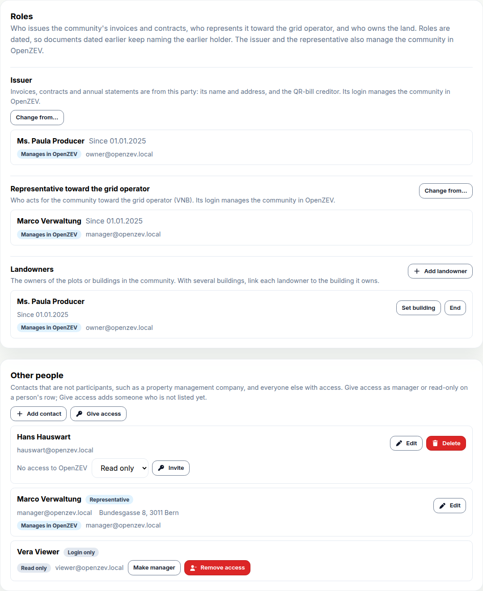

This release separates the people a ZEV legally consists of from the logins
that use OpenZEV, and records where its meters are. A ZEV no longer has one
owner account: it has dated roles, and access is granted per community. If
you import SDAT files, or CSV files with timezone offsets, read **Tariff
bands follow Swiss time** before you regenerate draft invoices.

### Parties, dated roles and access per community

Every person or organisation of a ZEV is now a *party*, with or without a
login. A participant can be a company or a household, and **Same person or
organisation as** adds a second participation for someone already in the
ZEV. Issuer, representative toward the grid operator and landowner are dated
roles, and each document names the issuer on its own date (for an invoice,
its period's last day).

All of it is on one tab, **Settings → People & access**:



The issuer and the representative manage the ZEV while they hold the
role. Anyone else gets access to the whole ZEV only when you
give it, as **Manager** or **Read only**, on their row or with **Give
access**; people without an account are invited by email. A read-only
viewer, such as a bookkeeper, sees everything but changes nothing. OpenZEV
refuses any change that would leave a ZEV without a manager.

Participant logins work as before. One login covers every relationship, and
the community switcher shows the account's relation to each ZEV.

Existing ZEVs migrate as they were: the owner's party becomes issuer and
landowner, and the owner keeps managing. An owner who was not a participant
leaves the ZEV without an issuer, as before; **Overview** now warns that its
invoices carry no QR bill.

### Buildings: where the meters are

A ZEV now has one or more buildings, each with an address and optionally its
EGID, and every metering point belongs to one. A participant's address stays
the billing address, so a PV owner living elsewhere is recorded as such. Use **Add building** on **Metering
Points**, which groups the meters by building once there are several; a
landowner can name the building it owns. The optional map now draws
buildings, so participant addresses are no longer sent to OpenStreetMap.

The upgrade creates one building per ZEV, and in a vZEV one per participant
address, each meter in its holder's building. In a vZEV that is a guess, so
check it. Documents do not print the building yet.

### Tariff bands follow Swiss time

Billing asked its calendar questions in UTC. For SDAT and offset-carrying
CSV data, HT/NT and weekday bands were off by one hour in winter and two in
summer (06:30 in summer billed as low rate, Saturday 00:30 counted as
Friday), and periods and tariff validity started at UTC midnight.
Offset-less CSV billed correctly.

Billing now uses Europe/Zurich, and charts and PDFs show Swiss hours. The import wizard asks how to read timestamps without an
offset. Approved and sent invoices are unchanged; regenerate your drafts.

### Annual ZEV report

**Reports** shows an annual report per ZEV: self-consumption and
self-sufficiency against the previous year, month by month, and each
participant's consumption, ZEV share and savings against the grid rate. The
annual-statement ZIP moved here, under **Annual documents**.

### Also new

- **Generation behind the meter (surplus metering)** on a metering point: its
  holder shows no self-sufficiency rate instead of a misleading 1–2 %.
- Two-factor authentication is one switch, **Require two-factor
  authentication for every account**, under **Platform → Settings →
  Security**.
- Shorter sidebar labels, a **Reports** link on **Billing**, and a page
  telling an account linked to no ZEV how to get access.

### Fixes worth knowing about

- **Participants could see invoices before they were sent.** Draft and
  approved invoices appeared under *My invoices* and counted toward their
  annual statement. Now only sent invoices do.
- **Re-rendering a sent invoice used today's data.** Issuer, IBAN, VAT
  number and recipient address were read live. Invoices now keep a copy,
  frozen on approval. Existing invoices were filled from today's data;
  check any sent invoice whose IBAN or address has changed since.
- **Invoice PDFs left out the recipient's second address line** (c/o, flat
  number), although it was stored. Regenerate affected PDFs; a custom
  template needs the line added under **Platform → Templates → PDF**.
- **The ZEV creation wizard could lose a meter ID** on its metering-point
  step and then refuse **Next**.

### Under the hood

An open form or pending save stays with the community it started in when
you switch. ADRs 0026–0029 record the Swiss-time, access, party and building
decisions.

### Upgrading

Seventeen migrations, most rewriting data: thirteen in `zev` (grants,
parties and roles from each owner, `Zev.owner` dropped, buildings), two in
`accounts` (the 2FA switch, the role collapse), and one each in `invoices`
(the issuer/recipient copy) and `metering`.

**Two-factor authentication:** a policy that covered any role now covers
every account, and the grace period restarts at the upgrade.

**Offset-less CSV imports** need re-anchoring before you regenerate drafts.
Nothing moves automatically, and invoiced batches are refused without
`--allow-invoiced`:

```
python manage.py reanchor_readings --list
python manage.py reanchor_readings --batch <id> [--apply]
```

**Breaking changes:**

- `User.role` is `admin` or `user`; per-ZEV access is in `memberships`.
  `/auth/me` drops `zev_name` and `zev_count`. A non-admin without access
  gets 403 from management endpoints instead of empty lists.
- ZEVs have no `owner`; the API returns a read-only `issuer`. An admin
  creating a ZEV through the API grants nobody access, and a ZEV restored
  from a backup has no managers until an admin adds one.
- The dashboard summary's `role` is now `summary_kind`;
  `mfa_required_roles` is now `mfa_required`.
- Templates: `owner_participant.*` and `zev.owner.*` alias `issuer.*`, but
  `zev.owner.username` renders empty.
- Metering points carry a `building`, required on create once a ZEV has
  several; participants no longer return `building_footprint` (buildings do).
- Transfer archives are format 6, which 1.20 cannot import.

<!-- release-notes-state
version: 1.21.0
source-pr: 853
triaged:
  866: section   # #761 per-ZEV grants model; parties-and-access section
  868: section   # #761 scoping union, viewer write-deny; parties-and-access section
  869: section   # #761 grant API, invitations, MFA switch; section + Upgrading
  872: section   # #761 community switcher, viewer UI (Access tab later merged)
  873: section   # #761 role collapse; Upgrading breaking changes
  875: fix       # invoices keep issuer/recipient copy
  877: section   # #761 parties, organisation/household participants
  878: section   # #761 dated issuer/representative/landowner roles
  879: section   # #761 drop Zev.owner; Issuer column in Also new; Upgrading
  880: section   # #761 transfer archive format 5; Upgrading
  881: section   # #761 parties management UI (Parties tab later merged)
  882: section   # #761 issuer and representative manage by role
  884: section   # #761 People & access tab (final UI)
  885: section   # #761 QR-bill readiness warning, last-manager guards
  887: section   # #761 creator manages via issuer role; migration 0039
  894: section   # buildings (#890); migrations 0040-0042, archive format 6,
                 # map geocodes buildings; Upgrading breaking changes
  852: section   # Swiss civil time; reanchor_readings in Upgrading
  854: section   # annual ZEV report on Reports
  855: also-new  # generation behind the meter flag
  870: also-new  # guest landing page, shorter sidebar labels; System
                 # Settings is now Platform → Settings (path updated)
  891: hood      # shared page layouts, scoped state kept on refresh
  892: hood      # writes and dialogs bound to their community
  863: fix       # participants saw unsent invoices
  864: omit      # spec/ADR docs
  865: omit      # tests only
  876: omit      # spec/ADR docs
  886: omit      # demo data and guide screenshots
  888: omit      # user-guide wording
  856: omit      # dead UI code removed
  857: omit      # dead code removed
  859: omit      # landing-page wording
  858: omit      # dependency
  860: omit      # dependency
  871: omit      # dependency
  874: omit      # dependency
  883: omit      # dependency
  893: omit      # dependency
  895: omit      # layout fix to unreleased People & access row; the
                 # screenshot was taken with it
  896: also-new  # Reports link on Billing; other cross-links and the
                 # tariff drawer's source summary too minor to list
  897: fix       # wizard metering-point step lost meter IDs (also in 1.20)
  898: fix       # invoice PDFs omitted recipient address line 2 (since before 1.20)
not-final:
  478: open      # renovate frontend major bump; omit when it lands
  416: open      # renovate backend bump; omit when it lands
-->
