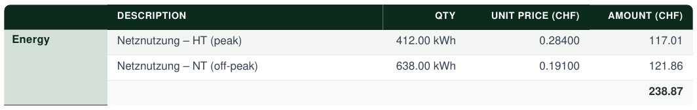

Both changes in this release are about an invoice telling the truth about money. VAT becomes an explicit choice, with a treatment for the community that is not registered but still pays VAT it cannot get back. And a tariff with several price bands can now bill each band at its own rate, instead of one averaged rate that matches nothing the grid operator publishes. If your ZEV is VAT-registered and your tariffs have one band, nothing changes — the amounts billed are byte-for-byte what they were.

### VAT is now a choice, and "not registered" no longer means "no VAT"

Until now VAT was an implicit switch: if a ZEV had a VAT number, the engine added VAT on top of the subtotal; if it didn't, tariff prices were billed exactly as entered.

That left the common case unserved. A small residential ZEV under the CHF 100k turnover threshold isn't VAT-registered — but it still buys grid electricity, grid usage, the Netzzuschlag, cantonal and communal levies and metering **with VAT it cannot reclaim**. Its real cost is the net price plus the VAT rate. Billing participants the net prices under-recovers on every grid-side line, every period.

**Settings → Payment Details** now has a **VAT treatment** field with three options:

- **Not VAT-registered — prices are final as entered.** The default, and what every ZEV without a VAT number already did.
- **VAT-registered — VAT added on top of net prices.** Unchanged. A VAT number is now required in this mode.
- **Not registered — fold non-recoverable VAT into prices.** The new one.

In the third mode the engine grosses up the lines that actually carry input VAT — grid energy, grid fees, levies and metering — by the active VAT rate at the end of the billing period. Local (solar) energy and the feed-in credit are left alone: you pay no input VAT on your own production, and the feed-in credit is money going out. The rate comes from **Admin Console → System Settings → VAT** and is resolved once, at period end, exactly the way the registered mode resolves it. If no rate is active for that period, nothing is grossed up.

Tariff prices stay **net in storage**. That is the point of doing this at the invoice rather than at the tariff: the prices you keep are still the ones on the grid operator's published sheet, so re-importing next year's Art. 7b file is idempotent — no re-grossing, no per-row state about whether a price has already been grossed. And if the ZEV later crosses the threshold and registers, that's one field, not a re-pricing of every tariff.

**No VAT line appears on the invoice.** A non-registered issuer must not show one, so the participant's invoice looks exactly as it did — the amounts are simply the gross ones. The folded-in VAT is totalled onto the invoice as `embedded_vat_chf` for your own bookkeeping.

What this deliberately does not do:

- **It doesn't show you the embedded VAT in the app.** `embedded_vat_chf` is on the invoice API and nowhere else — not on the financial summary, not in any list. If you want the figure, read it from the API.
- **It never reaches participants.** Not on the invoice, not on the annual statement. It is your number, not theirs.
- **The tariffs page still shows net prices.** They are the figures that reconcile against the operator's sheet, so they are not grossed up there. A notice on the page says so when the mode is active, but the prices you see are not the prices invoiced.
- **The participation contract still says the ZEV is not VAT-liable**, with no note that prices are VAT-inclusive. That is correct as far as it goes, and may get a clarifying line later.

### Price bands can be billed one line each

A tariff can carry several price bands — peak and off-peak, a weekend rate, a different price in winter. Until now such a tariff always billed as a **single** line, priced at the average of the bands your participant actually used, weighted by how much they used in each.

That average is nobody's published rate. Worse, it differs from participant to participant: someone who runs their washing machine at night gets a lower figure than their neighbour, from the same tariff. Neither can check their invoice against the tariff sheet they were given, and there is no arithmetic they can do that reproduces the number.

Tick **Itemise price bands on the invoice** under **Settings → General ZEV Settings** and each band that was actually used gets its own line at its own rate.

**Before** — one line, at an average rate the tariff sheet never mentions:

**After** — one line per band, each at its published rate:

The bands are named the way your participation contracts already name them, so the document a participant signed and the invoice they receive finally agree on what "HT" means.

**The invoice costs exactly the same either way** — both tables above come to 238.87. A tariff's total is worked out first and then divided across its band lines, never the other way round, so switching the setting on cannot move anyone's bill by a centime.

What this deliberately does not do:

- **It is off by default,** and it changes only invoices generated afterwards. Existing invoices are left exactly as they are.
- **It does not split a tariff that has one band.** There would be nothing to distinguish, so the line reads as it always did, with no band name appended.
- **It does not touch fixed fees**, monthly or yearly — they have no bands. Nor percentage-of-energy tariffs, whose price comes from the grid rate rather than from a band of their own.
- **A band nobody used gets no line.** The invoice shows what was consumed, not the tariff's full structure; that is what the contract is for.

### Under the hood

An explicit `vat_mode` replaces the old "`vat_number` is set" inference throughout, with the reasoning and the rejected alternatives written up in ADR 0016. The classifier deciding which tariffs carry input VAT is the part that has to be right — a misclassification misprices — so it is small, separate and directly tested.

Naming a price band moved into one shared helper, so the contract and the invoice cannot drift into calling the same band two different things. Line totals are now rounded against their tariff rather than one by one, which is what lets a tariff be split into band lines without its total moving.

The transfer archive carries `vat_mode`, `embedded_vat_chf` and the new band-itemisation setting. The format version is unchanged, and archives exported before this release still import: one carrying a VAT number is read as registered, the same rule the migration applies. Going the other way, an archive from 1.9.0 imported into a 1.8.x instance loses the mode, so a ZEV set to fold VAT in arrives there as not-registered and bills net until it is exported back.

### Upgrading

Three migrations, all additive, no configuration changes and no downtime expected:

- `zev.0022_zev_vat_mode` — adds the field, then moves every ZEV with a non-empty VAT number to `registered`. Everyone else keeps the `not_registered` default, which is the same 0% they had before. Nobody is opted into the new mode automatically.
- `invoices.0013_invoice_embedded_vat_chf` — adds one nullable column.
- `zev.0023_zev_itemize_tariff_bands` — adds the band-itemisation flag, off for every existing ZEV.

No existing invoice changes, and no invoice is recalculated.

**One behaviour change for API clients.** The VAT number and the VAT mode are now validated against each other: a `registered` ZEV must have a number, and a ZEV in either other mode must not. A script that used to `PATCH` a `vat_number` onto a ZEV without setting the mode now gets a 400 instead of a silent state change. Set `vat_mode` in the same request. The same rule applies on create. In the UI the VAT number field is simply hidden unless the mode is `registered`.

<!-- release-notes-state
version: 1.9.0
source-pr: 544
triaged:
  543: section    # explicit VAT mode + inclusive treatment for non-registered ZEVs
  545: omit       # the 1.9.0 release notes themselves
  547: section    # per-ZEV itemisation of multi-band tariffs on the invoice
-->
