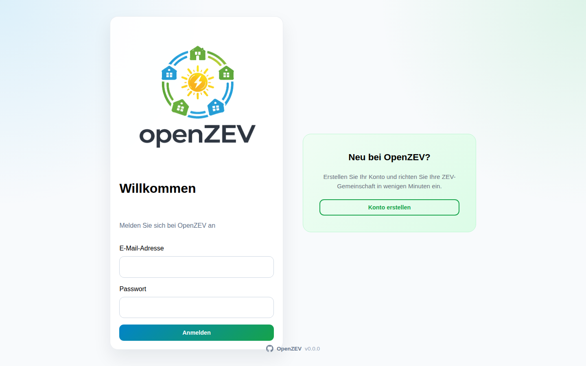
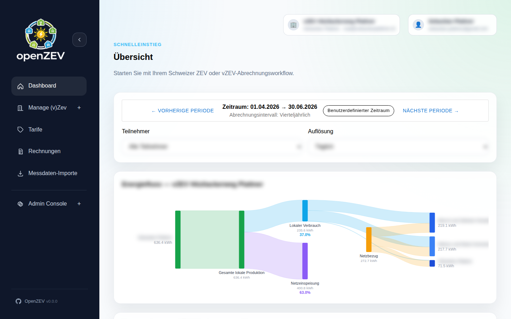
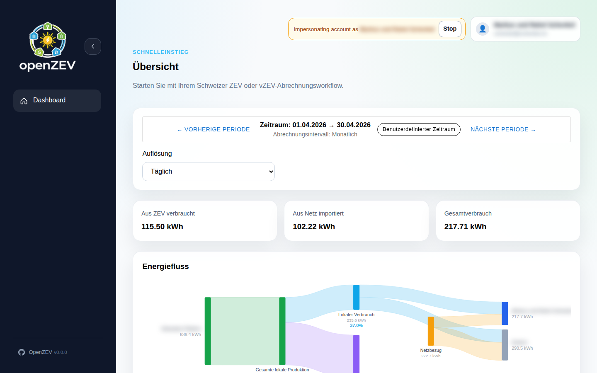
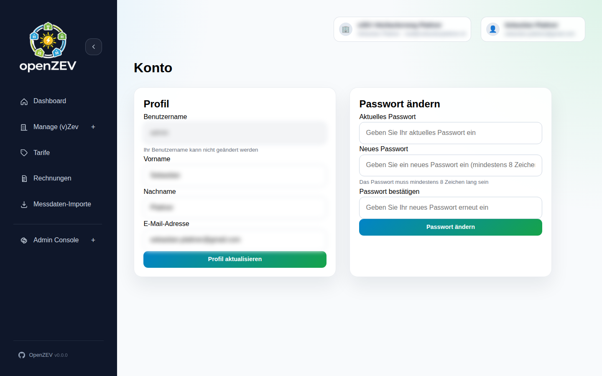

# Getting Started with OpenZEV

This guide covers installation, quick setup, and first-time use of OpenZEV.

## Prerequisites

- Docker and Docker Compose installed on your system
- Basic familiarity with terminal/command line
- A modern web browser

## Quick Start with Docker

OpenZEV is designed to run in Docker for easy setup and deployment.

### Default Setup (Recommended)

Keep frontend, backend, and worker separated for cleaner scaling and easier operations:

```bash
cd /path/to/openzev
docker compose up -d --build
```

Wait a few seconds for services to start, then access:

- **Frontend (UI):** http://localhost:8080
- **Backend API:** http://localhost:8000
- **Database:** localhost:5432 (PostgreSQL)
- **Message Broker:** localhost:6379 (Redis)

To stop:

```bash
docker compose down
```

### Fullstack Container Mode (Single Container)

If you prefer running frontend and backend in a single container:

```bash
docker compose -f docker-compose.fullstack.yml up -d --build
docker compose -f docker-compose.fullstack.yml down
```

In fullstack mode:
- Frontend URL: http://localhost:8080
- Worker, database, and Redis run as separate services

## Demo Accounts

A demo dataset is pre-loaded with sample data for testing. Use these credentials:

| Role | Username | Password | Purpose |
| --- | --- | --- | --- |
| **Admin** | `admin` | `admin1234` | Full system management |
| **ZEV Owner** | `zev_owner` | `owner1234` | Manage a ZEV community |
| **Participant** | `alice` | `alice1234` | View own data and invoices |
| **Participant** | `bob` | `bob1234` | View own data and invoices |

The demo dataset includes sample ZEV communities, participants, metering points, tariffs, and test readings.

### Resetting Demo Data

To reload the demo dataset:

```bash
docker compose exec backend python manage.py seed_demo
```

## First-Time Setup

### 1. Login

1. Navigate to http://localhost:8080
2. Login with admin credentials (or ZEV owner to manage a community)
3. You'll see the main dashboard



### 2. Explore as Admin

If logged in as admin:
- Go to **Admin Dashboard** to see system-wide KPIs
- View **Accounts**, **ZEV Management**, and Regional/VAT **Settings**

### 3. Explore as ZEV Owner

If logged in as a ZEV owner:
- Go to **ZEV Settings** to configure your community parameters
- Go to **Participants** to view member list
- Go to **Metering Points** to see participant meters
- Go to **Metering Data** to import readings and check data quality
- Go to **Tariffs** to configure energy pricing
- Go to **Invoices** to generate and manage billing



### 4. View as Participant

Login as a participant (alice or bob):
- **Dashboard** shows your energy consumption/production overview
- **Metering Data** shows your consumption charts
- **Invoices** lists your personal invoices (read-only)





## API Access

OpenZEV provides a complete REST API for programmatic access:

- **Swagger UI:** http://localhost:8000/api/docs/
- **ReDoc:** http://localhost:8000/api/redoc/
- **API Base URL:** http://localhost:8000/api/v1/

The API is protected by JWT authentication. Demo credentials work for API access too.

## Prebuilt Container Images

If you prefer not to build locally, prebuilt images are available on GitHub Container Registry:

- `ghcr.io/splattner/openzev-backend:latest`
- `ghcr.io/splattner/openzev-frontend:latest`
- `ghcr.io/splattner/openzev-fullstack:latest`

Tag variants:
- `latest` — newest published release
- `vX.Y.Z` — specific release version
- `main` — latest development build (may be unstable)

## What's Next?

- **Operators:** See [ZEV Setup and Configuration](02-zev-setup.md)
- **Data Management:** See [Metering Data Import](05-metering-import.md)
- **Billing:** See [Tariff Configuration](07-tariff-configuration.md)
- **Understanding Roles:** See [Roles and Permissions](11-roles-and-permissions.md)

## Troubleshooting

### Services won't start

Check Docker logs:

```bash
docker compose logs
```

### Can't access frontend

- Ensure port 8080 is not in use: `lsof -i :8080`
- Check Docker container is running: `docker compose ps`

### Database connection errors

Verify PostgreSQL container is healthy:

```bash
docker compose logs db
```

See [Troubleshooting](12-troubleshooting.md) for more help.

## Disclaimer

OpenZEV is built for personal use and self-hosting by tinkerers who enjoy running their own stack. **Please double-check your data and billing outputs**—we do not take responsibility for incorrect imports, calculations, invoices, or invoicing workflows.

Before using in production:
- Test thoroughly with sample data
- Verify all calculations match your tariff agreements
- Set up regular backups of your database
- Review user roles and access controls
