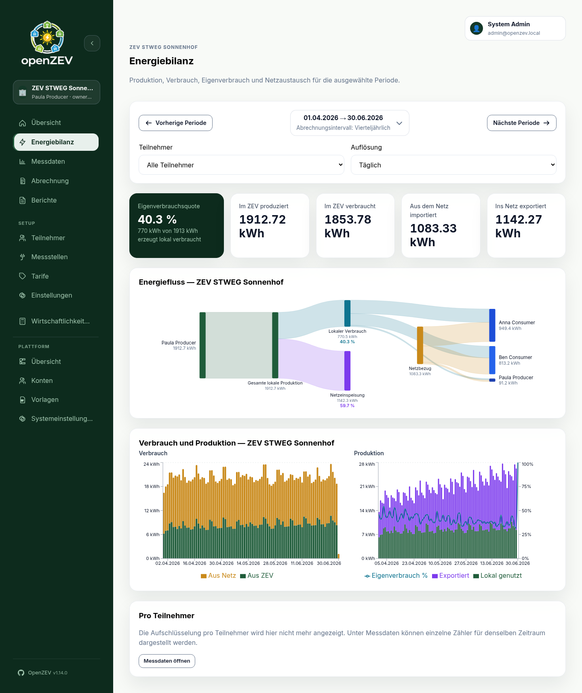
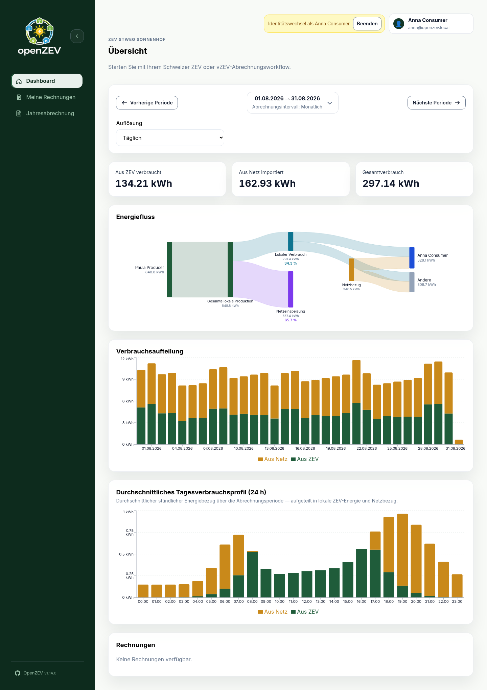
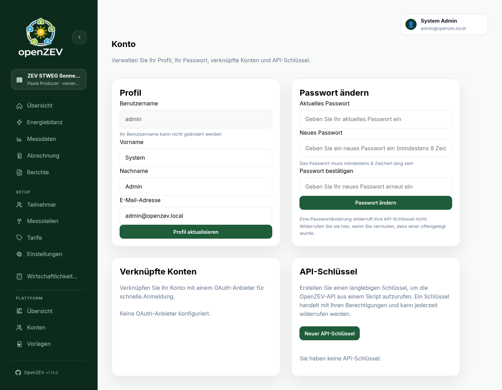

# Getting Started with OpenZEV

This guide covers installing OpenZEV — as a demo, for development, or for
production with Docker Compose or Kubernetes — creating the first admin
account, and a first tour of the interface.

## Choose an Installation

| You want to… | Use | Section |
|---|---|---|
| Try OpenZEV with sample data | `scripts/start-demo-environment.sh` | [Demo and local development](#demo-and-local-development) |
| Work on the code | `docker-compose.dev.yml` | [Demo and local development](#demo-and-local-development) |
| Run it for a real community on one server | `docker-compose.yml` | [Production with Docker Compose](#production-with-docker-compose) |
| Run it as one application container | `docker-compose.fullstack.yml` | [Single-container variant](#single-container-variant) |
| Run it on Kubernetes | Helm chart `charts/openzev` | [Production on Kubernetes (Helm)](#production-on-kubernetes-helm) |

A production instance starts empty: no accounts, no communities. After
installing, [create the first admin account](#creating-the-first-admin-account).

## Prerequisites

- For Docker Compose: Docker with the Compose plugin (or Podman with
  `podman compose`), and a copy of this repository (`git clone
  https://github.com/splattner/openzev.git`)
- For Kubernetes: a cluster, `helm`, `kubectl`, and a PostgreSQL database and
  Redis instance the cluster can reach
- For a public instance: a domain name, TLS termination (a reverse proxy or
  ingress with a certificate), and an SMTP account for outgoing mail
- Basic familiarity with the terminal
- A modern web browser

## Demo and local development

Keep frontend, backend, and worker separated for cleaner scaling and easier operations. To start the stack and seed the full demo dataset in one step:

```bash
scripts/start-demo-environment.sh
```

The script creates `backend/.env` from `backend/.env.example` (development
defaults) when it does not exist yet, and refuses to run when `backend/.env`
disables `DEBUG` (a production configuration) instead of seeding it.
For day-to-day development with live
reload, use the dev stack instead:

```bash
cd /path/to/openzev
docker compose -f docker-compose.dev.yml up -d --build
```

Wait a few seconds for services to start, then access:

- **Frontend (UI):** http://localhost:8080 (dev stack: http://localhost:5173)
- **Backend API:** http://localhost:8080/api/v1/ (dev stack: http://localhost:8001)
- **Database:** localhost:5432 (PostgreSQL, dev stack only)
- **Message Broker:** localhost:6379 (Redis, dev stack only)

To stop the dev stack:

```bash
docker compose -f docker-compose.dev.yml down
```

Never use either of these for real data: they run with `DEBUG=True`, and the
demo seed ships well-known passwords.

## Production with Docker Compose

`docker-compose.yml` runs the frontend (nginx), the backend (Django +
gunicorn), a Celery worker, one Celery Beat scheduler, PostgreSQL and Redis on
one host. Only the frontend port `8080` is published; nginx proxies `/api/` to
the backend, and PostgreSQL and Redis are reachable only on the compose
network. The images are built from your checkout of the repository.

### 1. Get the code

```bash
git clone https://github.com/splattner/openzev.git
cd openzev
git checkout vX.Y.Z   # pick the newest release tag; main may be unstable
```

### 2. Configure `backend/.env`

```bash
cp backend/.env.production.example backend/.env
```

Fill in every value. The examples below assume the instance is reached at
`https://zev.example.ch`:

| Setting | Example | Notes |
|---|---|---|
| `SECRET_KEY` | *(generated, see below)* | The backend refuses to start without it |
| `ALLOWED_HOSTS` | `zev.example.ch` | Bare hostname(s), comma-separated, no scheme or port |
| `CSRF_TRUSTED_ORIGINS` | `https://zev.example.ch` | Full public origin — set it even though CORS stays empty |
| `CORS_ALLOWED_ORIGINS` | *(empty)* | Leave empty: nginx serves the UI and the API from the same origin |
| `FRONTEND_URL` | `https://zev.example.ch` | Used for links in emails and for redirects |
| `EMAIL_HOST`, `EMAIL_PORT`, `EMAIL_USE_TLS`, `EMAIL_HOST_USER`, `EMAIL_HOST_PASSWORD`, `DEFAULT_FROM_EMAIL` | your SMTP account | Needed for invitations, password resets and invoice emails — see [Email Configuration](10-email-configuration.md) |
| `WEBAUTHN_RP_ID` | `zev.example.ch` | Bare domain for passkeys; changing it later invalidates every registered passkey |
| `WEBAUTHN_ORIGIN` | `https://zev.example.ch` | Full origin for passkeys |
| `MFA_ENCRYPTION_KEYS` | *(generated, see below)* | Encrypts two-factor secrets; without it nobody can enrol an authenticator app |
| `BACKUP_ENCRYPTION_KEYS` | *(generated, see below)* | Encrypts backup archives; without it backups are written unencrypted — see [Backups](18-backups.md) |

Generate the three keys with Python (any machine with Python 3; the
`cryptography` package is only needed for the second line):

```bash
python3 -c "import secrets; print(secrets.token_urlsafe(50))"                               # SECRET_KEY
python3 -c "from cryptography.fernet import Fernet; print(Fernet.generate_key().decode())"  # MFA_ENCRYPTION_KEYS
python3 -c "import base64, os; print(base64.urlsafe_b64encode(os.urandom(32)).decode())"    # BACKUP_ENCRYPTION_KEYS
```

Store a copy of all three keys outside the server. Losing
`MFA_ENCRYPTION_KEYS` makes enrolled authenticator apps unusable, and losing
`BACKUP_ENCRYPTION_KEYS` makes encrypted backups unreadable.

The backend checks this configuration every time it starts. If a required
value is missing or still points at a development host, the database
migration step stops with an error such as `accounts.E003` (hosts),
`accounts.E005` (trusted origins) or `accounts.E006` (email backend), and the
backend container exits — read it with `docker compose logs backend`.

### 3. Start the stack

```bash
docker compose up -d --build
docker compose ps
```

The backend applies database migrations on every start. The `beat` container
may exit once on the very first start, before those migrations have created
its tables; it restarts on its own.

### 4. Put HTTPS in front of it

With `DEBUG=False` the login and CSRF cookies are marked `Secure`, so browsers
only send them over HTTPS. Plain `http://localhost:8080` works for a quick
check on the server itself, but a public instance needs TLS termination in
front of port `8080` — for example Caddy, Traefik, or an nginx with a Let's
Encrypt certificate — forwarding `https://zev.example.ch` to
`http://127.0.0.1:8080`. Open the app at that `https://` URL.

The shipped nginx sanitizes `X-Forwarded-For` and the production stack keeps
`NUM_PROXIES=1`. If another proxy sits in front of it, audit and rate-limit
identity is therefore the immediate outer-proxy address; do not increase
`NUM_PROXIES` unless the entire proxy chain is deliberately sanitized and
configured to preserve client addresses.

> **`/media/` is never web-served in production** — invoice files are served
> only through authenticated API endpoints.

### 5. Create the first admin account

See [Creating the first admin account](#creating-the-first-admin-account) below.

### 6. Back up and update

- Set up backups of the database **and** the `backend_media` volume (invoice
  PDFs) before billing real participants — see [Backups](18-backups.md).
- To update, check out the new release tag and rebuild; migrations run
  automatically when the backend starts:

  ```bash
  git fetch --tags
  git checkout vX.Y.Z
  docker compose up -d --build
  ```

### Single-container variant

`docker-compose.fullstack.yml` runs the frontend and backend in one `app`
container (nginx and gunicorn together); the worker, Beat scheduler,
PostgreSQL and Redis stay separate services. Configuration and HTTPS work
exactly as above:

```bash
cp backend/.env.production.example backend/.env   # then fill it in as in step 2
docker compose -f docker-compose.fullstack.yml up -d --build
```

The frontend is on http://localhost:8080. Stop it with
`docker compose -f docker-compose.fullstack.yml down`. Pass
`-f docker-compose.fullstack.yml` to every `docker compose` command for this
stack, and use the service name `app` where the default stack uses `backend`.

## Production on Kubernetes (Helm)

The Helm chart deploys the frontend, backend, a Celery worker, one Celery Beat
scheduler, an Ingress and a volume for invoice files. It does **not** deploy
PostgreSQL or Redis — provide both yourself (a managed service or a separate
chart).

1. Create secrets for the database URL, Django `SECRET_KEY`, the SMTP password
   and the encryption keys (generate the keys as shown in
   [step 2](#2-configure-backendenv) above).
2. Write a `values-prod.yaml` with your domain, trusted origins, passkey
   domain, database and Redis endpoints, SMTP settings and ingress. The
   [chart README](../../charts/openzev/README.md#example-values) has a
   complete example — start from it.
3. Install:

   ```bash
   helm repo add openzev https://splattner.github.io/openzev
   helm repo update
   helm upgrade --install openzev openzev/openzev -n openzev --create-namespace -f values-prod.yaml
   ```

4. [Create the first admin account](#creating-the-first-admin-account).

The ingress needs TLS for the same reason as above (`Secure` cookies), and the
backend runs the same configuration check on start. For every chart value,
including TLS, existing secrets and `NUM_PROXIES` behind an ingress, see the
[chart README](../../charts/openzev/README.md).

## Creating the First Admin Account

A fresh production instance has no accounts, and the login page has no way to
create an admin. Create the first one from the command line with Django's
`createsuperuser` command, run inside the backend container. It asks for a
username, an email address and a password:

```bash
# Docker Compose (docker-compose.yml)
docker compose exec backend python manage.py createsuperuser

# Single container (docker-compose.fullstack.yml)
docker compose -f docker-compose.fullstack.yml exec app python manage.py createsuperuser

# Kubernetes (release "openzev" in namespace "openzev")
kubectl -n openzev exec -it deploy/openzev-backend -- python manage.py createsuperuser
```

The account gets the **admin** role. You sign in with the **email address**,
not the username. The password must pass the usual strength checks (at least
8 characters, not entirely numeric, not a common password).

To create the account from a script instead of interactively, pass the
password through the environment:

```bash
docker compose exec -e DJANGO_SUPERUSER_PASSWORD='choose-a-strong-password' backend \
  python manage.py createsuperuser --noinput --username admin --email admin@example.ch
```

Then:

1. Open the instance in the browser and sign in with that email address and
   password.
2. Under **Account → Security**, turn on two-factor authentication or add a
   passkey for the admin account.
3. Create the other people's accounts in **Platform → Accounts → Users**, or
   create a community and its owner with the wizard in **Platform → ZEVs** —
   see [Platform Administration](14-admin-console.md).
4. Decide whether strangers may sign up. **ZEV owner self-registration is on by
   default**: anyone who can reach the login page can register an owner
   account and create a community. On a public instance you run only for your
   own community, turn it off under **Platform → System Settings → Functions**,
   or set `FEATURE_ZEV_SELF_REGISTRATION_ENABLED=false` in `backend/.env`.

Use `createsuperuser` again whenever you need another admin and cannot sign in
— for example, if the only admin account was locked out.

## Demo Accounts

A demo dataset is available for testing. It is loaded by starting the stack
with `scripts/start-demo-environment.sh`, or by running `seed_demo` on an
already-running stack (see below). It contains two communities owned by the
same owner — the flagship **ZEV STWEG Sonnenhof** and the smaller
**ZEV Sonnenfirma AG** — so both sides of the community switcher have real
data to show. Credentials and the full list of what the seed creates are in
the root [`README.md`](../../README.md#seed-data--demo-accounts).

### Resetting Demo Data

To reload the demo dataset:

```bash
docker compose exec backend python manage.py seed_demo
```

This refreshes demo readings, invoices, import/email logs and audit events for
both communities. Issued contract snapshots are retained.

## First-Time Setup

This tour uses the demo accounts. On a production instance, sign in with the
admin account you [created above](#creating-the-first-admin-account); the
pages look the same, just without data.

### 1. Login

1. Navigate to http://localhost:8080 (or your instance's `https://` URL)
2. Login with admin credentials (or ZEV owner to manage a community)
3. Managers land on **Overview**; participants land on their personal dashboard

The interface follows your browser's language (German, French, Italian or
English). To change it, open the account menu at the top right
and pick a **Language**; the choice is remembered in this browser. Invoice and
contract PDFs use the community's own **Invoice language** instead.


### 2. Explore as Admin

If logged in as admin:
- Go to **Platform → Overview** to see system-wide KPIs
- View **ZEVs**, **Accounts**, **Invoices**, and **System Settings** (regional/VAT)
- To work inside a community: open **Platform → Overview → ZEVs** and click **Manage** on a row — this selects the ZEV and takes you to its operational Overview. (While under `/admin` the shell shows the **Platform administration** indicator instead of the switcher.)
- The sidebar ZEV switcher (top-left) selects the working community anywhere else; the selected community is shown above the page title on every page, so it stays visible even when the navigation scrolls, the sidebar is collapsed, or you are on mobile
- For keyboard access, open the switcher or account button with Enter or Space, use Tab to move through its options, and press Escape to close it. After selecting a community, focus returns to the switcher. On mobile, Escape closes the navigation drawer and returns focus to its menu button.

### 3. Explore as ZEV Owner

If logged in as a ZEV owner:
- Go to **Overview** for setup guidance and billing work grouped by period
- Go to **Energy balance** to analyse production, consumption, self-consumption, and grid exchange for a period
- Go to **Settings** to configure your community parameters (General · Billing & payment · Documents & emails · Audit log · Export/transfer)
- Go to **Participants** to view member list
- Go to **Metering Points** to see participant meters
- Go to **Metering** for consumption charts, data quality, and import history
- Go to **Tariffs** to configure energy pricing
- Go to **Billing** to generate and manage invoices, inspect/retry email delivery, and download statements
- Go to **Reports** for annual statements and financial summaries




In the participant table, Tab to a name and press Enter or Space to filter the
charts; swipe the table horizontally on narrow screens to see every column.

### 4. View as Participant

Login as a participant (Anna or Ben):
- **Dashboard** shows your energy consumption/production overview
- **My invoices** lists the invoices issued to you (details + PDF)
- **Annual statement** shows your yearly statement and financial summary





## API Access

OpenZEV provides a complete REST API for programmatic access:

- **Swagger UI:** http://localhost:8080/api/docs/
- **ReDoc:** http://localhost:8080/api/redoc/
- **API Base URL:** http://localhost:8080/api/v1/

Development stack (`docker-compose.dev.yml`) serves the API directly on port 8001.

The API is protected by JWT authentication. Demo credentials work for API access too.

## Prebuilt Container Images

If you prefer not to build locally, prebuilt images are available on GitHub Container Registry:

- `ghcr.io/splattner/openzev-backend:latest`
- `ghcr.io/splattner/openzev-frontend:latest`
- `ghcr.io/splattner/openzev-fullstack:latest`

Tag variants:
- `latest` — newest published release
- `vX.Y.Z` — specific release version
- `main` — latest development build (may be unstable)

### Reverse proxies and NUM_PROXIES

`NUM_PROXIES` defaults to `0`, so direct requests cannot choose their own
rate-limit or audit identity through `X-Forwarded-For`. The default and fullstack
Compose stacks use `1` behind nginx and expose the API through port 8080 only.
The development stack keeps `0` because its backend is directly accessible;
requests through Vite may share a rate-limit bucket. For custom proxies or
Kubernetes, follow the [proxy configuration guidance](../../charts/openzev/README.md#reverse-proxies-and-num_proxies)
before enabling trusted hops.

## What's Next?

- **Operators:** See [ZEV Setup and Configuration](02-zev-setup.md)
- **Data Management:** See [Metering Imports](05-metering-import.md)
- **Billing:** See [Tariff Configuration](07-tariff-configuration.md)
- **Understanding Roles:** See [Roles and Permissions](11-roles-and-permissions.md)

## Troubleshooting

### Services won't start

Check Docker logs:

```bash
docker compose logs
```

### Can't access frontend

- Ensure port 8080 is not in use: `lsof -i :8080`
- Check Docker container is running: `docker compose ps`

### Database connection errors

Verify PostgreSQL container is healthy:

```bash
docker compose logs db
```

### The database looks empty after switching compose files

All three compose files (`docker-compose.yml`, `docker-compose.dev.yml`,
`docker-compose.fullstack.yml`) share the `postgres_data` volume and mount it at
`/var/lib/postgresql/data`, with `PGDATA` pinned to the `pgdata` subdirectory —
so switching between them keeps one database.

Older revisions mounted that volume at different paths in different files, which
gave each stack a cluster the others could not see: starting one, then the
other, looked like the database had been wiped. If you are coming from such a
setup, the first start after upgrading initialises an empty cluster; see the
upgrade note in the [README](../../README.md#quick-start-docker) for how to
carry data across.

See [Troubleshooting](12-troubleshooting.md) for more help.

## Disclaimer

OpenZEV is built for personal use and self-hosting by tinkerers who enjoy running their own stack. **Please double-check your data and billing outputs**—we do not take responsibility for incorrect imports, calculations, invoices, or invoicing workflows.

Before using in production:
- Test thoroughly with sample data
- Verify all calculations match your tariff agreements
- Set up regular backups of your database **and** the invoice PDF files — see [Backups](18-backups.md)
- Review user roles and access controls
