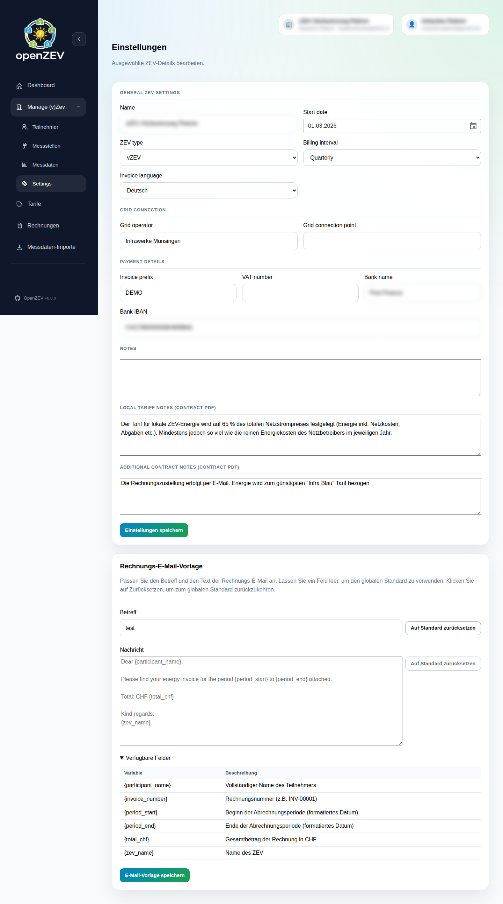

# ZEV Setup and Configuration

This guide covers creating and configuring a ZEV energy community in OpenZEV.

## What is a ZEV?

A ZEV (or vZEV) is a virtual energy community:
- Members (participants) share local energy production
- Energy is allocated fairly using a timestamp-level allocation model
- Billing is transparent and community-auditable

OpenZEV supports operating one or many ZEVs, each with independent:
- Participants
- Metering points
- Tariffs
- Invoicing schedules

There are two types:
- **ZEV** — Zusammenschluss zum Eigenverbrauch (physical self-consumption community)
- **vZEV** — Virtueller Zusammenschluss zum Eigenverbrauch (virtual self-consumption community)

## Creating a ZEV

There are two ways to create a ZEV:

### Option A: Self-Registration (ZEV Owner)

New ZEV owners can register themselves and create their ZEV without admin involvement.

**Step 1: Register on the login page**

1. Go to the login page
2. In the **Register** panel on the right, click **Register as ZEV Owner**
3. In the modal, enter:
   - **Username** — Your login username
   - **Email** — Your email address (used for verification)
4. Click **Register**
5. A verification email is sent to your address

**Step 2: Verify your email**

1. Open the verification email ("Verify your OpenZEV account")
2. Click the verification link (valid for 24 hours)
3. You are redirected to the setup wizard

**Step 3: Set your password (Step 1 of 2)**

1. Enter a new password (minimum 8 characters)
2. Confirm the password
3. Click **Continue**

**Step 4: Create your ZEV (Step 2 of 2)**

1. Fill in the ZEV details:
   - **ZEV Name** — Community identifier (required)
   - **Start Date** — When the ZEV begins operation (defaults to today)
   - **ZEV Type** — `ZEV` or `vZEV`
   - **Billing Interval** — Monthly, quarterly, semi-annual, or annual
   - **Grid Operator** — Your VNB name (optional)
2. Click **Create ZEV**
3. You are redirected to the dashboard as the owner of your new ZEV

> **Note:** Self-registration creates the account with the `zev_owner` role. Each self-registered owner can create exactly one ZEV via this flow.

### Option B: Admin-Created ZEV (with Owner Wizard)

Admins can create a ZEV together with a new owner account in a single step. See [Admin Console → ZEV Management](14-admin-console.md#zev-management) for details.

## ZEV Settings

**ZEV Owners** configure their community in **ZEV Settings** (accessible from the sidebar).

### General Settings

The settings form is organized into sections:

#### Basic Information

| Setting | Purpose | Required |
| --- | --- | --- |
| **Name** | Community identifier | Yes |
| **Start Date** | When the ZEV begins operation | Yes |
| **ZEV Type** | `ZEV` or `vZEV` | Yes |
| **Billing Interval** | Invoice frequency | Yes |
| **Invoice Language** | Language for generated PDFs (de/fr/it/en) | Yes |

#### Grid Information

| Setting | Purpose | Required |
| --- | --- | --- |
| **Grid Operator** | VNB name (Verteilnetzbetreiber) | No |
| **Grid Connection Point** | Verknüpfungspunkt / EAN identifier | No |

#### Billing & Payment

| Setting | Purpose | Required |
| --- | --- | --- |
| **Invoice Prefix** | Prefix for invoice numbers (default: `INV`) | No |
| **VAT Number** | Swiss UID — enables VAT on invoices | No |
| **Bank Name** | Bank name for QR-Rechnung | No |
| **Bank IBAN** | IBAN for QR-Rechnung | No |

#### Notes

| Setting | Purpose |
| --- | --- |
| **Notes** | General notes about the ZEV |
| **Local Tariff Notes** | Free-text conditions for local tariff (appears on contract PDF) |
| **Additional Contract Notes** | Extra text for participation contract PDF |

### Billing Interval

Choose how often invoices are generated:

- **Monthly** — One invoice per month
- **Quarterly** — One invoice per 3 months
- **Semi-Annual** — One invoice every 6 months
- **Annual** — One invoice per year

> **Tip:** Monthly is most common for community billing; annual works for smaller communities or cooperatives with annual settlements.

### VAT Configuration

If your ZEV is VAT-registered:

1. Enter your **VAT Number** (UID format) in ZEV Settings
2. Ask an admin to configure VAT rates — see [Admin Console → VAT Settings](14-admin-console.md#vat-settings)

If no VAT number is set on the ZEV, or no VAT rate is active for an invoice period, VAT defaults to **0%**.

### Email Templates

**ZEV Owners** can customize invoice email templates in **ZEV Settings → Email Templates**:

- **Subject line** — Email subject sent with invoices
- **Email body** — Message body sent with invoice PDF attachment

Both fields support variable placeholders:

| Placeholder | Replaced With |
| --- | --- |
| `{invoice_number}` | Invoice number |
| `{zev_name}` | Community name |
| `{participant_name}` | Recipient full name |
| `{period_start}` | Billing period start date |
| `{period_end}` | Billing period end date |
| `{total_chf}` | Invoice total in CHF |

Leave fields blank to use the system defaults. If a template contains an invalid placeholder, the system falls back to defaults automatically.

For more details on email delivery, see [Email Configuration](10-email-configuration.md). For system-wide default email templates managed by admins, see [Admin Console → Email Templates](14-admin-console.md#email-templates).

## Access Control

ZEV access is controlled via **role assignments**:

| Role | Access |
| --- | --- |
| **Admin** | Global access to all ZEVs, users, and settings |
| **ZEV Owner** | Full operational management of owned ZEV(s) |
| **Participant** | Read-only access to own metering data and invoices |

Admins manage user accounts in **Admin → Accounts**.

Participants automatically see only their own metering data and invoices (ZEV-scoped access).

## Data Ownership and Privacy

- All metering data is scoped to the ZEV — participants cannot see other participants' readings
- Invoices are private to their recipient and ZEV owners
- Admins have global read access for monitoring and compliance

## Multi-ZEV Operations

If running multiple ZEVs:

1. **Global navigation:** Use the ZEV selector in the top navigation bar
2. **Each ZEV is independent:** Tariffs, participants, and invoices are isolated
3. **Owners can manage one or more ZEVs:** Admin can assign ownership of additional ZEVs

## Next Steps

- **Add participants:** [Managing Participants](03-participant-management.md)
- **Configure metering points:** [Metering Points](04-metering-points.md)
- **Import readings:** [Metering Data Import](05-metering-import.md)
- **Set up tariffs:** [Tariff Configuration](07-tariff-configuration.md)
- **Email setup:** [Email Configuration](10-email-configuration.md)
