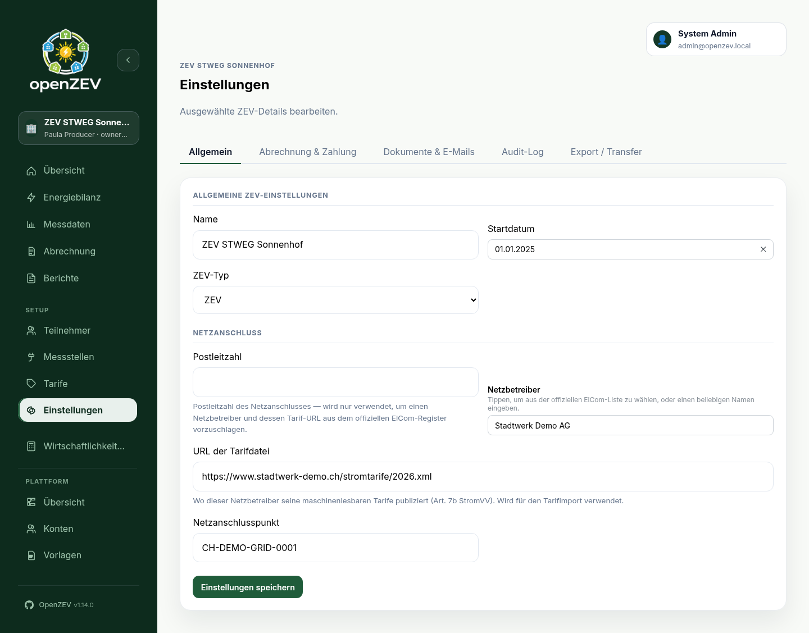
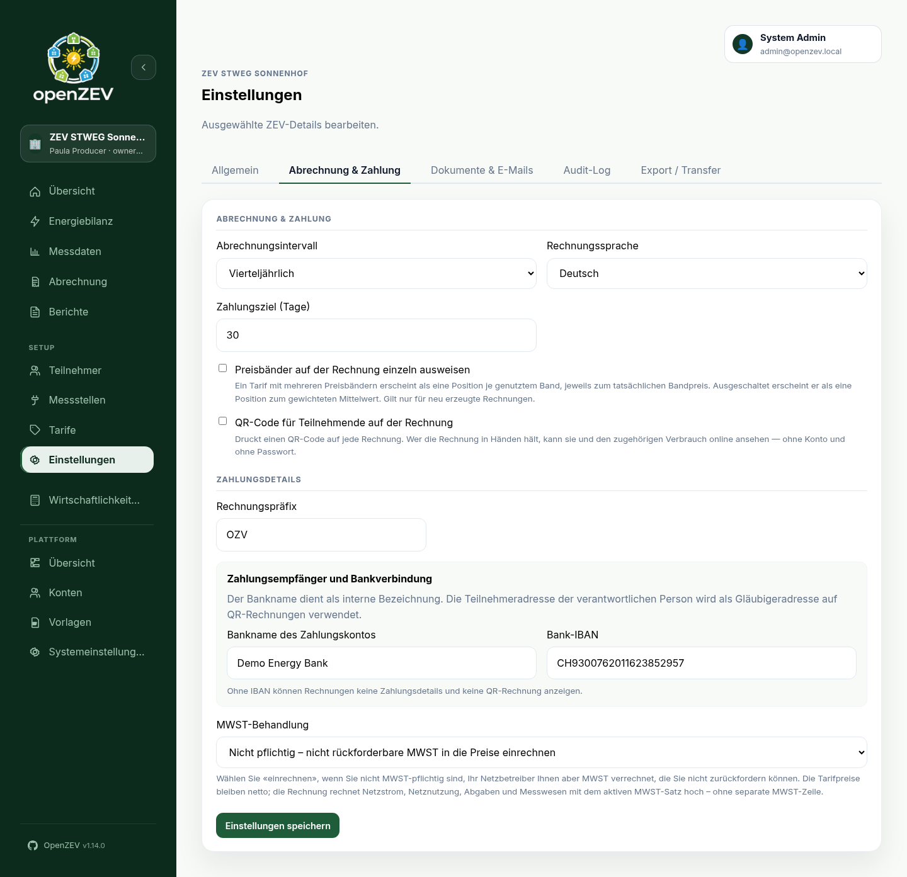

# ZEV Setup and Configuration

This guide covers creating and configuring a ZEV energy community in OpenZEV.

## What is a ZEV?

A ZEV (or vZEV) is a virtual energy community:
- Members (participants) share local energy production
- Energy is allocated fairly using a timestamp-level allocation model
- Billing is transparent and community-auditable

OpenZEV supports operating one or many ZEVs, each with independent:
- Participants
- Metering points
- Tariffs
- Invoicing schedules

There are two types:
- **ZEV** — Zusammenschluss zum Eigenverbrauch (physical self-consumption community)
- **vZEV** — Virtueller Zusammenschluss zum Eigenverbrauch (virtual self-consumption community)

## Creating a ZEV

There are two ways to create a ZEV:

### Option A: Self-Registration (ZEV Owner)

New ZEV owners can register themselves and create their ZEV without admin involvement.

**Step 1: Register on the login page**

1. Go to the login page
2. In the **Register** panel on the right, click **Register as ZEV Owner**
3. In the modal, enter:
   - **Username** — Your login username
   - **Email** — Your email address (used for verification)
4. Click **Register**
5. A verification email is sent to your address

**Step 2: Verify your email**

1. Open the verification email ("Verify your OpenZEV account")
2. Click the verification link (valid for 24 hours)
3. You are redirected to the setup wizard

**Step 3: Set your password (Step 1 of 2)**

1. Enter a new password (minimum 8 characters)
2. Confirm the password
3. Click **Continue**

**Step 4: Create your ZEV (Step 2 of 2)**

1. Fill in the ZEV details:
   - **ZEV Name** — Community identifier (required)
   - **Start Date** — When the ZEV begins operation (defaults to today)
   - **ZEV Type** — `ZEV` or `vZEV`
   - **Billing Interval** — Monthly, quarterly, semi-annual, or annual
   - **Grid Operator** — Your VNB name (optional)
2. Click **Create ZEV**
3. You are redirected to the dashboard as the owner of your new ZEV

> **Note:** Self-registration creates the account with the `zev_owner` role. Each self-registered owner can create exactly one ZEV via this flow.

### Option B: Admin-Created ZEV (with Owner Wizard)

Admins can create a ZEV together with a new owner account in a single step. See [Platform → Overview → ZEVs](14-admin-console.md#zev-management) for details.

## ZEV Settings

**ZEV Owners** configure their community in **ZEV Settings** (sidebar entry
**Setup → Settings**, `/zev-settings`). The settings are organized into tabs:

- **General** — name, start date, ZEV type, grid connection
- **Billing & payment** — billing interval, invoice language, payment terms,
  invoice prefix, VAT, bank details
- **Documents & emails** — invoice email template, contract/tariff notes
- **Audit log** — this ZEV's audit events (see
  [Audit Logs](14-admin-console.md#audit-logs))
- **Export / transfer** — whole-ZEV export archive (see
  [ZEV Transfer](../specs/2026-08-zev-transfer-archive.md))



### General Settings

The General and Billing & payment tabs hold the settings form sections:

#### Basic Information

| Setting | Purpose | Required |
| --- | --- | --- |
| **Name** | Community identifier | Yes |
| **Start Date** | When the ZEV begins operation | Yes |
| **ZEV Type** | `ZEV` or `vZEV` | Yes |
| **Billing Interval** | Invoice frequency | Yes |
| **Invoice Language** | Language for generated PDFs (de/fr/it/en) | Yes |
| **Itemise price bands on the invoice** | Show each price band of a multi-band tariff as its own line (see below) | No |

#### Grid Information

| Setting | Purpose | Required |
| --- | --- | --- |
| **Grid Operator** | VNB name (Verteilnetzbetreiber) | No |
| **Tariff document URL** | Where this operator publishes its machine-readable tariffs (Art. 7b StromVV). Used by the [tariff import](07-tariff-configuration.md#importing-tariffs-from-your-grid-operator) | No |
| **Grid Connection Point** | Verknüpfungspunkt / EAN identifier | No |

#### Billing & Payment



| Setting | Purpose | Required |
| --- | --- | --- |
| **Invoice Prefix** | Prefix for invoice numbers (default: `INV`) | No |
| **VAT treatment** | How VAT is applied when billing participants (see below) | No |
| **VAT Number** | Swiss UID — shown only when VAT treatment is *VAT-registered* | If registered |
| **Bank Name** | Bank name for QR-Rechnung | No |
| **Bank IBAN** | IBAN for QR-Rechnung | No |

#### Notes

| Setting | Purpose |
| --- | --- |
| **Notes** | General notes about the ZEV |
| **Local Tariff Notes** | Free-text conditions for local tariff (appears on contract PDF) |
| **Additional Contract Notes** | Extra text for participation contract PDF |

### Billing Interval

Choose how often invoices are generated:

- **Monthly** — One invoice per month
- **Quarterly** — One invoice per 3 months
- **Semi-Annual** — One invoice every 6 months
- **Annual** — One invoice per year

> **Tip:** Monthly is most common for community billing; annual works for smaller communities or cooperatives with annual settlements.

### VAT Configuration

**VAT treatment** has three options:

- **Not VAT-registered** (default) — tariff prices are billed exactly as you
  entered them. No VAT line appears. Use this when the prices you entered are
  already the final amounts your participants should pay.

- **VAT-registered** — enter your **VAT Number** (UID format), and ask an admin
  to configure VAT rates ([Platform → VAT Settings](14-admin-console.md#vat-settings)).
  Tariff prices are treated as net; the invoice adds the active rate on top and
  shows a VAT line. You reclaim the VAT you pay upstream in your own VAT return.

- **Not registered — fold VAT into prices** — for the common case of a small
  ZEV that is *not* registered but whose grid operator invoices it **with VAT
  it cannot reclaim**. Enter tariff prices net, exactly as the operator
  publishes them (this is also what the [tariff import](07-tariff-configuration.md#importing-tariffs-from-your-grid-operator)
  writes). At invoice time OpenZEV grosses up grid energy, grid fees, levies
  and metering by the active VAT rate. Your own local (solar) energy and the
  feed-in credit are left untouched. No VAT line appears — a non-registered
  issuer must not show one — but the amounts billed are gross, so you recover
  what the operator charged you. The folded-in VAT is recorded per invoice for
  your bookkeeping.

  An admin still has to configure the VAT rate for this to take effect; with no
  active rate, prices are billed unchanged.

### Price bands on the invoice

A tariff can carry several price bands — peak and off-peak, a weekend rate, a
different winter price. By default such a tariff appears on the invoice as
**one line**, priced at the average of the bands your participant actually
used, weighted by how much they used in each.

That average is nobody's published rate. It also differs from participant to
participant: someone who runs their washing machine at night gets a lower
figure than their neighbour, from the same tariff. Neither can check the
invoice against the tariff sheet they were given.

Tick **Itemise price bands on the invoice** and each band that was used gets
its own line at its own rate:

```
Netznutzung – HT (Hochtarif)    412.0000 kWh × 0.28400   117.01
Netznutzung – NT (Niedertarif)  638.0000 kWh × 0.19100   121.86
```

The bands are named the way your participation contracts name them, so the two
documents agree.

The invoice costs exactly the same either way — a tariff's total is worked out
first and then divided across its band lines, never the other way round. A
tariff with only one band is never split.

Fixed monthly and yearly fees are not affected: they have no bands. Neither
are percentage-of-energy tariffs, whose price comes from the grid rate rather
than from a band of their own.

This changes invoices **generated from now on**. Invoices you have already
generated are left exactly as they are; regenerate one (only possible while it
is still a draft) if you want it in the new shape.

If no VAT rate is active for an invoice period, VAT defaults to **0%** in every mode.

### Participant Access from the Invoice

Off by default, and **no upgrade turns it on for you**.

Tick **Participant QR code on the invoice** under **Manage (v)ZEV → Settings → General ZEV Settings** and every invoice you generate from then on carries a second QR code on its insights page. Scanning it opens that one invoice — the total, whether it is paid, the line items, the consumption figures and the same three charts the insights page prints — with no account and no password.

The setting changes invoices **generated from now on**. Invoices already generated keep whatever they were printed with.

What the QR deliberately cannot do: reach any other invoice, name any other participant beyond what the energy-flow diagram already prints on the same sheet, or change anything.

Two things to know before turning it on:

- **The link never expires.** It is printed on a document that sits in a folder for years, and a link that dies underneath it is a support ticket rather than a security control. Revoking is the control — see [Invoice Management → Participant access links](09-invoice-management.md#participant-access-links).
- **Anyone holding the invoice can open it.** That is the design: the page shows nothing the printed page does not already show. But it does mean a photographed or mis-delivered invoice is readable by whoever has it, until you revoke the link.

The QR sits on the insights page and never on a sheet carrying the QR-Rechnung, so the two codes cannot be confused; it is smaller and captioned "this is not a payment code" in all four languages. An invoice with no consumption gets no QR, because there would be nothing to show.

From the page, **Send me a sign-in link** emails a one-time link to the address you have on file for that participant, which opens the ordinary participant portal. The requester never gets to say where it goes — the invoice identifies them — and nobody sets a password at any point.

### Email Templates

**ZEV Owners** can customize invoice email templates in **ZEV Settings → Documents & emails**:

- **Subject line** — Email subject sent with invoices
- **Email body** — Message body sent with invoice PDF attachment

Both fields support variable placeholders such as `{invoice_number}`, `{zev_name}`, `{participant_name}`, `{period_start}`, `{period_end}`, and `{total_chf}`. See [Email Configuration → Email Templates](10-email-configuration.md#email-templates) for the full variable reference.

Leave fields blank to use the system defaults. If a template contains an invalid placeholder, the system falls back to defaults automatically.

For more details on email delivery, see [Email Configuration](10-email-configuration.md). For system-wide default email templates managed by admins, see [Platform → Templates → Email templates](14-admin-console.md#email-templates).

## Access Control

ZEV access is controlled via **role assignments**:

| Role | Access |
| --- | --- |
| **Admin** | Global access to all ZEVs, users, and settings |
| **ZEV Owner** | Full operational management of owned ZEV(s) |
| **Participant** | Read-only access to own metering data and invoices |

Admins manage user accounts in **Admin → Accounts**.

Participants automatically see only their own metering data and invoices (ZEV-scoped access).

## Data Ownership and Privacy

- All metering data is scoped to the ZEV — participants cannot see other participants' readings
- Invoices are private to their recipient and ZEV owners
- Admins have global read access for monitoring and compliance

## Multi-ZEV Operations

If running multiple ZEVs:

1. **ZEV switcher:** Use the ZEV switcher at the top of the sidebar (top-left); the selected community is also shown above the page title on every page. Under Platform pages (`/admin/*`) the switcher is replaced by the **Platform administration** indicator — enter a ZEV via **Platform → Overview → ZEVs → Manage** instead
2. **Each ZEV is independent:** Tariffs, participants, and invoices are isolated
3. **Owners can manage one or more ZEVs:** Admin can assign ownership of additional ZEVs

## Next Steps

- **Add participants:** [Managing Participants](03-participant-management.md)
- **Configure metering points:** [Metering Points](04-metering-points.md)
- **Import readings:** [Metering Imports](05-metering-import.md)
- **Set up tariffs:** [Tariff Configuration](07-tariff-configuration.md)
- **Email setup:** [Email Configuration](10-email-configuration.md)
