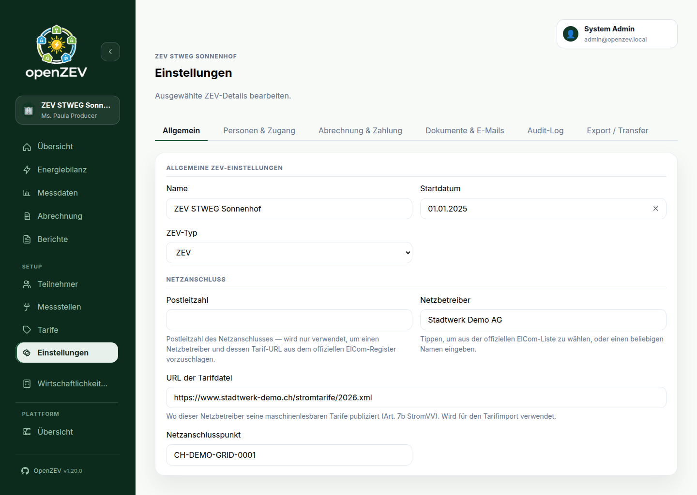
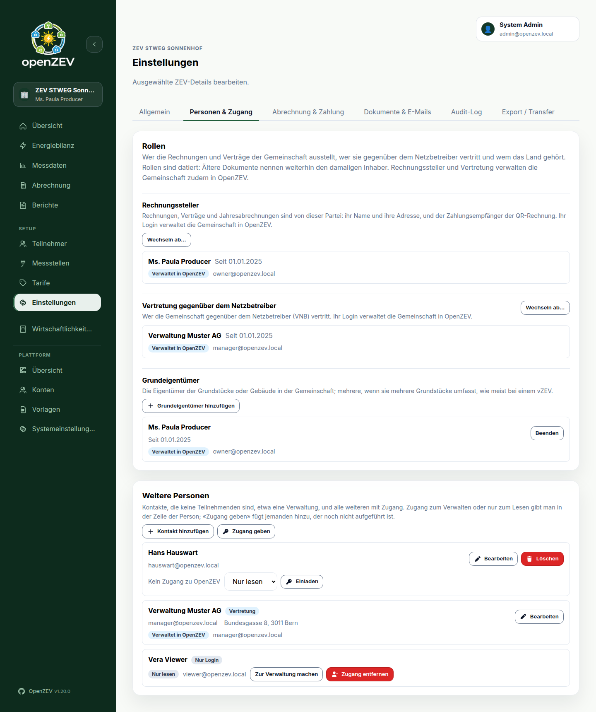
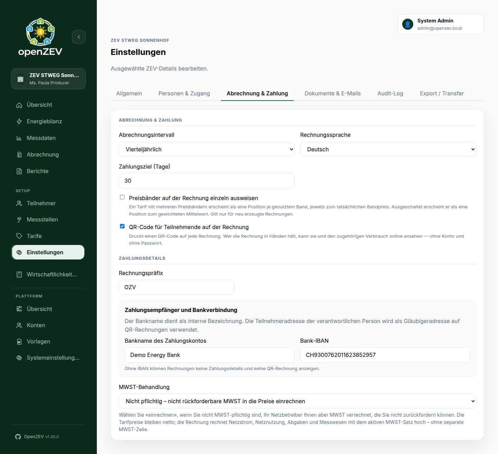
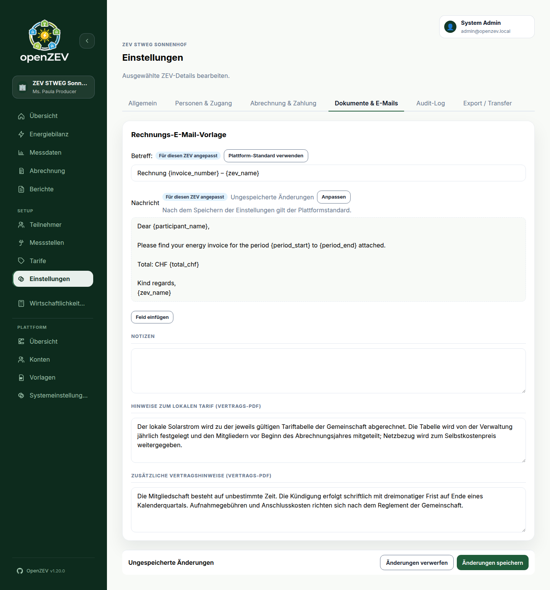

# ZEV Setup and Configuration

This guide covers creating and configuring a ZEV energy community in OpenZEV.

## What is a ZEV?

A ZEV or vZEV is a self-consumption community under Swiss energy law:
- Members (participants) share locally produced solar energy
- Energy is allocated fairly using a timestamp-level allocation model
- Billing is transparent and community-auditable

OpenZEV supports operating one or many ZEVs, each with independent:
- Participants
- Metering points
- Tariffs
- Invoicing schedules

There are two types:
- **ZEV** — Zusammenschluss zum Eigenverbrauch: the members sit behind one shared grid connection
- **vZEV** — virtueller Zusammenschluss zum Eigenverbrauch: the members keep their own grid connections and are combined through the grid operator's meters

## Creating a ZEV

There are two ways to create a ZEV:

### Option A: Self-Registration { #option-a-self-registration }

New users can register themselves and create their ZEV without admin involvement.

**Step 1: Register on the login page**

1. Go to the login page
2. In the **New to OpenZEV?** panel on the right, click **Create account**
3. In the modal, enter your **Email address** — it is your sign-in name
4. Click **Request verification link**

The page shows the same confirmation for every valid address. A registration
that was never completed receives a new verification link (at most one mail per
address every 15 minutes, with immediate retry after a failed send if the cache
is available); established accounts receive no registration email.

The panel is shown only while self-registration is enabled (an admin can turn
it off under **Platform → Settings → Functions**).

**Step 2: Verify your email**

1. Open the verification email ("Verify your OpenZEV account")
2. Click the verification link (valid for 24 hours)
3. You are redirected to the setup wizard

**Step 3: Set your password (Step 1 of 2)**

1. Enter a new password (minimum 8 characters)
2. Confirm the password
3. Click **Set password & continue**

**Step 4: Create your ZEV (Step 2 of 2)**

1. Fill in the ZEV details:
   - **ZEV Name** — Community identifier (required)
   - **Start Date** — When the ZEV begins operation (defaults to today)
   - **ZEV Type** — `ZEV` or `vZEV`
   - **Billing Interval** — Monthly, quarterly, semi-annual, or annual
   - **Postal Code** — Postal code of the grid connection (optional); suggests
     the grid operator below from ElCom's official register
   - **Grid Operator** — Your VNB name (optional)
   - **Payment recipient address** — your address, printed as the QR-Rechnung creditor
   - **Bank Name** — Bank holding the payment account (optional)
   - **Bank IBAN** — Account receiving participant payments (optional; required for QR payment details)
2. Click **Create ZEV & finish**
3. You are redirected to the dashboard as the issuer and manager of your new ZEV

> **Note:** A self-registered account may set up a ZEV of its own, and becomes its manager. It can create one ZEV this way; to run more, an admin creates them or another manager gives access.
>
> The IBAN belongs to the account that receives participant payments. If you enter one, provide the payment recipient's address as well so QR-Rechnungen can be generated. Skipping it leaves invoices without payment details until you add it under **Billing & payment** in ZEV Settings.

### Option B: Admin-Created ZEV (with Responsible Person Wizard)

Admins can create a ZEV together with a new responsible-person account in a single wizard. See [Platform → Overview → ZEVs](14-admin-console.md#zev-management) for details.

## ZEV Settings

**Managers** configure their community in **ZEV Settings** (sidebar entry
**Setup → Settings**, `/zev-settings`). The settings are organized into tabs:

- **General** — name, start date, ZEV type, grid connection
- **People & access** — who issues the invoices, who represents the ZEV toward
  the grid operator, the landowners, who may manage or view the ZEV, and other
  contacts (see [People & access tab](#people-and-access-tab))
- **Billing & payment** — billing interval, invoice language, payment term,
  invoice presentation, participant QR code, invoice prefix, bank details, VAT
- **Documents & emails** — invoice email template, notes, contract notes
- **Audit log** — this ZEV's audit events (see
  [Audit Logs](14-admin-console.md#audit-logs))
- **Export / transfer** — whole-ZEV export archive (see
  [ZEV Export and Import](17-zev-transfer.md))



One save bar serves every tab. Switching tabs keeps your edits; **Save changes**
checks all settings and opens the first invalid field. Switching communities
or leaving settings asks for confirmation while edits are unsaved.

### General tab

#### General ZEV Settings

| Setting | Purpose | Required |
| --- | --- | --- |
| **Name** | Community identifier | Yes |
| **Start date** | When the ZEV begins operation | Yes |
| **ZEV type** | `ZEV` or `vZEV` | Yes |

#### Grid Connection

In **Grid Connection**, each field's guidance appears directly beneath it.

| Setting | Purpose | Required |
| --- | --- | --- |
| **Postal Code** | Postal code of the grid connection. Used only to suggest a grid operator and its tariff document URL from the official ElCom register — see below | No |
| **Grid Operator** | VNB name (Verteilnetzbetreiber) | No |
| **Tariff document URL** | Where this operator publishes its machine-readable tariffs (Art. 7b StromVV). Used by the [tariff import](07-tariff-configuration.md#importing-tariffs-from-your-grid-operator) | No |
| **Grid Connection Point** | Verknüpfungspunkt / EAN identifier | No |

> **Tip:** Enter a **Postal Code** and OpenZEV suggests the grid operator that
> serves it, sourced from ElCom's official register. Click the suggestion to
> fill in **Grid Operator**. If that operator has a registered tariff
> document URL, a second suggestion offers to fill in **Tariff document
> URL** too — but only after **Test this URL** confirms the address actually
> serves a tariff document. Operators sometimes move the file without
> ElCom's copy being updated, so an untested suggestion is never saved
> automatically, and an address you already entered is never overwritten.

### People & access tab { #people-and-access-tab }

**People & access** shows, on one page, who the community deals with and what
each of them may do in OpenZEV — on the same row: whether a person manages
the community, can only read, or has no access, and the buttons to change it.
It has two parts: **Roles** and **Other people**. Viewers see the tab but
change nothing.



#### Roles

Every role has a start date (and, once it ends, an end date), so documents
always name whoever held a role on their own date:

| Role | What it does | Which date counts |
|---|---|---|
| **Issuer** | Invoices, contracts and annual statements are from this party: its name and address head the document, and it is the creditor on the QR bill. Its login manages the community | An invoice: the last day of its period. A contract: the day it is issued. An annual statement: 31 December |
| **Representative toward the grid operator** | Who acts for the community toward the grid operator (VNB). Its login manages the community | — |
| **Landowners** | The owners of the plots or buildings in the community — several when it spans several plots, as a vZEV usually does. Each landowner can be linked to the [building](04-metering-points.md#buildings) it owns | — |

- **Change from…** on the issuer or the representative picks a party and a
  date. The current holder ends the day before. Invoices for earlier periods
  keep naming the earlier issuer, and an invoice that is already approved never
  changes.
- **The issuer and the representative manage the community.** While a party
  holds one of these roles, its login — its own, or the one of its participant
  entry — has manager access, shown on its row (see
  [Access on each row](#access-on-each-row)), and loses it when the role ends. Before a change takes
  effect, a confirmation names the login that gets access, or says that nobody
  does because the party has no login. A change that would leave the community
  without any manager is refused: give someone manager access first.
- **Landowners get no access** through their role: a landowner does not see
  other participants' data.
- Without an issuer, documents carry only the community's name. The page says
  so until one is set.
- **Add landowner** adds a party from a date, optionally with the building it
  owns; **Set building** / **Change building** on a landowner's row links or
  re-links it, and **End** sets a landowner's last day. A party that owns two
  buildings has two landowner rows. Ending a role before it started removes
  it.
- Whoever a ZEV is created for — through self-registration or the admin
  wizard — is its issuer and a landowner from the start date, and manages it
  through the issuer role. A ZEV that starts later gives them manager access
  until the start date, so they can set it up beforehand.

#### Access on each row

Every person on the tab shows its access to OpenZEV on its own row:

- **Issuer and representative** — **Manages in OpenZEV** with the login, for
  as long as the role lasts; that access changes with the role. A holder
  without a login says so, and **Invite** sends it an invitation to set one up
  (as manager).
- **Landowners and other people** — **Manage** or **Read only** with the
  login, or **No access to OpenZEV**. Without access, choose **Manage** or
  **Read only** and press **Give access** (or **Invite**, when the person has
  no login yet — the invitation goes to the email address on the person).
  With access: **Make manager** / **Make viewer** (making a manager a viewer
  asks for confirmation), **Resend invitation** for an invitation that has not
  been accepted, and **Remove access**, after a confirmation.

**Invitation pending** marks a login that has not been set up yet. A ZEV
always keeps at least one manager — by access or through a role. Removing the
last one, or making them a viewer, is refused, and so is anything else that
would take the last manager away: ending or handing over the issuer role,
unlinking the account of the issuer's participant, deleting that participant,
or deleting the account. Give someone else manager access first. Every change
is recorded in the ZEV's audit log.

#### Other people

**Other people** lists the contacts that are not participants — such as a
property management company that represents the community — and everyone else
who has access: a participant given read-only access, or a login added by email
(a bookkeeper). **Add contact** creates a contact (a person, or an organisation
with a contact person); a contact that holds no role and has no access can be
deleted. In a role's party picker, **New contact…** creates one on the spot.

**Give access** in the header adds someone who is not listed yet: pick a
**party of the community** or enter an **email address**, choose **Manage** or
**Read only** and, if the access should end, a last day. Someone with an
OpenZEV login gets access straight away and a notice by email; anyone else
gets an invitation email to set up their account — a party at its own email
address, after which the new login belongs to that party.

### Billing & payment tab



#### Billing & Payment

| Setting | Purpose | Required |
| --- | --- | --- |
| **Billing interval** | Invoice frequency (see below) | Yes |
| **Invoice language** | Language for generated PDFs (de/fr/it/en) | Yes |
| **Payment term (days)** | Days from the issue date until payment is due (default 30, 1–365) | Yes |
| **Itemise price bands on the invoice** | Show each price band of a multi-band tariff as its own line (see [below](#price-bands-on-the-invoice)) | No |
| **Participant QR code on the invoice** | Print a QR code that opens the invoice online (see [below](#participant-access-from-the-invoice)) | No |

#### Payment Details

| Setting | Purpose | Required |
| --- | --- | --- |
| **Invoice prefix** | Prefix for invoice numbers (default: `INV`); 1–10 uppercase letters, digits or hyphens | No |
| **Bank name** | Internal reference for the payment account | No |
| **Bank IBAN** | Account participants pay into; without it invoices carry no payment details or QR payment slip | No |
| **VAT treatment** | How VAT is applied when billing participants (see [below](#vat-configuration)) | No |
| **VAT number** | Swiss UID — shown only when VAT treatment is *VAT-registered* | If registered |

The QR-Rechnung creditor address is the address of the ZEV's responsible
person, taken from their participant record.

### Documents & emails tab

The invoice email template (see [Email Templates](#email-templates) below)
and these free-text fields:

| Setting | Purpose |
| --- | --- |
| **Notes** | General notes about the ZEV |
| **Local Tariff Notes** | Free-text conditions for local tariff (appears on contract PDF) |
| **Additional Contract Notes** | Extra text for participation contract PDF |

### Billing Interval

Choose how often invoices are generated:

- **Monthly** — One invoice per month
- **Quarterly** — One invoice per 3 months
- **Semi-Annual** — One invoice every 6 months
- **Annual** — One invoice per year

> **Tip:** Monthly is most common for community billing; annual works for smaller communities or cooperatives with annual settlements.

### VAT Configuration

**VAT treatment** has three options:

- **Not VAT-registered** (default) — tariff prices are billed exactly as you
  entered them. No VAT line appears. Use this when the prices you entered are
  already the final amounts your participants should pay.

- **VAT-registered** — enter your **VAT Number** (UID format), and ask an admin
  to configure VAT rates ([Platform → Settings → VAT](14-admin-console.md#vat-settings)).
  Tariff prices are treated as net; the invoice adds the active rate on top and
  shows a VAT line. You reclaim the VAT you pay upstream in your own VAT return.

- **Not registered — fold VAT into prices** — for the common case of a small
  ZEV that is *not* registered but whose grid operator invoices it **with VAT
  it cannot reclaim**. Enter tariff prices net, exactly as the operator
  publishes them (this is also what the [tariff import](07-tariff-configuration.md#importing-tariffs-from-your-grid-operator)
  writes). At invoice time OpenZEV grosses up grid energy, grid fees, levies
  and metering by the active VAT rate. Your own local (solar) energy and the
  feed-in credit are left untouched. No VAT line appears — a non-registered
  issuer must not show one — but the amounts billed are gross, so you recover
  what the operator charged you. The folded-in VAT is recorded per invoice for
  your bookkeeping.

  An admin still has to configure the VAT rate for this to take effect; with no
  active rate, prices are billed unchanged.

If no VAT rate is active for an invoice period, VAT defaults to **0%** in every mode.

### Price bands on the invoice

A tariff can carry several price bands — peak and off-peak, a weekend rate, a
different winter price. By default such a tariff appears on the invoice as
**one line**, priced at the average of the bands your participant actually
used, weighted by how much they used in each.

That average is nobody's published rate. It also differs from participant to
participant: someone who runs their washing machine at night gets a lower
figure than their neighbour, from the same tariff. Neither can check the
invoice against the tariff sheet they were given.

Tick **Itemise price bands on the invoice** and each band that was used gets
its own line at its own rate:

```
Netznutzung – HT (Hochtarif)    412.0000 kWh × 0.28400   117.01
Netznutzung – NT (Niedertarif)  638.0000 kWh × 0.19100   121.86
```

The bands are named the way your participation contracts name them, so the two
documents agree.

The invoice costs exactly the same either way — a tariff's total is worked out
first and then divided across its band lines, never the other way round. A
tariff with only one band is never split.

Fixed monthly and yearly fees are not affected: they have no bands. Neither
are percentage-of-energy tariffs, whose price comes from the grid rate rather
than from a band of their own.

This changes invoices **generated from now on**. Invoices you have already
generated are left exactly as they are; regenerate one (only possible while it
is still a draft) if you want it in the new shape.

### Participant Access from the Invoice

Off by default, and **no upgrade turns it on for you**.

Tick **Participant QR code on the invoice** under **Settings → Billing & payment** and every invoice you generate from then on carries a second QR code on its insights page. Scanning it opens that one invoice — the total, whether it is paid, the line items, the consumption figures and the same three charts the insights page prints — with no account and no password.

The setting changes invoices **generated from now on**. Invoices already generated keep whatever they were printed with.

What the QR deliberately cannot do: reach any other invoice, name any other participant beyond what the energy-flow diagram already prints on the same sheet, or change anything.

Two things to know before turning it on:

- **The link never expires.** It is printed on a document that sits in a folder for years, and a link that dies underneath it is a support ticket rather than a security control. Revoking is the control — see [Invoice Management → Participant access links](09-invoice-management.md#participant-access-links).
- **Anyone holding the invoice can open it.** That is the design: the page shows nothing the printed page does not already show. But it does mean a photographed or mis-delivered invoice is readable by whoever has it, until you revoke the link.

The QR sits on the insights page and never on a sheet carrying the QR-Rechnung, so the two codes cannot be confused; it is smaller and captioned "this is not a payment code" in all four languages. An invoice with no consumption gets no QR, because there would be nothing to show.

From the page, **Send me a sign-in link** emails a one-time link to the address you have on file for that participant, which opens the ordinary participant portal. The requester never gets to say where it goes — the invoice identifies them — and nobody sets a password at any point.

### Email Templates

**Managers** can customize invoice email templates in **ZEV Settings → Documents & emails**:



- **Subject line** — Email subject sent with invoices
- **Email body** — Message body sent with invoice PDF attachment

Both fields support variable placeholders such as `{invoice_number}`, `{zev_name}`, `{participant_name}`, `{period_start}`, `{period_end}`, and `{total_chf}`. See [Email Configuration → Email Templates](10-email-configuration.md#email-templates) for the full variable reference.

Subject and body can inherit the platform template or use your own text
independently. Their badges show the saved choice; **Unsaved changes** marks a
staged edit. **Use platform default** takes effect after **Save changes**. See
[Email Configuration](10-email-configuration.md#email-templates) for details.

If a template contains an invalid placeholder, the system falls back to defaults automatically.

For more details on email delivery, see [Email Configuration](10-email-configuration.md). For system-wide default email templates managed by admins, see [Platform → Templates → Email templates](14-admin-console.md#email-templates).

## Access Control

Access to a ZEV is given per community:

| Relation | Access |
| --- | --- |
| **Admin** | Global access to all ZEVs, users, and settings |
| **Manager** | Full operational management of this ZEV (whoever created it manages it as its issuer) |
| **Viewer** | Sees everything a manager sees, may download and export, changes nothing |
| **Participant** | Read-only access to own metering data and invoices |

Who may manage or view a ZEV is set on the
[People & access tab](#people-and-access-tab).

Admins manage user accounts in **Platform → Accounts**.

Participants automatically see only their own metering data and invoices (ZEV-scoped access).

## Data Ownership and Privacy

- All metering data is scoped to the ZEV — participants cannot see other participants' readings
- Invoices are private to their recipient and the community's managers and viewers
- Admins have global read access for monitoring and compliance

## Multi-ZEV Operations

If running multiple ZEVs:

1. **Choosing the ZEV:** The selected community is named above the page title on every page; click the name (it has a small arrow when you have more than one community) and pick another from the list. Platform pages (`/admin/*`) show **Platform administration** there instead — enter a ZEV via **Platform → Overview → ZEVs → Manage**
2. **Each ZEV is independent:** Tariffs, participants, and invoices are isolated
3. **One account, several communities:** an account can manage or view several ZEVs and take part in others; the list behind the community name shows each with your relation to it

## Next Steps

- **Add participants:** [Managing Participants](03-participant-management.md)
- **Configure metering points:** [Metering Points](04-metering-points.md)
- **Import readings:** [Metering Imports](05-metering-import.md)
- **Set up tariffs:** [Tariff Configuration](07-tariff-configuration.md)
- **Email setup:** [Email Configuration](10-email-configuration.md)
