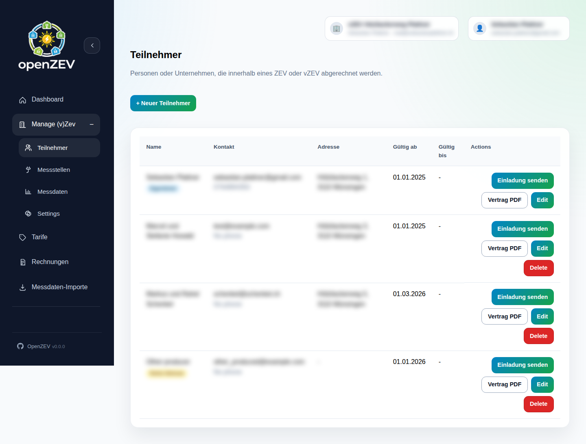

# Managing Participants

This guide covers adding, editing, and managing community members (participants) in OpenZEV.

## What is a Participant?

A **participant** is a member of a ZEV community:
- Owns one or more metering devices (metering points)
- Consumes and/or produces energy within the community
- Receives invoices based on their energy allocation
- Can view their own data and invoices in the portal

## Adding a Participant

**ZEV Owners** add new participants in **Participants**.

1. Click **Add Participant**
2. Enter participant details:
   - **First Name** and **Last Name** (required)
   - **Email Address** (used for login and invoice notifications)
   - **Company/Organization** (optional, for business participants)
   - **Phone** (optional)
   - **Address** (optional, for invoice delivery)

3. Set **Validity Period**:
   - **Valid From:** Participant entry date (defaults to today)
   - **Valid To:** Participant exit date (leave empty for ongoing)

   > **Tip:** Validity periods ensure participants are only billed during active membership.

4. Click **Create**

The participant is created and added to a participant list.

## Participant Account Access

Participants can:
- Login with their email and a password (initially set during account creation or password reset)
- View their own consumption and production data
- Download invoices
- Update their account profile

Participants **cannot**:
- See other participants' data
- Manage ZEV settings
- Create tariffs or invoices

## Editing Participant Details

1. Go to **Participants**
2. Select a participant from the list
3. Click **Edit**
4. Update fields as needed
5. Click **Save**

### Updating Validity Periods

To mark a participant as active/inactive:

- **Ongoing membership:** Leave **Valid To** blank
- **End membership:** Set **Valid To** to the last day of their invoice period

> **Important:** Changing validity dates affects future invoices only—past invoices remain unchanged.

## Viewing Participant Metering Points

From the participant detail page, you can see all assigned metering points:
- **Consumption meters** (type `IN`)
- **Production meters** (type `OUT`)
- **Bidirectional meters** (both `IN` and `OUT`)

Each meter shows:
- **Meter ID** — Equipment identifier
- **Type** — `consumption`, `production`, or `bidirectional`
- **Valid From/To** — Meter assignment period

> **See also:** [Metering Points](04-metering-points.md) for setup details.

## Removing a Participant

Participants are **never deleted**—instead, mark them inactive:

1. Go to **Participants**
2. Select the participant
3. Click **Edit**
4. Set **Valid To** to the participant's last active date
5. Click **Save**

Past invoices and data remain intact for audit trail. Future invoicing skips inactive participants.

## Participant Communication

### Initial Setup Email

When adding a participant, they can be sent an invitation email with:
- Account activation link
- Password setup instructions
- Link to their participant portal

Enable in **ZEV Settings** if needed.

### Invoice Notifications

Participants receive invoice notifications when:
- Invoice is sent (status = **Sent**)
- Invoice is paid (status = **Paid**)

Email frequency depends on your ZEV's [billing interval](02-zev-setup.md#billing-interval).

## Participant Data Retention

Participant records are kept permanently for:
- Audit trail and history
- Reproducibility of past invoices
- Regulatory compliance

**Data Privacy:** Only ZEV owners and admins can view participant details. Participants cannot see other members.

## Troubleshooting

**Participant cannot login**
- Check that participant email is correct
- Reset password via login page "Forgot Password"
- Verify participant is marked as active (**Valid To** is not in the past)

**Participant invoices are wrong**
- Check participant validity period (**Valid From/To**)
- Verify metering points are correctly assigned
- See [Metering Analysis](06-metering-analysis.md) to check data quality

**Bulk import failed**
- Check CSV column names and data types
- Ensure emails are unique and valid
- Review error messages for specific rows

## Next Steps

- **Assign metering points:** [Metering Points](04-metering-points.md)
- **Import consumption data:** [Metering Data Import](05-metering-import.md)
- **Check billing:** [How Energy Allocation Works](08-billing-allocation-explained.md)
