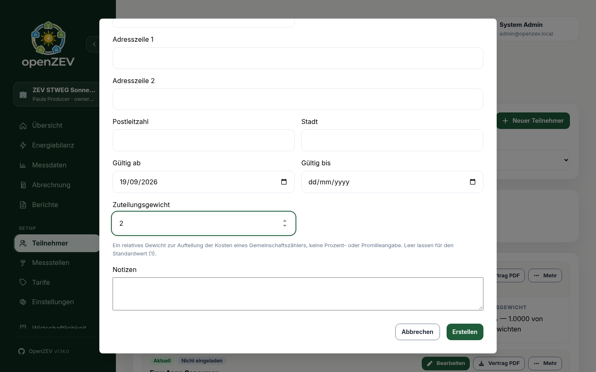

# Managing Participants

This guide covers adding, editing, and managing community members (participants) in OpenZEV.

## What is a Participant?

A **participant** is a member of a ZEV community:
- Owns one or more metering devices (metering points)
- Consumes and/or produces energy within the community
- Receives invoices based on their energy allocation
- Can view their own data and invoices in the portal


## Adding a Participant

**ZEV Owners** add new participants in **Participants**.

1. Click **New Participant**
2. Enter participant details:
   - **Title**, **First Name** and **Last Name** (first and last name required)
   - **Email** (where onboarding links and invoice emails go)
   - **Phone** (optional)
   - **Address** — address lines, postal code and city (needed on the invoice
     and for the [map](#map))
   - **Notes** (optional, internal)

3. Set **Validity Period**:
   - **Valid From:** Participant entry date (defaults to today)
   - **Valid To:** Participant exit date (leave empty for ongoing)

   > **Tip:** Validity periods ensure participants are only billed during active membership.

4. Set **Allocation Weight** (optional — leave empty for the default `1`).
   See [Allocation Weight](#allocation-weight) below.

5. Click **Save Participant**

The participant is added to the list. A card flagged **Needs attention** is
missing an email address, a postal address or a metering point; the
**Readiness** filter narrows the list to those cards.

## Participant Account Access

Participants can:
- Sign in through their onboarding link, and afterwards with their email and
  a password they choose themselves
- View their own consumption and production data
- Download invoices
- Update their account profile

Participants **cannot**:
- See other participants' data
- Manage ZEV settings
- Create tariffs or invoices

Each participant card shows the **Account** it is linked to, or *No account
yet*, plus an onboarding status badge (*Not invited*, *Invited*, *Active*,
*Revoked*, *Expired*). While a link is live — or after it has expired — the
card also shows its expiry date beside the badge, so you can see when a dead
link died without resending it. Open **More** on a card to send or copy the participant's onboarding link
(which creates the account), or to revoke it. The link stays usable for 30 days and can be
reused within that time — copying or resending it hands out the same link,
unless it has expired, in which case a fresh one is issued automatically. Once
the participant sets their own password, the link is revoked. Administrators can also **Link existing** — attach
a guest or participant account that is not yet linked to anyone — or **Unlink**
the current one. Platform → Accounts lists every account and which communities
it belongs to; see [Roles and Permissions](11-roles-and-permissions.md).

### A Participant Forgot Their Password

There is no "forgot password" link on the login page. Send or copy the
participant's onboarding link again from **More** on their card: it signs
them in, and they then choose a new password. If their invoices carry the
[participant QR code](02-zev-setup.md#participant-access-from-the-invoice),
they can also request a sign-in link themselves from the page it opens.

## Participation Contract

**Contract PDF** on a participant's card downloads their participation
contract, filled from the ZEV settings (including the contract notes on the
**Documents & emails** tab), the participant's details and the tariffs.

Every contract is kept exactly as issued, with a document number. Downloading
again returns the same version while nothing has changed; once the
participant's details, the tariffs or the settings change, the next download
issues a new numbered version, and the earlier ones stay on record.

## Editing Participant Details

1. Go to **Participants**
2. Click **Edit** on the participant's card
3. Update fields as needed
4. Click **Save Participant**

### Updating Validity Periods

To mark a participant as active/inactive:

- **Ongoing membership:** Leave **Valid To** blank
- **End membership:** Set **Valid To** to the last day of their invoice period

> **Important:** Changing validity dates affects future invoices only—past invoices remain unchanged.

## Allocation Weight

**Allocation weight** decides how much of a shared cost a participant carries.
It is used for:

- [Community (common-area) metering points](04-metering-points.md#shared-common-area-metering-points) — always
- Shared fees whose split key is set to *By allocation weight*
  (see [Tariff Configuration](07-tariff-configuration.md#how-a-shared-fee-is-split))

It is a **plain relative number, not a percentage.** Weights of `1`, `1`, `2`
mean the third participant carries twice what each of the others does — the
shares work out as 25 % / 25 % / 50 %. Weights of `10`, `10`, `20` give
exactly the same result. There is no requirement that weights add up to
anything in particular.

> **Not a Wertquote.** The allocation weight is not the legal value quota
> under Art. 712e ZGB, and OpenZEV does not treat it as one. If your community
> has agreed to bill common-area costs by value quota, you may enter those
> figures as weights — but that is your decision, recorded here as a plain
> number.

The default is `1`. Leave the field empty when adding a participant and every
member shares common costs equally — the behaviour you get if you never touch
this setting at all.



Each participant card shows the resulting share, for example:

```
ALLOCATION WEIGHT
25.0000 % — 1.0000 of 4.0000 weights
```

The percentage is informational and recomputed from current membership. It
changes on its own when somebody joins or leaves, because the total changes.

### Choosing weights

Common bases a community might agree on:

| Basis | Example weights |
| --- | --- |
| Equal split (default) | `1` for everyone |
| Floor area (m²) | `85`, `120`, `64` |
| Number of rooms | `2.5`, `4.5`, `3.5` |
| Agreed value quota | `142`, `210`, `98` |

Use whichever your community's regulations specify. Only one weight per
participant is supported — you cannot bill the lift by value quota and the
laundry by floor area.

> **Editing a weight is retroactive on regeneration.** Changing a weight does
> not alter invoices that have already been sent. But if you regenerate a
> **draft** invoice for an earlier period, it is recalculated with the *new*
> weight. Agree weights before a billing run rather than during one.

## Participant Metering Points

Metering points are assigned to participants on the **Metering Points** page,
each assignment with its own validity period. A participant without any
metering point is flagged **Needs attention**. See
[Metering Points](04-metering-points.md).

## Map

The map is **off by default**, because locating buildings sends participant
addresses to the public OpenStreetMap Nominatim service. An admin turns it on
under **Platform → System Settings → Functions** (`participant_geocoding_enabled`).

When it is on, the Participants page shows a small map with each participant's building outlined on OpenStreetMap. It's built from the address fields (street, postal code, city), assuming a Swiss address, and updates automatically whenever a participant's address is added or changed.

- Participants at the same building share a single outline; its popup lists everyone there.
- An address that can't be located (typo, incomplete, or simply not entered yet) is just left off the map — a note below it says how many participants aren't shown. There's no manual pin-placement in this iteration.
- Locating a building can take a short while after saving a new or changed address, since it happens in the background — refresh the page if a just-added participant hasn't appeared yet.

## Removing a Participant

When someone leaves the community, **end their membership instead of deleting
them**:

1. Go to **Participants**
2. Click **Edit** on the participant's card
3. Set **Valid To** to the participant's last active date
4. Click **Save Participant**

Past invoices and data remain intact. Invoice periods after **Valid To** skip
the participant.

> **Warning:** **Delete** (under **More**) removes the participant *and every
> invoice issued to them*, including sent and paid ones. Use it only for a
> participant created by mistake.

## Participant Communication

### Onboarding Email

**Send onboarding link** (under **More** on the card) emails the participant
their onboarding link. Nothing is sent automatically when you add a
participant. The email text is an admin-managed template — see
[Email Configuration](10-email-configuration.md).

### Invoice Emails

A participant receives an email with the invoice PDF when you send the
invoice (status **Sent**). No email is sent when an invoice is marked paid.
How often invoices go out depends on your ZEV's
[billing interval](02-zev-setup.md#billing-interval).

## Participant Data Retention

Participant records are kept permanently for:
- Audit trail and history
- Reproducibility of past invoices
- Regulatory compliance

**Data Privacy:** Only ZEV owners and admins can view participant details. Participants cannot see other members.

## Troubleshooting

**Participant cannot login**
- Check that the participant's email is correct — it is their sign-in name
- Check the onboarding badge on their card: *Expired* or *Revoked* links no
  longer work; send a new one
- For a forgotten password, see [above](#a-participant-forgot-their-password)

**Participant invoices are wrong**
- Check participant validity period (**Valid From/To**)
- Verify metering points are correctly assigned
- See [Metering Analysis](06-metering-analysis.md) to check data quality

## Next Steps

- **Assign metering points:** [Metering Points](04-metering-points.md)
- **Import consumption data:** [Metering Imports](05-metering-import.md)
- **Check billing:** [How Energy Allocation Works](08-billing-allocation-explained.md)
