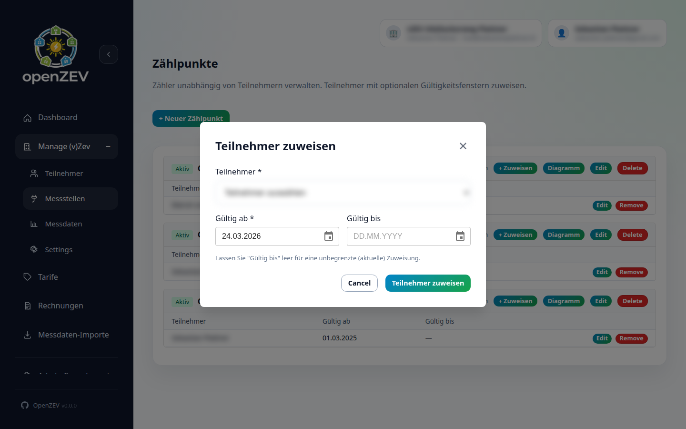

# Metering Points

This guide covers metering point types, configuration, and validation in OpenZEV.

## What is a Metering Point?

A **metering point** is a physical or logical energy meter:
- Owned and operated by a participant
- Measures energy consumption or production
- Records readings at regular intervals (typically hourly)
- Forms the basis for invoice calculations

A single participant can own multiple metering points (e.g., PV on roof + home consumption).

## Metering Point Types

OpenZEV supports three metering point types:

| Type | Purpose | Icon | Usage |
| --- | --- | --- | --- |
| **Consumption** (`IN`) | Measures energy drawn from grid/community | 📥 | Household loads, offices |
| **Production** (`OUT`) | Measures energy fed back to grid/community | 📤 | Solar panels, wind turbines |
| **Bidirectional** | Combined meter (both consumption and production) | 🔄 | Modern smart meters |

## Creating a Metering Point

**ZEV Owners** create metering points in **Metering Points**.

1. Click **Add Metering Point**
2. Enter details:
   - **Metering Point ID** — Equipment/MSID number (required, must be unique)
   - **Type** — `Consumption`, `Production`, or `Bidirectional`
   - **Description** (optional, e.g., "Roof solar panel")
   - **Meter Manufacturer** (optional, for reference)
   - **Data Resolution** — `hourly`, `daily`, or `monthly` (defaults to hourly)

3. Click **Create**

4. Configure participant assignment window (if applicable):
   - **Valid From:** Assignment start date
   - **Valid To:** Assignment end date (leave empty for ongoing)

## Data Resolution

**Data resolution** determines the granularity of recorded readings:

- **Hourly (default):** One reading per hour — most common for modern smart meters
- **Daily:** One reading per day — typical for older meters or aggregated data
- **Monthly:** One reading per month — rarely used; supports legacy data

The resolution affects:
- Import file format expectations
- Timestamp-level billing allocation accuracy
- Data storage and query performance

> **Tip:** For accurate billing, use hourly resolution if available.

## Assignment Validity Periods

Metering points themselves do not have `valid_from`/`valid_to` fields.
Date validity is defined on the **metering point assignment** to a participant:

- **Valid From:** Assignment start date (e.g., 2026-01-01)
- **Valid To:** Assignment end date (optional; leave blank for ongoing)

Assignment validity affects:
- Which participant is associated with the meter at a given date
- Whether imported readings can be attributed for billing
- Invoicing — only active assignment windows in the billing period are used

### Example Validity Scenarios

**Scenario 1: New solar installation mid-year**
- Meter installed: 2026-06-15
- Create assignment with **Valid From** = 2026-06-15
- Leave assignment **Valid To** blank (ongoing)
- Result: Billing includes solar production from June onwards

**Scenario 2: Meter replacement**
- Old meter final reading: 2026-12-31
- New meter first reading: 2027-01-01
- Old assignment: **Valid To** = 2026-12-31
- New assignment: **Valid From** = 2027-01-01
- Result: No billing gaps or overlaps

## Viewing Metering Point Details

Click on a metering point to see:
- All readings imported for this point
- Current assignment window and status
- Last reading timestamp
- Data quality indicators (gaps, outliers)

## Metering Point Validation

OpenZEV validates metering points during import:

| Check | Requirement | Impact |
| --- | --- | --- |
| **ID Uniqueness** | No duplicate metering point IDs | Import fails if duplicate |
| **Participant** | Metering point assigned to valid participant | Import warns if participant inactive |
| **Assignment Window** | Reading timestamp within assignment Valid From/To | Readings rejected outside period |
| **Resolution Match** | Import matches declared resolution | Import warns on mismatch |

## Bulk Import of Metering Points

For communities with many meters:

1. Go to **Metering Points → Import**
2. Prepare CSV with columns:
   - `metering_point_id` (required, unique)
   - `participant_email` (email of participant owner)
   - `type` (`consumption`, `production`, `bidirectional`)
   - `description` (optional)

3. Upload and review preview
4. Confirm import

## Meter Maintenance

### Updating a Metering Point

1. Go to **Metering Points**
2. Select meter
3. Click **Edit**
4. Update fields (ID, type, assignment)
5. Click **Save**

> **Warning:** Changing a meter ID retroactively can break billing audit trails. Prefer creating a new meter and adjusting assignment windows.

### Decommissioning a Meter

To stop billing a meter:

1. Select the metering point
2. Click **Edit**
3. Set **Is Active** to false
4. Click **Save**

Inactive meters are skipped in normal operations; historical data remains available for audits.

## Metering Point and Billing

During invoice generation:

1. System identifies all active metering points for each participant
2. Resolves active participant assignments by date
3. Loads readings from each point during invoice period
4. Allocates energy between local and grid (see [Billing Allocation](08-billing-allocation-explained.md))
5. Generates line items per metering point type

If a metering point has **no readings** in an invoice period:
- That participant may be marked as having incomplete data
- Invoice can still be generated using last-known readings (with warnings)
- See [Data Quality](06-metering-analysis.md) for details

## Next Steps

- **Import readings:** [Metering Data Import](05-metering-import.md)
- **Check data quality:** [Metering Analysis](06-metering-analysis.md)
- **Configure tariffs:** [Tariff Configuration](07-tariff-configuration.md)
- **Understand billing:** [How Energy Allocation Works](08-billing-allocation-explained.md)
