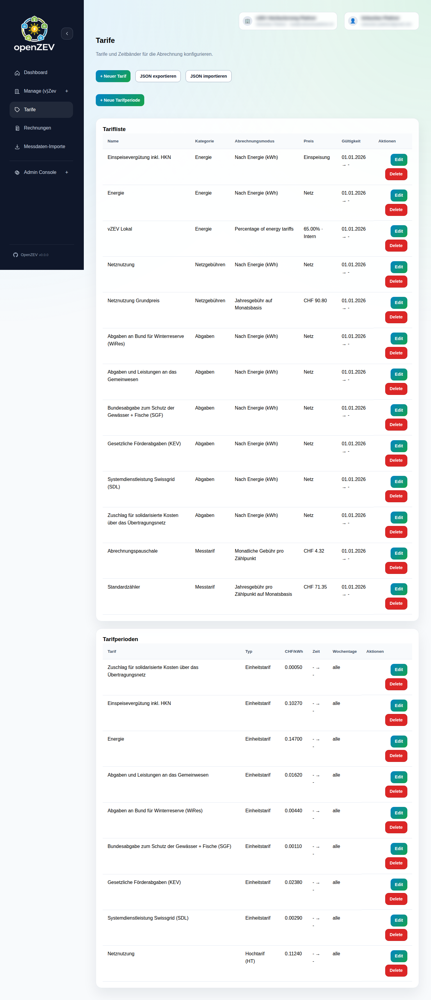

# Tariff Configuration

This guide covers setting up tariffs and pricing in OpenZEV.

## What is a Tariff?

A **tariff** is a pricing rule that defines how to charge participants for energy.

OpenZEV supports several tariff types:
- **Energy tariffs** — Per-kWh fees for consumption or production
- **Fixed fees** — Monthly, quarterly, or yearly community costs

Tariffs are **activity-based**:
- **Local energy tariff** — Energy supplied within the community
- **Grid energy tariff** — Energy imported from external grid
- **Feed-in tariff** — Credits for participant production fed back



## Creating a Tariff

**ZEV Owners** create tariffs in **Tariffs**.

1. Click **Add Tariff**
2. Enter details:
   - **Name** — Tariff identifier (e.g., "Summer Local 2026-Q2")
   - **Type** — `Local Energy`, `Grid Energy`, `Feed-in`, or `Fixed Fee`
   - **Description** (optional)

3. Set **Validity Period**:
   - **Valid From** — Start date
   - **Valid To** — End date (leave blank for ongoing)

   > **Tip:** Tariffs are versioned by validity—you can have multiple tariffs of the same type with different periods.

4. Configure pricing (depends on type; see below)

5. Click **Create**

## Energy Tariff Types

### Local Energy Tariff

Charges for energy consumed from the ZEV's own production.

**Pricing options:**
- **Flat rate** — Single price per kWh (e.g., CHF 0.12/kWh)
- **Time-of-use (HT/NT)** — Different rates by time-of-day
  - HT (high tariff) — Peak hours (e.g., 06:00–22:00)
  - NT (night tariff) — Off-peak (e.g., 22:00–06:00)

Example:
```
Local Energy Tariff "Summer Local"
├─ HT (06:00–22:00): CHF 0.10/kWh
├─ NT (22:00–06:00): CHF 0.05/kWh
```

### Grid Energy Tariff

Charges for energy consumed from the external grid (not covered by local production).

Usually higher than local tariff to reflect grid cost.

Example:
```
Grid Tariff "Grid 2026"
├─ HT: CHF 0.28/kWh (includes distribution)
├─ NT: CHF 0.18/kWh
```

### Feed-In Tariff

Credits for participant production fed back to community/grid.

Often lower than local tariff (encourages consumption of own production).

Example:
```
Feed-in Tariff "Solar Credit"
├─ Flat: CHF 0.08/kWh
```

### Percentage of Energy Tariff

A percentage tariff derives its price from other active tariffs rather than specifying a fixed CHF/kWh rate.

Instead of setting a price, you set a **percentage** (0–100%). During billing, OpenZEV looks up the sum of all active **grid energy tariff** rates at each timestamp and multiplies by the percentage to calculate the effective per-kWh price.

**Configuration:**
- **Billing Mode** — Select `Percentage of energy tariffs`
- **Energy Type** — `Local Energy`, `Grid Energy`, or `Feed-in` (determines which energy stream the tariff applies to)
- **Percentage** — The percentage value (e.g., 50%)

> **Note:** Percentage tariffs do not have HT/NT periods. The effective price is derived automatically from the grid energy tariff rates at each timestamp.

Example:
```
Percentage Tariff "Local Energy 50%"
├─ Energy type: Local Energy
├─ Percentage: 50%
├─ Effective price: 50% of grid energy rate
│   (if Grid HT = CHF 0.28/kWh → Local = CHF 0.14/kWh)
│   (if Grid NT = CHF 0.18/kWh → Local = CHF 0.09/kWh)
```

This is useful when you want to set local energy prices as a fraction of the grid energy rate, so that price changes to the grid tariff are automatically reflected.

### Fixed Fee Tariff

Flat monthly, quarterly, or annual charges (not energy-dependent).

**Charge types:**
- **Monthly fee** — CHF X per month
- **Yearly fee** — CHF X per year (paid monthly as CHF X/12)
- **Per-metering-point fee** — CHF Y per active meter per month

Example:
```
Fixed Fees 2026
├─ Community admin fee: CHF 50/month
├─ Meter maintenance: CHF 5 per meter/month
```

## Tariff Periods

**Tariff periods** subdivide a tariff by time-of-day (for HT/NT pricing).

Default periods:
- **HT (High Tariff):** 06:00–22:00 (daytime peak)
- **NT (Night Tariff):** 22:00–06:00 (night/off-peak)

Create custom periods if your ZEV has different peak hours:

1. Edit a tariff
2. Click **Add Period**
3. Enter:
   - **Name** — Period identifier (e.g., "Winter Peak")
   - **Start Time** — HH:MM (24-hour format)
   - **End Time** — HH:MM
   - **Price— CHF/kWh

> **Crossing midnight:** If end time < start time, period wraps (e.g., 22:00–06:00).

## Multi-Tariff Configuration

Most ZEVs use multiple tariffs simultaneously:

| Tariff | Purpose | Typical Price |
| --- | --- | --- |
| Local Energy (HT) | Community supply, daytime | CHF 0.10/kWh |
| Local Energy (NT) | Community supply, night | CHF 0.05/kWh |
| Grid Energy (HT) | External grid, daytime | CHF 0.28/kWh |
| Grid Energy (NT) | External grid, night | CHF 0.18/kWh |
| Feed-in | Participant solar credits | CHF 0.08/kWh |
| Fixed Fee | Monthly admin cost | CHF 50/month |

During billing, OpenZEV automatically selects the right tariff for each timestamp and energy type.

## Seasonal and Quarterly Tariffs

Create version-specific tariffs for seasonal changes:

**Example: Summer vs. Winter**

```
Tariff: Local Energy HT "Spring/Summer 2026-04-01"
  Valid From: 2026-04-01
  Valid To: 2026-09-30
  HT Price: CHF 0.10/kWh
  NT Price: CHF 0.05/kWh

Tariff: Local Energy HT "Fall/Winter 2026-10-01"
  Valid From: 2026-10-01
  Valid To: 2027-03-31
  HT Price: CHF 0.12/kWh (higher winter demand)
  NT Price: CHF 0.06/kWh
```

OpenZEV automatically applies the correct tariff based on each invoice period's end date.

## Tariff Validation

When saving a tariff, OpenZEV checks:

| Check | Requirement |
| --- | --- |
| **Valid From ≤ Valid To** | Validity period must be in order |
| **No overlapping periods (same type)** | Can't have two "Local Energy" tariffs for the same date |
| **Price format** | Numeric, up to 5 decimals (e.g., `0.12345` CHF/kWh) |
| **Mandatory fields** | Name, type, validity period, prices |

If validation fails, you'll see a clear error message. Fix and retry.

## Editing and Deactivating Tariffs

### Updating a Tariff

Edit **future** tariffs freely:

1. Select tariff
2. Click **Edit**
3. Change prices, periods, validity dates
4. Click **Save**

Changes apply to **new invoices only**. Past invoices keep original tariffs.

### Deactivating a Tariff

Set **Valid To** to exclude from future invoices:

1. Select tariff
2. Click **Edit**
3. Set **Valid To** to today or last usage date
4. Click **Save**

> **Important:** Never delete a tariff—always set Valid To instead. This preserves invoice audit trail.

## Tariff Application During Billing

When OpenZEV generates an invoice:

1. **For each timestamp in billing period:**
   - Identify energy type (local vs. grid)
   - Find applicable tariff by validity date
   - Find applicable period (HT vs. NT) by timestamp
   - Multiply energy × price

2. **Fixed fees:**
   - Sum all applicable monthly fees by calendar month in period
   - Apply yearly fees as monthly installments (price ÷ 12)
   - Group by metering point type if per-point fees

3. **Final invoice:**
   - Sum all line items
   - Apply VAT if configured
   - Create PDF invoice

> **See also:** [How Energy Allocation Works](08-billing-allocation-explained.md) for detailed billing logic.

## Tariff Tips

**Use consistent naming:** Helps operators find right tariff.
- ❌ Bad: `Tariff1`, `FeeX`, `new_rate`
- ✓ Good: `Local Energy HT 2026-Q2`, `Grid Energy 2026`, `Fixed Fees Monthly`

**Plan ahead:** Create seasonal tariffs before the season starts.

**Test with draft invoices:** Generate test invoices before finalizing.

**Review after each quarter:** Check if tariffs align with actual ZEV costs.

## Next Steps

- **Check data quality:** [Metering Analysis](06-metering-analysis.md)
- **Understand allocation:** [How Energy Allocation Works](08-billing-allocation-explained.md)
- **Generate invoices:** [Invoice Management](09-invoice-management.md)
