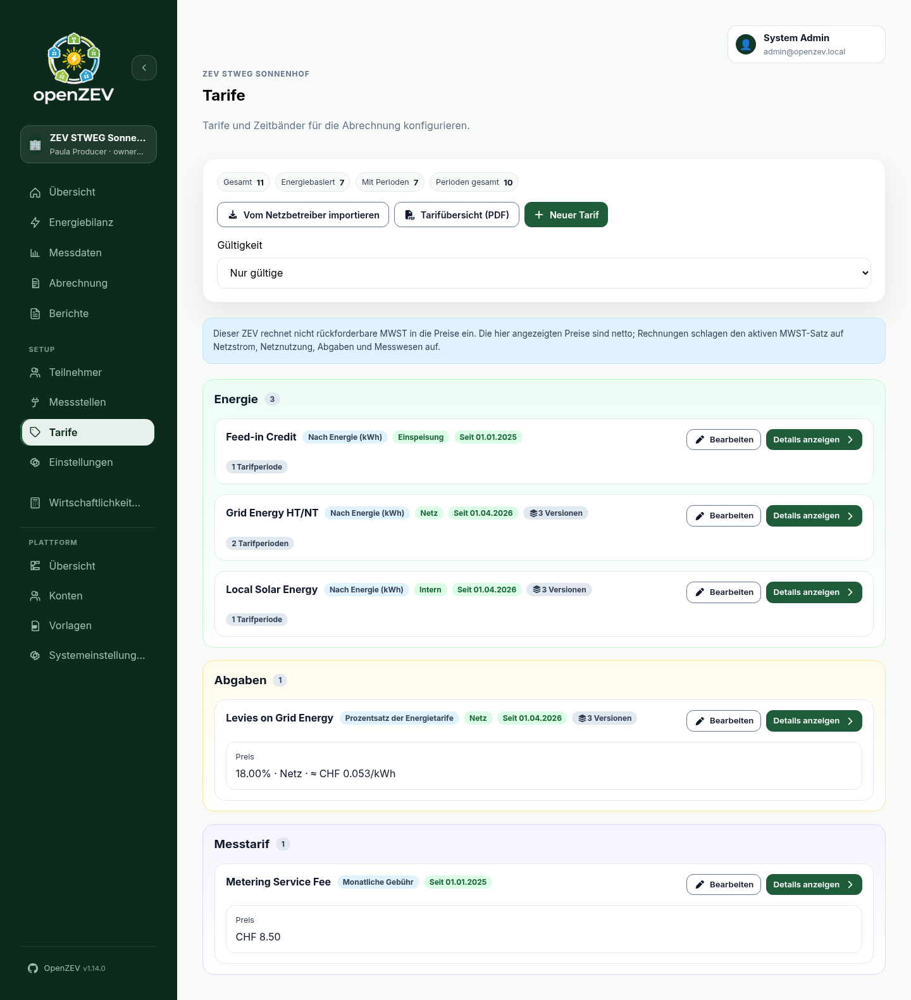
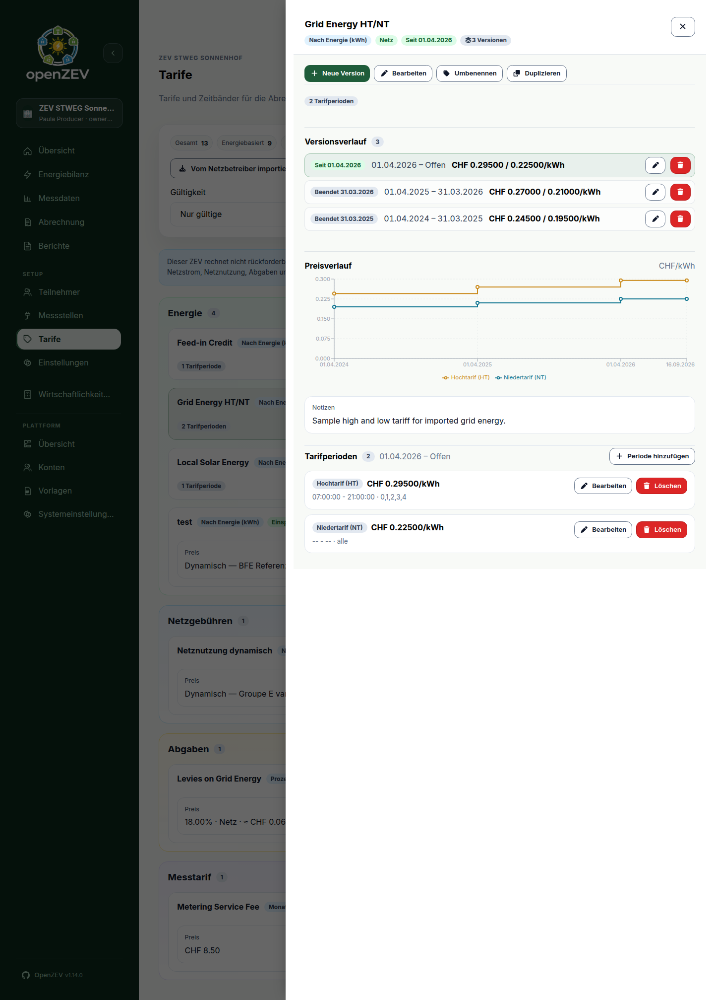

# Tariff Configuration

This guide covers setting up tariffs and pricing in OpenZEV.

## What is a Tariff?

A **tariff** is a pricing rule that defines how to charge participants for energy.

OpenZEV supports several tariff types:
- **Energy tariffs** — Per-kWh fees for consumption or production
- **Fixed fees** — Monthly, quarterly, or yearly community costs

Tariffs are **activity-based**:
- **Local energy tariff** — Energy supplied within the community
- **Grid energy tariff** — Energy imported from external grid
- **Feed-in tariff** — Credits for participant production fed back



## Creating a Tariff

**ZEV Owners** create tariffs in **Tariffs**.

1. Click **Add Tariff**
2. Enter details:
   - **Name** — Tariff identifier (e.g., "Summer Local 2026-Q2")
   - **Type** — `Local Energy`, `Grid Energy`, `Feed-in`, or `Fixed Fee`
   - **Description** (optional)

3. Set **Validity Period**:
   - **Valid From** — Start date
   - **Valid To** — End date (leave blank for ongoing)

   > **Tip:** Leave **Valid To** blank. When the price later changes, use **New
   > version** rather than editing or creating a second tariff — see
   > [Tariff Versions](#tariff-versions).

4. Configure pricing (depends on type; see below)

5. Click **Create**

## Energy Tariff Types

### Local Energy Tariff

Charges for energy consumed from the ZEV's own production.

**Pricing options:**
- **Flat rate** — Single price per kWh (e.g., CHF 0.12/kWh)
- **Time-of-use (HT/NT)** — Different rates by time-of-day
  - HT (high tariff) — Peak hours (e.g., 06:00–22:00)
  - NT (night tariff) — Off-peak (e.g., 22:00–06:00)

Example:
```
Local Energy Tariff "Summer Local"
├─ HT (06:00–22:00): CHF 0.10/kWh
├─ NT (22:00–06:00): CHF 0.05/kWh
```

### Grid Energy Tariff

Charges for energy consumed from the external grid (not covered by local production).

Usually higher than local tariff to reflect grid cost.

Example:
```
Grid Tariff "Grid 2026"
├─ HT: CHF 0.28/kWh (includes distribution)
├─ NT: CHF 0.18/kWh
```

### Feed-In Tariff

Credits for participant production fed back to community/grid.

Often lower than local tariff (encourages consumption of own production).

Example:
```
Feed-in Tariff "Solar Credit"
├─ Flat: CHF 0.08/kWh
```

### Percentage of Energy Tariff

A percentage tariff derives its price from other active tariffs rather than specifying a fixed CHF/kWh rate.

Instead of setting a price, you set a **percentage** (0–100%). During billing, OpenZEV looks up the sum of all active **grid energy tariff** rates at each timestamp and multiplies by the percentage to calculate the effective per-kWh price.

**Configuration:**
- **Billing Mode** — Select `Percentage of energy tariffs`
- **Energy Type** — `Local Energy`, `Grid Energy`, or `Feed-in` (determines which energy stream the tariff applies to)
- **Percentage** — The percentage value (e.g., 50%)

> **Note:** Percentage tariffs do not have HT/NT periods. The effective price is derived automatically from the grid energy tariff rates at each timestamp.

Example:
```
Percentage Tariff "Local Energy 50%"
├─ Energy type: Local Energy
├─ Percentage: 50%
├─ Effective price: 50% of grid energy rate
│   (if Grid HT = CHF 0.28/kWh → Local = CHF 0.14/kWh)
│   (if Grid NT = CHF 0.18/kWh → Local = CHF 0.09/kWh)
```

This is useful when you want to set local energy prices as a fraction of the grid energy rate, so that price changes to the grid tariff are automatically reflected.

### Fixed Fee Tariff

Flat monthly, quarterly, or annual charges (not energy-dependent).

**Charge types:**
- **Monthly fee** — CHF X per month, charged to *each* participant
- **Yearly fee** — CHF X per year, charged to each participant (paid monthly as CHF X/12)
- **Per-metering-point fee** — CHF Y per active meter per month
- **Shared monthly fee** — CHF X per month for the *whole community*, divided between the participants
- **Shared yearly fee** — CHF X per year for the whole community, divided and paid monthly

Example:
```
Fixed Fees 2026
├─ Community admin fee: CHF 50/month     (each participant pays 50)
├─ Meter maintenance:   CHF 5 per meter/month
├─ Caretaker contract:  CHF 90/month shared  (3 participants → 30 each)
```

### Shared Fees

Use a shared fee for a cost the community carries **jointly** — a caretaker
contract, an insurance premium, the ZEV's own administration — rather than one
attributable to a participant's consumption or meters.

> **The price you enter means something different here.** For every other fixed
> fee, the amount is what *one participant* pays. For a shared fee it is what
> the **whole community** pays. Entering CHF 20 intending "per person" will bill
> the community CHF 20 in total, not CHF 20 each.

**How the split works:**

- The amount is divided between the participants **active in each billed month**.
- The division is recalculated every month, so somebody joining in February does
  not change what January cost.
- Each participant is charged only for the months they were actually a member.

**Example — a community fee of CHF 60/month, billed January to March:**

| | January | February | March | Invoice total |
|---|---|---|---|---|
| Alice (whole period) | 60 ÷ 3 = 20.00 | 20.00 | 20.00 | **60.00** |
| Bob (whole period) | 20.00 | 20.00 | 20.00 | **60.00** |
| Carol (joins Feb 1) | — | 20.00 | 20.00 | **40.00** |
| Dave (leaves Jan 31) | 20.00 | — | — | **20.00** |
| **Collected** | 60.00 | 60.00 | 60.00 | **180.00** |

Every month's CHF 60 is collected exactly once, no matter how membership moved.
Dave still receives an invoice for the period and pays for the one month he was
a member; Carol pays for the two months she was.

> **Rounding:** if the amount does not divide evenly, each invoice is rounded to
> the centime on its own, so the community can end up a centime or two short —
> CHF 100 across 3 participants bills 33.33 each and collects 99.99. Choose
> amounts divisible by your participant count if this matters to your
> bookkeeping.

**A note on the ZEV owner:** the owner is counted like anyone else, provided
they have a participant record in the ZEV. If the owner is not a participant,
they are not counted and not charged.

**Credits:** enter a negative amount to distribute a community-wide *rebate*
across the participants. It appears on invoices as a credit line.

## Tariff Periods

**Tariff periods** subdivide a tariff by time-of-day (for HT/NT pricing).

Default periods:
- **HT (High Tariff):** 06:00–22:00 (daytime peak)
- **NT (Night Tariff):** 22:00–06:00 (night/off-peak)

Create custom periods if your ZEV has different peak hours:

1. Edit a tariff
2. Click **Add Period**
3. Enter:
   - **Name** — Period identifier (e.g., "Winter Peak")
   - **Start Time** — HH:MM (24-hour format)
   - **End Time** — HH:MM
   - **Price— CHF/kWh

> **Crossing midnight:** If end time < start time, period wraps (e.g., 22:00–06:00).

## Multi-Tariff Configuration

Most ZEVs use multiple tariffs simultaneously:

| Tariff | Purpose | Typical Price |
| --- | --- | --- |
| Local Energy (HT) | Community supply, daytime | CHF 0.10/kWh |
| Local Energy (NT) | Community supply, night | CHF 0.05/kWh |
| Grid Energy (HT) | External grid, daytime | CHF 0.28/kWh |
| Grid Energy (NT) | External grid, night | CHF 0.18/kWh |
| Feed-in | Participant solar credits | CHF 0.08/kWh |
| Fixed Fee | Monthly admin cost, per participant | CHF 50/month |
| Shared Fee | Joint community cost, divided between participants | CHF 90/month total |

During billing, OpenZEV automatically selects the right tariff for each timestamp and energy type.

## Tariff Versions

Prices change — usually every year. Rather than creating a new tariff each time,
add a **version** to the existing one.

All versions of a tariff share its **name**. That is what makes them versions:
the name identifies the tariff, and the validity windows say which version
applied when.

```
Local Energy                                    ← one tariff, three versions
├─ 2025-01-01 → 2025-12-31   0.10 CHF/kWh
├─ 2026-01-01 → 2026-12-31   0.11 CHF/kWh
└─ 2027-01-01 → (open)       0.12 CHF/kWh       ← active
```

### Adding a New Version

1. Find the tariff and click **New version**
2. Enter the date the new prices take effect (defaults to today)
3. Adjust the prices (pre-filled from the current version)
4. Click **Create**

OpenZEV **closes the previous version automatically** on the day before, so the
timeline stays continuous. You never set an end date by hand — the dialog names
the closing date it will use as you pick the start date.

> **Why this matters:** if a day falls between two versions, OpenZEV has no price
> for it. The energy still appears on the invoice but is **charged at nothing** —
> a whole month can be given away without any warning. Letting OpenZEV compute
> the end date removes the off-by-one that causes this. Any series that already
> has a gap is flagged on the tariff card.

You can also insert a version *between* two existing ones; OpenZEV bounds it on
both sides.

### Comparing Versions

The Tariffs page shows **one card per tariff**, displaying what it costs *today*
rather than a card per version. A badge tells you how many versions it has. Click
**Show details** for the rest.

**Version history** lists every version with its window and price. Click one to
make the card show that version — its price bands and periods switch to the ones
in force then, and a **Viewing an older version** badge appears so you can't
mistake a historical rate for the current one. Click the active version to go
back.

Each row has its own edit and delete buttons, because correcting a superseded
version's end date is a normal follow-up to adding a new one.



### Price History

Once a tariff has **more than one version**, expanding it also charts how its
price moved over time.

- The line is **stepped**, not sloped — a price holds for its whole window and
  then jumps. A sloped line would suggest it drifted between two Januaries.
- HT and NT are **separate lines**, so you can see the spread widen or narrow.
- **Uncovered stretches are shaded red** and the line breaks: nothing was billed
  there. This is the same problem the gap badge reports, shown on a timeline.
- For a **percentage tariff** the chart shows the *effective* price it worked out
  to, derived from the grid tariffs in force at each point — so it moves when
  those move, even in months this tariff itself did not change. A note under the
  title says so.

### Renaming

Renaming is done for the **whole tariff**, not per version — the name is what
holds the versions together, so renaming just one would split it into two
unrelated tariffs. **Rename** sits in the version history header, and tells you
how many versions it will affect.

### Duplicating

Use **Duplicate** (also in the version history header) to create a *different*
tariff starting from an existing one's numbers. It asks for a new name and leaves
the original untouched. (Use **New version** instead when the prices of the
*same* tariff have changed.)

### Which Version Gets Billed

OpenZEV picks the version that was valid **on each individual reading's
timestamp** — not the one valid at the end of the invoice period. So an invoice
covering a price change is priced correctly on both sides of it: a January–March
invoice uses the old price for January and the new one from February.

## Tariff Validation

When saving a tariff, OpenZEV checks:

| Check | Requirement |
| --- | --- |
| **Valid From ≤ Valid To** | Validity period must be in order |
| **No overlapping windows for the same name** | Two tariffs *called the same thing* can't both be valid on the same date — see below |
| **Versions agree on identity** | All versions of a name share one category, billing mode and energy type |
| **Price format** | Numeric, up to 5 decimals (e.g., `0.12345` CHF/kWh) |
| **Mandatory fields** | Name, type, validity period, prices |

If validation fails, you'll see a clear error message. Fix and retry.

### Several Tariffs at Once Is Normal

You can have **as many tariffs applying simultaneously as you need**, including
in the same category, with the same billing mode and the same energy type. This
is the usual shape of a Swiss tariff sheet:

```
Grid Fees
├─ Netznutzung Arbeit         0.09000 CHF/kWh
└─ Systemdienstleistung SDL   0.00750 CHF/kWh

Levies
├─ Netzzuschlag               0.02300 CHF/kWh
└─ Kantonale Abgabe           0.00500 CHF/kWh
```

All four apply at once, and each becomes its own line on the invoice, so
participants see what they are paying for rather than one merged figure.

The **only** thing OpenZEV blocks is two tariffs with the **same name** whose
validity windows overlap — because same name means same tariff, so an overlap
means two prices claim the same day:

```
✗ Local Energy   2026-01-01 → (open)      ← old version, never closed
  Local Energy   2026-04-01 → (open)      ← new version
    Both apply. Every participant is billed twice.

✓ Local Energy   2026-01-01 → 2026-03-31  ← closed automatically
  Local Energy   2026-04-01 → (open)
```

Use **New version** and you never hit this: OpenZEV closes the old window for
you. You only see this error when editing validity dates by hand. If two tariffs
really are meant to apply together, give them different names — which you would
want anyway, since the name is what appears on the invoice line.

Because a shared name makes two tariffs versions of each other, they must also
**agree on what the tariff is** — same category, same billing mode, same energy
type. OpenZEV rejects a version that disagrees and tells you which value the
others use. If you meant a genuinely different tariff, give it a different name.

## Copying Tariffs to Another Community

The tariff-only JSON export has been replaced by a whole-ZEV transfer. To move a
tariff structure to another instance, export the ZEV with **only the Tariffs
section** selected and import it there — the result is a new ZEV carrying just
the pricing. See [ZEV Export and Import](17-zev-transfer.md).

## Editing and Deactivating Tariffs

### Updating a Tariff

Edit **future** tariffs freely:

1. Select tariff
2. Click **Edit**
3. Change prices, periods, validity dates
4. Click **Save**

Changes apply to **new invoices only**. Past invoices keep original tariffs.

**Edit** works on one **version**. The four fields that identify the tariff —
name, category, billing mode, energy type — are therefore shown as values rather
than inputs: they are shared by every version, so changing them on one alone
would break the series. Use **Rename** for the name; for a different category,
billing mode or energy type, create a separate tariff.

> **Prices changed from a certain date?** Use **New version** instead of editing.
> Editing rewrites what the *current* version has always charged; a new version
> records the change, keeps the old prices on the record, and lets invoices
> spanning the switch bill each part correctly. See
> [Tariff Versions](#tariff-versions).

### Deactivating a Tariff

Set **Valid To** to exclude from future invoices:

1. Select tariff
2. Click **Edit**
3. Set **Valid To** to today or last usage date
4. Click **Save**

> **Important:** Never delete a tariff—always set Valid To instead. This preserves invoice audit trail.

This applies to the delete button on a **version** row too. Deleting a version
removes the prices that applied in its window, which leaves a gap: energy in
those days is then billed at nothing. Reserve it for a version created by
mistake — one you have not billed against.

## Tariff Application During Billing

When OpenZEV generates an invoice:

1. **For each timestamp in billing period:**
   - Identify energy type (local vs. grid)
   - Find applicable tariff by validity date
   - Find applicable period (HT vs. NT) by timestamp
   - Multiply energy × price

2. **Fixed fees:**
   - Sum all applicable monthly fees by calendar month in period
   - Apply yearly fees as monthly installments (price ÷ 12)
   - Group by metering point type if per-point fees

3. **Final invoice:**
   - Sum all line items
   - Apply VAT if configured
   - Create PDF invoice

> **See also:** [How Energy Allocation Works](08-billing-allocation-explained.md) for detailed billing logic.

## Tariff Tips

**Use consistent naming:** Helps operators find right tariff.
- ❌ Bad: `Tariff1`, `FeeX`, `new_rate`
- ✓ Good: `Local Energy HT 2026-Q2`, `Grid Energy 2026`, `Fixed Fees Monthly`

**Plan ahead:** Create seasonal tariffs before the season starts.

**Test with draft invoices:** Generate test invoices before finalizing.

**Review after each quarter:** Check if tariffs align with actual ZEV costs.

## Next Steps

- **Check data quality:** [Metering Analysis](06-metering-analysis.md)
- **Understand allocation:** [How Energy Allocation Works](08-billing-allocation-explained.md)
- **Generate invoices:** [Invoice Management](09-invoice-management.md)
