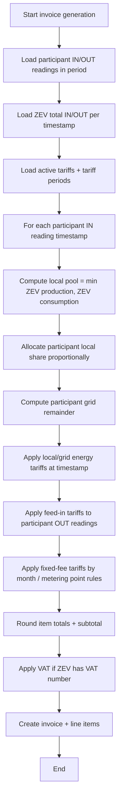

# How Energy Allocation and Billing Works

This guide explains the exact billing logic used by OpenZEV so you can understand and verify participant invoices.

## Key Principle: Fair Sharing

OpenZEV allocates energy fairly at the **timestamp level** (e.g., hour-by-hour), not just monthly totals.

**Concept:** At each moment, community production is shared among participants proportional to their consumption at that moment. Remaining consumption comes from the grid.

## Inputs for One Invoice

For a participant and billing period, OpenZEV loads:

- **Participant readings:**
  - Consumption (`IN`) from participant metering points
  - Feed-in/production (`OUT`) from participant metering points

- **ZEV totals per timestamp:**
  - Total community consumption (all participants)
  - Total community production (all participants)

- **Active tariffs** for the participant's ZEV

## Timestamp-Level Allocation

At each moment $t$ (e.g., one hour), OpenZEV calculates:

### 1) Local Pool

The amount of energy that can be matched *locally* (within community):

$$L(t) = \min(P_z(t), C_z(t))$$

Where:
- $P_z(t)$ = total ZEV production at timestamp $t$
- $C_z(t)$ = total ZEV consumption at timestamp $t$
- $L(t)$ = local pool

**Intuition:** Local pool is the overlapping overlap between "how much is being produced" and "how much is being consumed" at that exact moment. Can never exceed either.

### Example: Local Pool Calculation

**Scenario a) Production < Consumption**
- ZEV produces 15 kW, community consumes 25 kW
- Local pool = min(15, 25) = **15 kW** (limited by production)
- Remaining 10 kW demand goes to grid

**Scenario b) Production > Consumption**
- ZEV produces 30 kW, community consumes 20 kW
- Local pool = min(30, 20) = **20 kW** (limited by demand)
- Remaining 10 kW production is exported to grid (not billed to participants)

### 2) Participant's Local Energy Share

Each participant gets a **fair share** of the local pool proportional to their consumption:

$$E_{local,p}(t) = \begin{cases}
\min\left(C_p(t),\; L(t) \cdot \frac{C_p(t)}{C_z(t)}\right) & \text{if } C_z(t) > 0 \\
0 & \text{if } C_z(t) = 0
\end{cases}$$

Where:
- $C_p(t)$ = participant consumption at time $t$
- $C_z(t)$ = total ZEV consumption at time $t$
- $E_{local,p}(t)$ = participant's local energy

**Intuition:** If a participant consumes 20% of total community demand at that moment, they get 20% of the local pool (but never more than their own consumption).

### 3) Participant's Grid Energy

The remainder of consumption must come from external grid:

$$E_{grid,p}(t) = C_p(t) - E_{local,p}(t)$$

**Physical vs. Billing Note:** This is an *allocation model*, not a physical electron trace. A participant can be allocated grid energy even in their moment of overproduction—that production goes to the community pool, and they consume allocated local/grid energy at other times.

## Worked Example

**Timestamp:** 2026-01-15, 14:00 (solar peak)

**Community state:**
- Total consumption: 25 kW (all participants)
- Total production: 15 kW (all solar panels)
- Local pool: min(15, 25) = 15 kW

**Participant Alice:**
- Consumption: 10 kW (40% of community)
- As % of community demand: 10/25 = 40%
- Alice's local share: 15 kW × 40% = 6.0 kW
- Alice's grid share: 10 kW − 6.0 kW = 4.0 kW

**Participant Bob:**
- Consumption: 15 kW (60% of community)
- As % of community demand: 15/25 = 60%
- Bob's local share: 15 kW × 60% = 9.0 kW
- Bob's grid share: 15 kW − 9.0 kW = 6.0 kW

**Check:** 6.0 + 9.0 = 15.0 ✓ (all local pool allocated)

## Period Aggregation

Over a full billing period (e.g., calendar month), readings are summed:

- **Total period local energy:** Sum of $E_{local,p}(t)$ for all timestamps
- **Total period grid energy:** Sum of $E_{grid,p}(t)$ for all timestamps
- **Total period feed-in:** Sum of any participant production (`OUT` readings)

Example: Over January (744 hours)
- Alice accumulated: 168 kWh local + 98 kWh grid = 266 kWh total
- Bob accumulated: 240 kWh local + 147 kWh grid = 387 kWh total

## Tariff Application

Once energy is allocated, tariffs are applied per energy type:

| Energy Type | Tariff Applied | Price |
| --- | --- | --- |
| Local energy | Local tariff (HT/NT by hour) | e.g., 0.10–0.12 CHF/kWh |
| Grid energy | Grid tariff (HT/NT by hour) | e.g., 0.18–0.28 CHF/kWh |
| Feed-in production | Feed-in tariff | e.g., 0.08 CHF/kWh |

**Continuing the example:**

Alice's charges (Jan, sample rates):
- Local energy: 168 kWh × 0.11 CHF/kWh (average HT/NT) = **CHF 18.48**
- Grid energy: 98 kWh × 0.23 CHF/kWh (average HT/NT) = **CHF 22.54**
- Feed-in (if any): 5 kWh × 0.08 CHF/kWh = **CHF 0.40**
- Fixed fee: CHF 50/month = **CHF 50.00**

**Invoice subtotal:** 18.48 + 22.54 + 0.40 + 50.00 = **CHF 91.42**

If VAT applies (8.1%):
- VAT: 91.42 × 0.081 = **CHF 7.40** (rounded)
- **Invoice total:** CHF 98.82

## Fixed-Fee Behavior

Non-energy tariffs follow special rules:

- **Monthly fee:** Charged once per billing month in the invoice period
- **Yearly fee:** Charged as 1/12 per billing month (CHF price ÷ 12)
- **Per-metering-point fee:** Charged for each *active meter* per month

Exact invoice engine keys used for fixed-fee tariffs:

- `monthly_fee`: charged per intersecting month in the invoice period
- `yearly_fee`: monthly installment (`fixed_price_chf / 12`) per intersecting month
- `per_metering_point_monthly_fee`: charged per active metering point per intersecting month
- `per_metering_point_yearly_fee`: monthly installment (`fixed_price_chf / 12`) per active metering point per intersecting month

Negative fixed prices are represented as credit invoice items.

**Example:** ZEV with 3 participants, each with 1 meter

January invoice:
- Monthly admin fee (all): 3 × CHF 50 = CHF 150
- Meter fee (per meter): 3 × CHF 5 = CHF 15
- Total fixed: CHF 165 (split among 3 invoices)

## Rounding and VAT

**Precision:**
- Energy quantities: 4 decimals (0.0001 kWh)
- Unit prices: 5 decimals (e.g., 0.12345 CHF/kWh)
- Line item totals: Rounded to 2 decimals (CHF 0.01)
- Invoice subtotal: Rounded to 2 decimals

**VAT:**
- Applied only if ZEV has a VAT number configured
- Rate selected by invoice period end date from [Admin Console → VAT Settings](14-admin-console.md#vat-settings)
- If no rate is active, VAT defaults to 0%

**Final total:**
$$\text{Invoice Total} = \text{Subtotal} + \text{VAT}$$

## Billing Flow Diagram

Implementation reference: `backend/invoices/engine.py` (`generate_invoice`).

## Participant Trust & Verification

Every participant should be able to verify their invoice:

1. **Period check:** Invoice period matches expected billing window ✓
2. **Energy split check:** Local + Grid = Total consumption (minus feed-in) ✓
3. **Tariff check:** Line item prices match published tariffs ✓
4. **Credit check:** Feed-in and other credits appear as negatives ✓
5. **Rounding check:** Line totals and VAT are CHF cents ✓
6. **Total check:** Subtotal + VAT = Invoice total ✓

If any check fails, the invoice should be reviewed and corrected.

## Why Timestamp-Level Allocation?

Simpler approaches (monthly totals, last-hour precedence) can be unfair:

- **Monthly total:** Participant might produce heavily in June but consume in January; monthly total loses timing fairness
- **Allocation by timing:** Timestamp-level correctly captures the moment-by-moment local/grid split

## Edge Cases

### Zero Community Consumption

If $C_z(t) = 0$ (no one is consuming), no one is allocated local energy:
- $E_{local,p}(t) = 0$ for all participants
- Participant feed-in is not charged

### Partial Metering

If a participant's consumption meter is missing in a period:
- OpenZEV marks the invoice as **incomplete**
- Billing uses available readings + warning note
- ZEV owner should investigate and re-run invoice if data is corrected

### Meter Replacement

If a meter was replaced mid-period:
- Old meter: **Valid To** = replacement date
- New meter: **Valid From** = replacement date
- Readings from both meters are included
- No double-billing or gaps

## Worked Example: Two-Timestamp Period

Assume two timestamps in the same invoice period:

**Timestamp t1** (morning, cloudy)
- Community consumption: 20 kW
- Community production: 10 kW
- Local pool: min(10, 20) = 10 kW
- Alice consumption: 8 kW → Local: 10 × (8/20) = 4.0 kW, Grid: 4.0 kW
- Bob consumption: 12 kW → Local: 10 × (12/20) = 6.0 kW, Grid: 6.0 kW

**Timestamp t2** (afternoon, sunny)
- Community consumption: 12 kW
- Community production: 30 kW
- Local pool: min(30, 12) = 12 kW
- Alice consumption: 6 kW → Local: 12 × (6/12) = 6.0 kW, Grid: 0 kW
- Bob consumption: 6 kW → Local: 12 × (6/12) = 6.0 kW, Grid: 0 kW

**Period totals:**
- Alice: 10 kWh local, 4 kWh grid (14 kWh total consumption)
- Bob: 12 kWh local, 6 kWh grid (18 kWh total consumption)

With tariffs:
- Local: 0.10 CHF/kWh
- Grid: 0.30 CHF/kWh

Alice's energy charges:
- Local: 10 × 0.10 = CHF 1.00
- Grid: 4 × 0.30 = CHF 1.20
- Subtotal: CHF 2.20

## Questions?

See [FAQ and Glossary](15-glossary.md) for more on energy allocation and billing concepts.
