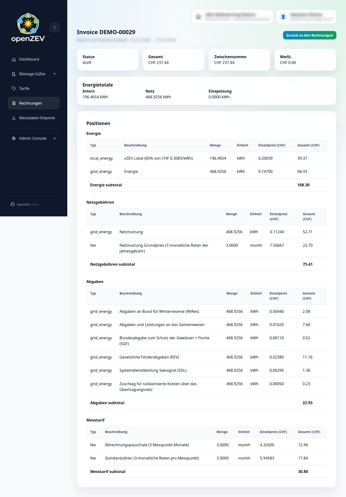

# Invoice Management

This guide covers generating, reviewing, and managing invoices for participants.

## Invoice Lifecycle

Invoices progress through a controlled workflow:

```
Draft → Approved → Sent → Paid
```

- **Draft** — just generated, can be reviewed, approved, deleted, or regenerated.
- **Approved** — locked for review; can be emailed, marked paid, or deleted.
- **Sent** — email was sent to the participant; can be resent or marked paid.
- **Paid** — fully settled; no further actions.
- **Cancelled** — removed from the active workflow; can be deleted. The backend supports cancellation, but there is currently no cancel button in the UI.

## Period-Based Invoice View

The **Invoices** page shows one billing period at a time. There are no status filters — you navigate between periods instead.

### Period Navigation

The toolbar at the top of the page displays:

- The **ZEV name** and the **period date range** (e.g. `01.01.2026 → 31.01.2026`).
- The ZEV's **billing interval** (`monthly`, `quarterly`, `semi_annual`, or `annual`).
- **← Prev Period** and **Next Period →** buttons to step through periods.

The period is automatically set based on the selected ZEV's billing interval.


### Period Overview Table

Each row in the table represents one **participant** who had active metering-point assignments during the period. Columns:

| Column | Description |
|---|---|
| **Participant** | Name and email address. |
| **Metering Data** | Green "complete" badge if all assigned metering points have daily readings for the full period. Red "missing" badge otherwise, with a count of points with data vs. total and a list of missing meter IDs with the number of missing days each. |
| **Invoice** | The invoice number, or "Not created" if no invoice exists yet. |
| **Status** | Badge showing the invoice status (`Draft`, `Approved`, `Sent`, `Paid`, `Cancelled`), or a neutral "Not created" badge. |
| **Email** | Latest email delivery status badge (`pending`, `sent`, `failed`). A small button shows the sent/total count (e.g. `1/2`) and opens the **Email Logs** modal. If any emails failed, a red count is shown. Multiple attempts are indicated. |
| **Total** | Invoice total in CHF. |
| **PDF** | **Generate PDF** button (or **Open PDF** + **Regenerate** if a PDF already exists). |
| **Actions** | Per-invoice action buttons (see below). |

### Empty State

If no participants with active assignments exist for the period, the page shows links to:

- **Participants** — to add or check participant records.
- **Metering Points** — to check metering-point assignments.
- **Tariffs** — to configure pricing.

## Generating Invoices

Invoice generation happens **per participant** from the period overview table.

1. Navigate to the desired billing period.
2. Review the **Metering Data** column — ensure data is complete for the participants you want to invoice.
3. Click **Generate Invoice** in the **Actions** column for the participant.

The system calculates energy allocation and applies tariffs, creating a **Draft** invoice.

### Regenerating an Existing Invoice

If an invoice already exists for a participant in the current period, the button label changes to **Generate Again**. Clicking it replaces the existing invoice with a freshly calculated one. Use this after correcting metering data or tariff configuration.

> **Tip:** You can generate invoices even when metering data is incomplete, but totals may be inaccurate. It is best to resolve missing data first.

## Reviewing Invoices

Click **Open Details** in the Actions column to view a read-only invoice detail page.

### Invoice Detail Page



The detail page shows:

- **Status card** — current invoice status as a badge.
- **Total CHF** — the final invoiced amount.
- **Subtotal CHF** — amount before VAT.
- **VAT CHF** — the VAT portion.

**Energy totals:**

| Metric | Description |
|---|---|
| Local kWh | Energy consumed from local (solar) production. |
| Grid kWh | Energy drawn from the external grid. |
| Feed-in kWh | Energy fed back into the grid. |

**Line items table** — grouped by **tariff category** (e.g. Energy, Fee). Each line shows:

- Type (e.g. Local Energy, Grid Energy, Feed-in Credit, Fee)
- Description
- Quantity (kWh)
- Unit
- Unit price (CHF)
- Total (CHF)

A subtotal is shown at the end of each tariff category group.

> **Note:** Invoices cannot be edited directly. If a correction is needed, fix the underlying data (metering readings or tariff prices) and use **Generate Again** to recreate the invoice.

## Approving Invoices

Approval locks an invoice and signals that it has been reviewed.

1. Find the draft invoice in the period overview.
2. Click **Approve** in the Actions column.

The status changes from `Draft` to `Approved`. Only draft invoices can be approved.

## Generating and Managing PDFs

PDF generation is a separate step from invoice creation.

- **Generate PDF** — creates the PDF for an invoice that does not yet have one.
- **Regenerate** — replaces an existing PDF (e.g. after the HTML template was updated).
- **Open PDF** — opens the generated PDF in a new browser tab.

These buttons appear in the **PDF** column of the period overview table for any invoice that exists.

## Sending Invoices by Email

Once an invoice is approved, you can email it to the participant.

1. Click **Send Email** in the Actions column (visible for `Approved` or `Sent` invoices).
2. The system queues the email via Celery and begins polling for delivery status.
3. While polling, the button shows **Sending…** and is disabled.
4. The **Email** column updates automatically when the email is delivered or fails.

For invoices already in `Sent` status, the button label changes to **Resend Email**, allowing you to send additional copies.

### Email Polling

After sending, the page polls the server every 2 seconds (up to 30 seconds) to check for email delivery updates. A 90-second overall timeout prevents indefinite polling.

### Email Logs Modal

Click the sent/total counter button (e.g. `1/2`) in the **Email** column to open the **Email Logs** modal. This shows:

- Each email attempt with recipient, status (`pending`, `sent`, `failed`), and timestamp.
- A **Retry** button next to any failed email log entry, which re-queues that specific email.

### Email Delivery Failures

If an email fails:

1. Open the Email Logs modal to see the error.
2. Verify the participant's email address in [Participants](03-participant-management.md).
3. Click **Retry** on the failed log entry to re-queue it.
4. If email continues to fail, review the [Email Configuration](10-email-configuration.md) environment variables.

Email sending is handled asynchronously by Celery with automatic retries (up to 3 attempts with 60-second delays). See [Email Configuration](10-email-configuration.md) for details.

## Marking Invoices as Paid

When a participant has paid:

1. Click **Mark Paid** in the Actions column (visible for `Approved` and `Sent` invoices).

The status changes to `Paid`. There is no additional confirmation dialog or payment-detail input — it is a single-click action.

## Deleting Invoices

Invoices can be deleted to clean up incorrect or test data.

1. Click **Delete** in the Actions column.
2. Confirm in the deletion dialog.

**Delete visibility rules:**

- **Draft** or **Cancelled** invoices — the delete button is visible for all ZEV owners.
- **Any status** — admins always see the delete button.

Deletion is permanent; the invoice is removed from the database.

## Troubleshooting

### No participants appear in the period overview

**Causes:**
- No active participants with metering-point assignments overlapping the selected period.
- The wrong ZEV is selected in the global ZEV selector.

**Fix:**
1. Check the ZEV selector in the top navigation.
2. Verify that [Participants](03-participant-management.md) exist and have [metering-point assignments](04-metering-point-management.md) covering the period.

### Invoice totals look wrong

1. Verify [tariff prices](07-tariff-configuration.md) are correct for the period.
2. Check [metering data](06-metering-analysis.md) completeness — missing readings lead to under-counted energy.
3. Review the [billing allocation logic](08-billing-allocation-explained.md) to understand how local vs. grid energy is split.
4. If needed, fix the data and click **Generate Again** to recreate the invoice.

### Email not received by participant

1. Check the participant's email address in [Participants](03-participant-management.md).
2. Open the **Email Logs** modal to check delivery status and error messages.
3. Click **Retry** on any failed log entry.
4. Review [Email Configuration](10-email-configuration.md) for SMTP environment variable issues.

## Best Practices

- **Check metering completeness** before generating invoices — the Metering Data column shows exactly which meters are missing data and how many days are affected.
- **Approve after review** — open the invoice detail page to verify line items and totals before approving.
- **Generate PDFs before sending** — while not strictly required, generating the PDF first lets you review the document before emailing.
- **Use Generate Again sparingly** — regenerating replaces the existing invoice. If the old invoice was already sent, consider whether the participant needs to be notified of the change.

## Next Steps

- **Configure email delivery:** [Email Configuration](10-email-configuration.md)
- **Understand billing logic:** [Billing & Allocation Explained](08-billing-allocation-explained.md)
- **Manage tariffs:** [Tariff Configuration](07-tariff-configuration.md)
