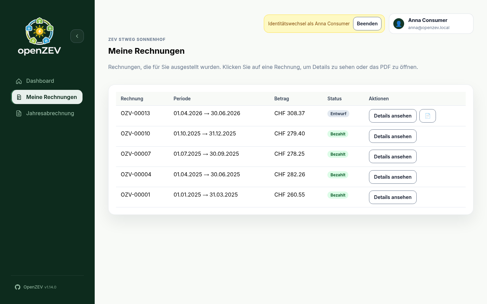
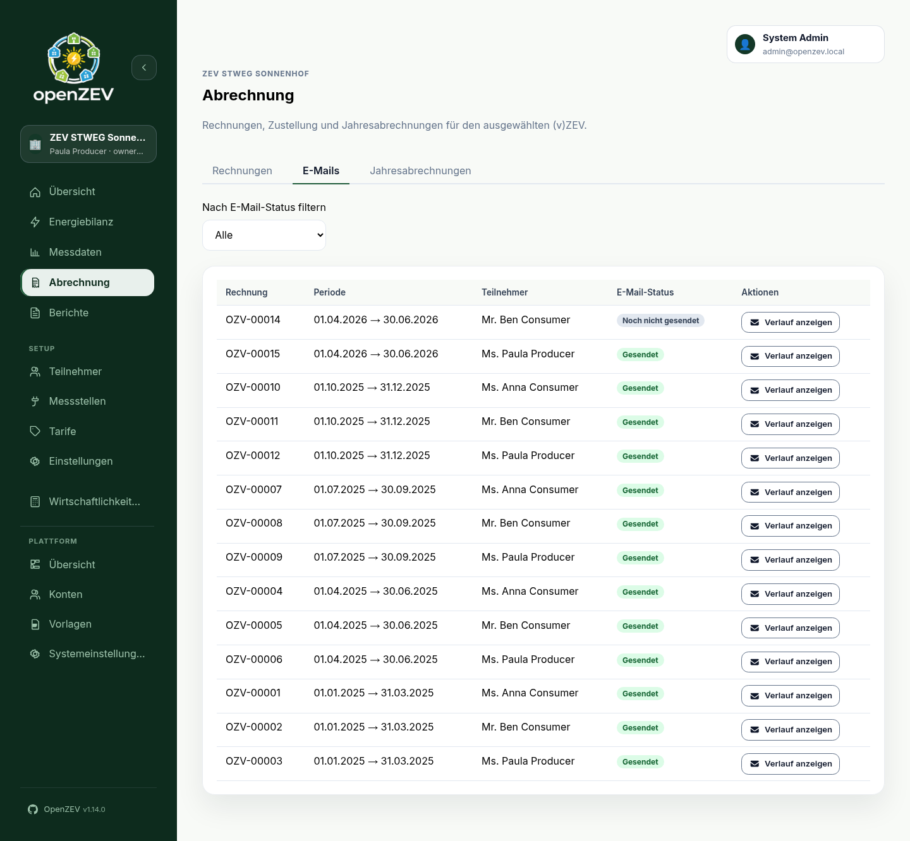
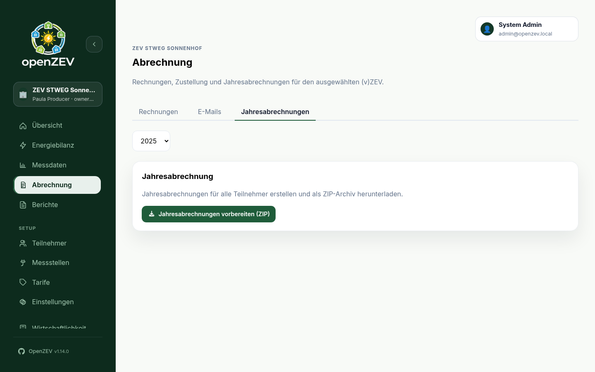
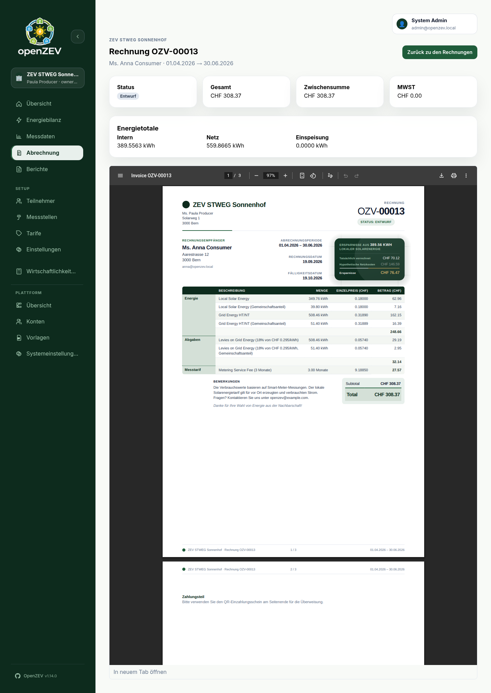
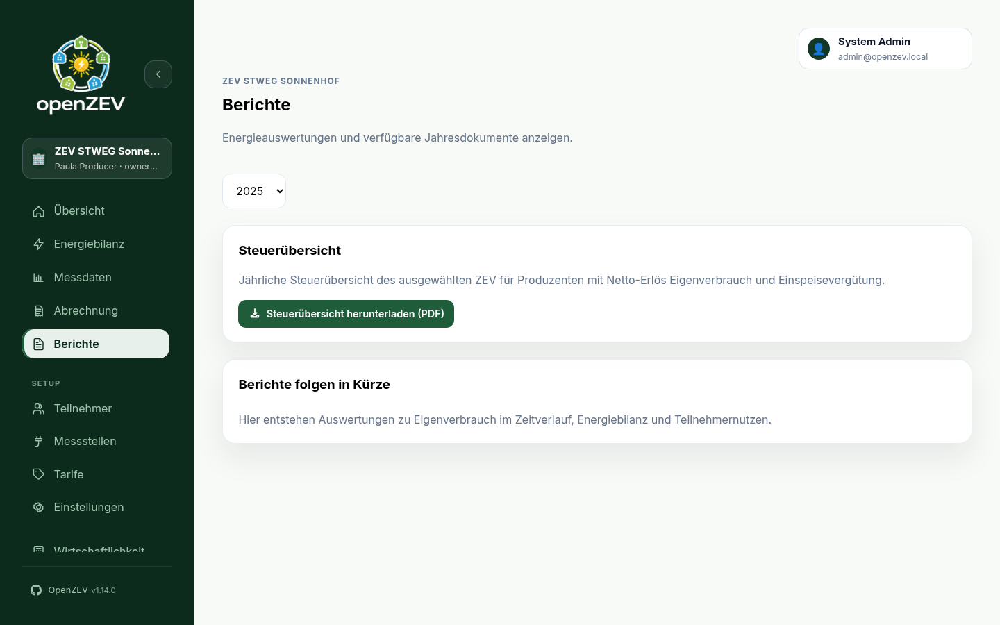
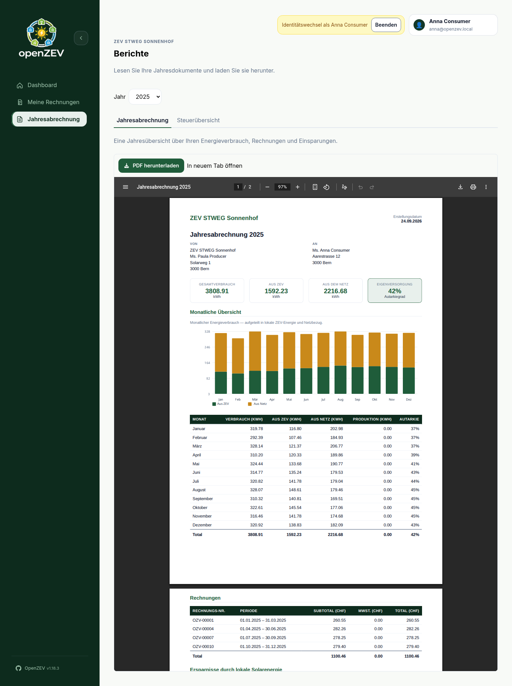

# Invoice Management

This guide covers generating, reviewing, and managing invoices for participants.

## Billing Work by Period (Overview)

The manager **Overview** groups billing work into one card per period, oldest
open period first. Each card shows the period status, the server-selected next
action, overdue invoices and failed deliveries, and any additional warnings.
Open **Period details** to see the remaining workflow steps and the compact
**Checked and complete** checklist. Steps that open an actionable page link to
it; a step that merely waits on an upstream one has no link. Data problems
never block generation — they appear as warnings. When locked invoices from an
earlier interval overlap the period (for example, paid monthly invoices under a
new quarterly rhythm), the card shows a generation conflict with a link to the
blocking invoices instead of offering generation.

Period resolution and step completion are separate: a period counts as open
when it holds a draft or
approved invoice, or a billable participant (active with a meter assignment)
with no invoice — a partial batch generation therefore keeps the period open
even after those invoices are sent. The later steps are trailing states, not
gates: approve/send/pay track the period's active invoices, so an older
period can be fully sent yet still show an unpaid payments step or an
unresolved failed delivery. Cancelled invoices are withdrawn and count neither for nor against any
step — but one still counts as an existing invoice, so it suppresses the
missing-invoice prompt for its participant until the operator regenerates it.

A community created mid-period has no partial first period: billing periods
align to the calendar, so the first billable one starts at the next aligned
boundary after the community's start date.

Three "nothing to do right now" states look similar but behave differently:

- **First run** — a brand-new ZEV with no participants **or** no metering
  points yet shows a setup checklist.
- **Awaiting first period** — participants and meters exist, but the first
  billing period has not ended yet. Missing meter assignments and a blank
  IBAN still show as warnings above the waiting message.
- **Caught up** — no ended period needs you right now (nothing waiting at
  draft/approved, every eligible participant invoiced); Overview shows a quiet
  **Up to date** message and keeps completed periods collapsed below it.

An unfinished setup never hides behind a green status: with active
participants but no current meter assignment Overview says nothing is
billable yet and links to meter assignment, and a missing IBAN for QR bills
stays visible beside normal period work without blocking generation.

Invoice alerts appear in the matching period card: unresolved failed invoice
emails (a later successful retry clears the item) and overdue sent invoices.
Alerts without a billing period, including participant validity endings that
still hold meter assignments, appear under **Community notices**. Tariff
coverage, metering gaps, unassigned readings and setup state are already
covered by readiness steps or setup guidance.

## Participant View: My Invoices

Participants open **My invoices** (`/me/invoices`) in the sidebar to see the
invoices issued to them — invoice number, period, total, status, and a link to
the details. Every issued invoice is listed, whether or not its PDF has been
generated yet; the PDF button appears only on rows that have a document.
Participants with several communities see which community issued each invoice.
The list is read-only; the deep link `/billing/invoices/{id}` shows a
participant only their own invoice (enforced by the backend), and its return
link leads back to **My invoices**.



## Invoice Lifecycle

Invoices progress through a controlled workflow:

```
Draft → Approved → Sent → Paid
```

- **Draft** — just generated; can be reviewed, approved, regenerated or deleted.
- **Approved** — locked; can be emailed or marked as sent. Its amounts can no
  longer change.
- **Sent** — emailed (or marked as sent); can be resent or marked paid.
- **Paid** — fully settled; only its PDF can still be regenerated.
- **Cancelled** — removed from the active workflow; can be deleted or generated
  again. A cancelled invoice does not count as generated for its period: its
  period card still asks you to generate a replacement. Cancelling is available
  through the API only — there is no cancel button in the UI.

Only admins can delete an invoice that is approved, sent or paid.

## Billing Hub (Invoices · Emails · Statements)

The sidebar entry **Billing** (`/billing/invoices`) opens the invoice-first
billing hub. Its tabs are routes — each is directly linkable:

- **Invoices** (`/billing/invoices`) — the period-based invoice view (below).
- **Emails** (`/billing/emails`) — delivery status of approved, sent, and paid
  invoices: the latest email status per invoice, a filter by status, a
  failed-email banner, **View history** for the actual attempt log, and an
  inline **Retry** per failed latest attempt.
- **Statements** (`/billing/statements`) — the yearly whole-ZEV annual-statement
  ZIP downloads (see
  [Annual Statements and Tax Overviews](#annual-statements-and-tax-overviews-billing--reports)).

The per-period work cards live on **Overview**. The running period is separated
as **Collecting data** and never exposes readiness actions. Ended periods with
open work remain visible as cards; fully completed ended periods are collapsed.
The primary action follows the backend-selected next step. **Open invoices**
deep-links into Billing with that exact period preselected
(`/billing/invoices?period_start=…&period_end=…`). Periods from an earlier
billing interval keep their exact entries after a switch, so a January monthly
invoice stays reachable next to its Jan–Mar quarter.

The former `/billing/periods` bookmark redirects to Overview (see the
Manager Overview screenshot in [Getting Started](01-getting-started.md)).

The card action opens the workflow that needs attention, such as metering
quality or tariffs. **Open invoices** opens that period's invoices.



After a retry is accepted, the tab shows it as pending while the worker
starts. It updates automatically when the next delivery attempt is recorded.
Invoice rows themselves keep only the latest delivery-state badge; detailed
attempts and errors are kept in the Emails tab's history panel.



## Period-Based Invoice View

The **Invoices** tab shows one billing period at a time. There are no status filters — you navigate between periods instead.

### Period Navigation

The toolbar at the top of the page displays:

- The **ZEV name** and the **period date range** (e.g. `01.01.2026 → 31.01.2026`).
- The ZEV's **billing interval** (`monthly`, `quarterly`, `semi_annual`, or `annual`).
- **← Prev Period** and **Next Period →** buttons to step through periods.

The period is automatically set based on the selected ZEV's billing interval.

**How the period is chosen and kept consistent:**

- **Default:** the most recent **completed** billing period (nothing older is
  silently implied — you can move further back with **Prev**).
- **New community:** with no completed period yet, the page opens on the
  community's **first aligned period** instead of an empty one.
- **Deep links:** opening a link that carries a period (`?period_start=…&
  period_end=…` — from an Overview period card, an attention item, or your own
  bookmark) shows that **exact period**, including historical periods from an
  earlier billing interval after a switch. Ranges that would start before the
  community existed are ignored and fall back to the default.
- **Boundary:** **Prev** stops at the community's earliest billable period;
  the preset menu offers nothing older. After switching billing intervals,
  already settled periods (fully paid under the previous interval) stay
  closed and link to the invoice that already settles them instead of
  offering Generate, while partly overlapping locked invoices surface as a
  generation conflict with a link to the blocking invoices.


### Period Overview Table

Each row in the table represents one **participant** who had active metering-point assignments during the period. A participant whose assignment has since ended keeps their row while they still hold an invoice for the period, so email/payment actions on that invoice stay reachable. Columns:

| Column | Description |
|---|---|
| **Participant** | Name and email address. |
| **Metering Data** | Green "complete" badge if all assigned metering points have daily readings for the full period. Red "missing" badge otherwise, with a count of points with data vs. total and a list of missing meter IDs with the number of missing days each. |
| **Invoice** | The invoice number, or "Not created" if no invoice exists yet. |
| **Status** | Badge showing the invoice status (`Draft`, `Approved`, `Sent`, `Paid`, `Cancelled`), or a neutral "Not created" badge. |
| **Email** | Latest email delivery status badge (`pending`, `sent`, `failed`). Open **Billing → Emails** for attempt history, errors, and retry. |
| **Total** | Invoice total in CHF. |
| **PDF** | **Generate PDF** button (or **Open PDF** + **Regenerate** if a PDF already exists). |
| **Actions** | Per-invoice action buttons (see below). |

### Empty State

If no participants with active assignments exist for the period, the page shows links to:

- **Participants** — to add or check participant records.
- **Metering Points** — to check metering-point assignments.
- **Tariffs** — to configure pricing.

## Row and Batch Actions

Each row shows its next step as a button — **Generate invoice**, **Approve**,
**Send Email** or **Mark Paid**, depending on the status — and puts the rest
under **More**:

| Status | Button | Under **More** |
| --- | --- | --- |
| *(none)* / Cancelled | **Generate invoice** / **Generate again** | Delete (cancelled) |
| Draft | **Approve** | Regenerate invoice, Generate/Regenerate PDF, Delete |
| Approved | **Send Email** | Mark as Sent, Generate/Regenerate PDF |
| Sent | **Mark Paid** | Resend Email, Generate/Regenerate PDF |
| Paid | — | Generate/Regenerate PDF |

Admins also see **Delete** for approved, sent and paid invoices.

The **Batch actions** toolbar above the table acts on the whole period at once:
**Generate all**, **Approve all**, **Send all**, **Regenerate all PDFs** and
**Download all PDFs**. The recommended next batch step names how many
invoices it touches (for example *Approve 4 invoices*).

## Generating Invoices

1. Navigate to the desired billing period.
2. Review the **Metering Data** column — ensure data is complete for the participants you want to invoice.
3. Click **Generate invoice** on a participant's row, or **Generate all** in the
   batch toolbar. Generating all runs in the background; the table fills in as
   the invoices are created.

The system calculates energy allocation and applies tariffs, creating a **Draft** invoice.

### Regenerating an Existing Invoice

While an invoice is a **Draft**, **More → Regenerate invoice** replaces it with a
freshly calculated one. Use this after correcting metering data or tariff
configuration. Approved, sent and paid invoices are locked and cannot be
regenerated.

> **Tip:** You can generate invoices even when metering data is incomplete, but totals may be inaccurate. It is best to resolve missing data first.

## Reviewing Invoices

Click **Open details** on a row to view a read-only invoice detail page.

### Invoice Detail Page



The detail page shows:

- **Status card** — current invoice status as a badge.
- **Total CHF** — the final invoiced amount.
- **Subtotal CHF** — amount before VAT.
- **VAT CHF** — the VAT portion.

**Energy totals:**

| Metric | Description |
|---|---|
| Local kWh | Energy consumed from local (solar) production. |
| Grid kWh | Energy drawn from the external grid. |
| Feed-in kWh | Energy fed back into the grid. |

**The invoice document** — the stored PDF itself is embedded below the summary cards in a full document viewer (the same file the participant receives by email). It contains the line items, grouped by **tariff category** (e.g. Energy, Fee),
with each line's type, description, quantity (kWh), unit price (CHF), and
total, plus a subtotal per group. If no PDF has been generated yet, the page shows a **Generate PDF** button instead (owners/admins only — a participant sees a plain document-unavailable message, since the API rejects their generation attempt); the viewer appears once the document exists.

> **Note:** Invoices cannot be edited directly. If a correction is needed on a
> draft, fix the underlying data (metering readings or tariff prices) and
> regenerate it.

## Approving Invoices

Approval locks an invoice and signals that it has been reviewed.

1. Find the draft invoice in the period overview.
2. Click **Approve** on its row (or **Approve all** for every draft in the period).

The status changes from `Draft` to `Approved`. Only draft invoices can be approved.

## Generating and Managing PDFs

PDF generation is a separate step from invoice creation.

- **Generate PDF** — creates the PDF for an invoice that does not yet have one.
- **Regenerate** — replaces an existing PDF (e.g. after the HTML template was updated).
- **Open PDF** — opens the generated PDF in a new browser tab.

These actions appear in the **PDF** column and under **More** for any invoice
that exists. **Download all PDFs** in the batch toolbar downloads the period's
documents together.

## Participant Access Links

Only relevant if you turned on **Participant QR code on the invoice** — see [ZEV Setup → Participant Access from the Invoice](02-zev-setup.md#participant-access-from-the-invoice). It is off by default.

When it is on, every invoice you generate carries a QR code on its insights page that opens that one invoice without an account. The invoice detail page then shows a **Participant access link** card with:

- **Printed since** — when the link was first minted, which is when the invoice first got a PDF.
- **Last opened** — the last time somebody scanned it, or **Never opened**. Recorded at most once per hour, so it answers "has this been read at all?" rather than "how often". This is a useful thing to check before chasing a payment.
- **Revoke link** — the only way to stop a printed link.

### Revoking a link

The link **never expires**, so revoking is the control. Revoke when an invoice was sent to the wrong address, or a participant tells you their copy went astray.

Revoking is per invoice: it kills the QR on that invoice and touches nothing else, including the participant's other invoices.

What it costs: the code on the copy already in the post stops working for good. The next time you generate that invoice's PDF it gets a fresh code, but a reprint will not match the sheet somebody is already holding. If the participant needs access again, send them the regenerated PDF.

Revoking is recorded in the audit log, as is every first open of a link in a given hour.

## Sending Invoices by Email

Once an invoice is approved, you can email it to the participant.

1. Click **Send Email** on an approved invoice's row (or **Send all**).
2. The system queues the email and watches for the delivery result.
3. While it waits, the button shows **Sending…** and is disabled.
4. The **Email** column updates automatically when the email is delivered or fails.

For a `Sent` invoice, **More → Resend Email** sends another copy.

If you delivered the invoice some other way (printed, handed over), use
**More → Mark as Sent** on the approved invoice instead: it moves to `Sent`
without an email.

### Email History

The **Email** column shows only the latest delivery status. Every attempt, with
recipient, status and error, is in **Billing → Emails** under **View
history**, where a failed latest attempt also has a **Retry** button.

Email sending is asynchronous via Celery with automatic retries. For delivery mechanics, retry behavior, and troubleshooting failed emails, see [Email Configuration](10-email-configuration.md).

## Marking Invoices as Paid

When a participant has paid:

1. Click **Mark Paid** on the row (shown for `Sent` invoices).

The status changes to `Paid`. There is no additional confirmation dialog or payment-detail input — it is a single-click action.

## Deleting Invoices

Invoices can be deleted to clean up incorrect or test data.

1. Open **More** on the row and click **Delete**.
2. Confirm in the deletion dialog.

**Delete visibility rules:**

- **Draft** or **Cancelled** invoices — **More → Delete** is available to ZEV owners.
- **Any status** — admins can always delete.

Deletion is permanent; the invoice is removed from the database.

## Annual Statements and Tax Overviews (Billing + Reports)

Select a year at the top of the page. The default is the last completed year.

**Admins and ZEV owners:** Open **Billing → Statements** (`/billing/statements`)
to prepare a ZIP of the selected ZEV's annual statements. Download it when
ready. You can return after reloading; links expire after 24 hours. Partial
exports include an `omitted.txt` listing statements that could not be generated.
The ZEV tax overview is also available under **Reports** (`/reports`).



**Participants:** Open **Annual statement** (`/me/statement`) to read your own
statement or select the **Tax Overview** tab. Use **Download PDF** to save the
document. **Open in new tab** shows the same PDF. Select **Retry** if generation
fails, or reload the page for fresh documents. The tax overview shows producers'
net local-energy revenue and feed-in compensation.



These documents use your consumption, invoices, and savings. They become
available after billing. The selected community appears above the page title.

## Troubleshooting

### No participants appear in the period overview

**Causes:**
- No active participants with metering-point assignments overlapping the selected period.
- The wrong ZEV is selected (check the community name above the page title).

**Fix:**
1. Check the ZEV switcher at the top of the sidebar (or the community name above the page title).
2. Verify that [Participants](03-participant-management.md) exist and have [metering-point assignments](04-metering-points.md) covering the period.

### Invoice totals look wrong

1. Verify [tariff prices](07-tariff-configuration.md) are correct for the period.
2. Check [metering data](06-metering-analysis.md) completeness — missing readings lead to under-counted energy.
3. Review the [billing allocation logic](08-billing-allocation-explained.md) to understand how local vs. grid energy is split.
4. If needed, fix the data and regenerate the invoice while it is still a draft.

### Email not received by participant

1. Check the participant's email address in [Participants](03-participant-management.md).
2. Open **Billing → Emails** and **View history** to check delivery status and error messages.
3. Click **Retry** on a failed latest attempt.
4. Review [Email Configuration](10-email-configuration.md) for SMTP environment variable issues.

## Best Practices

- **Check metering completeness** before generating invoices — the Metering Data column shows exactly which meters are missing data and how many days are affected.
- **Approve after review** — open the invoice detail page and check the embedded invoice document (line items and totals) before approving.
- **Generate PDFs before sending** — while not strictly required, generating the PDF first lets you review the document before emailing.
- **Approve only when final** — once approved, an invoice can no longer be
  regenerated. Correct data and tariffs while it is still a draft.

## Next Steps

- **Configure email delivery:** [Email Configuration](10-email-configuration.md)
- **Understand billing logic:** [Billing & Allocation Explained](08-billing-allocation-explained.md)
- **Manage tariffs:** [Tariff Configuration](07-tariff-configuration.md)
