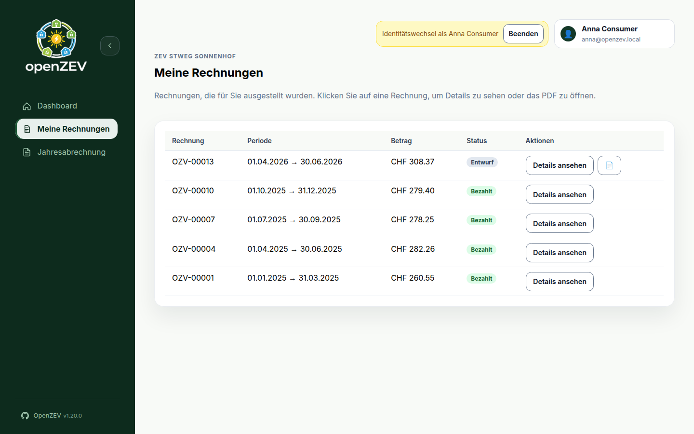
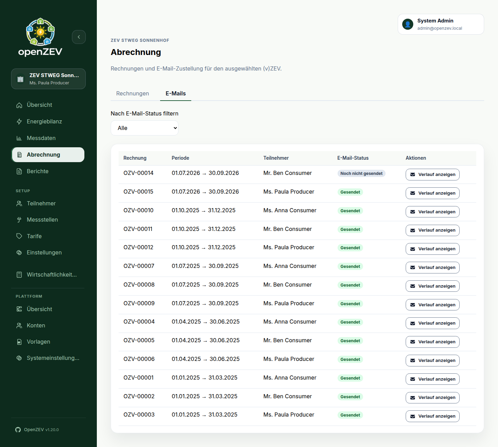
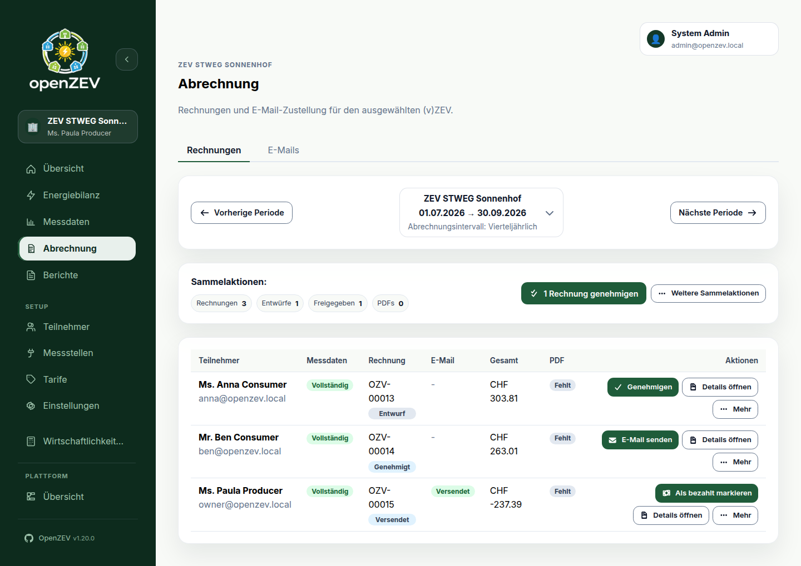
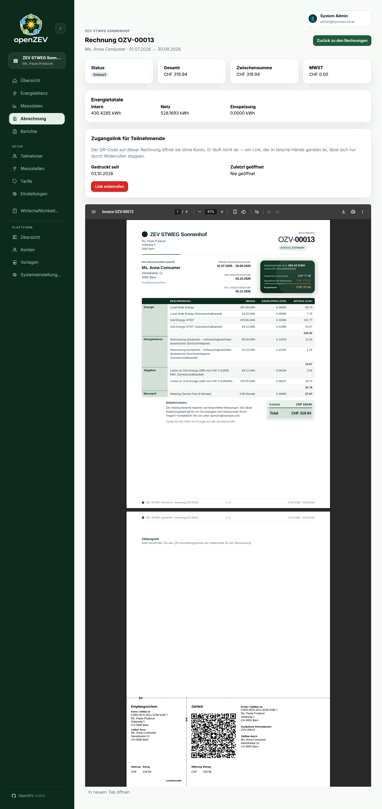
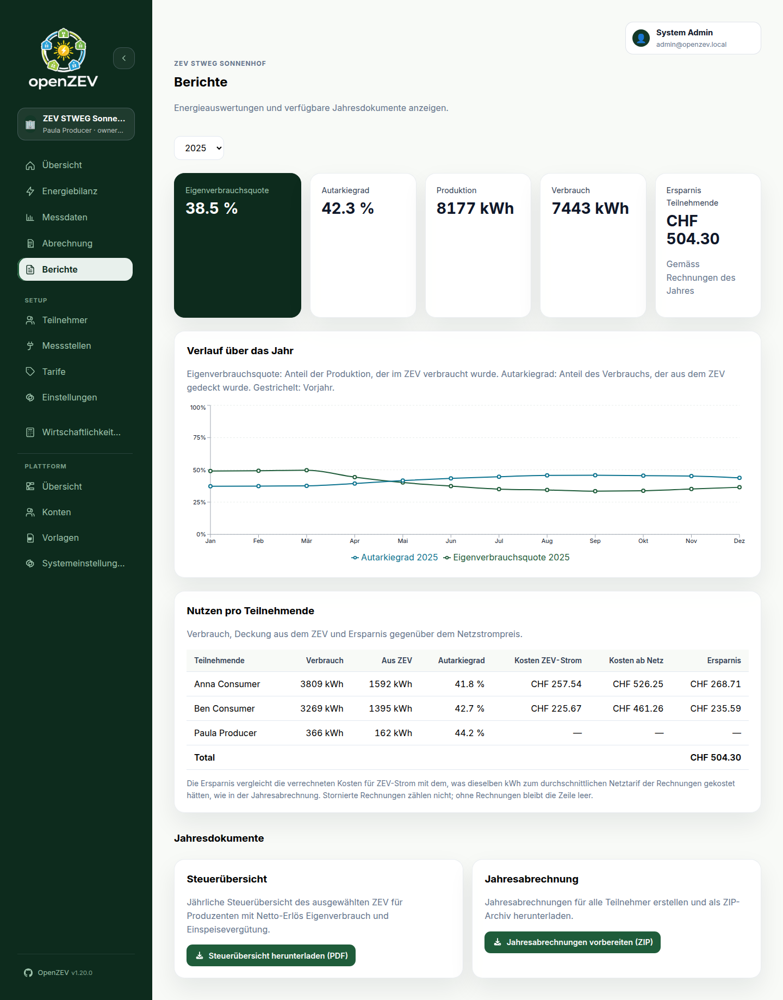
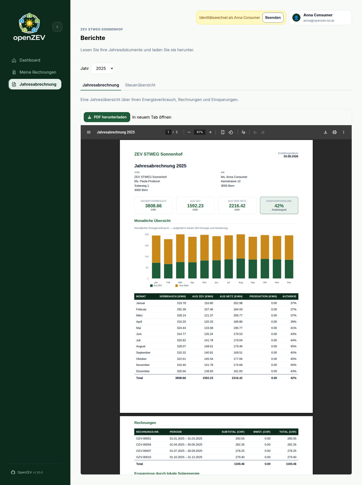

# Invoice Management

This guide covers generating, reviewing, and managing invoices for participants.

## Billing Work by Period (Overview)

The manager **Overview** groups billing work into one card per period, oldest
open period first. Each card shows the period status, the server-selected next
action, overdue invoices and failed deliveries, and any additional warnings.
Open **Period details** to see the remaining workflow steps and the compact
**Checked and complete** checklist. Steps that open an actionable page link to
it; a step that merely waits on an upstream one has no link. Data problems
never block generation — they appear as warnings. When locked invoices from an
earlier interval overlap the period (for example, paid monthly invoices under a
new quarterly rhythm), the card shows a generation conflict with a link to the
blocking invoices instead of offering generation.

Period resolution and step completion are separate: a period counts as open
when it holds a draft or
approved invoice, or a billable participant (active with a meter assignment)
with no invoice — a partial batch generation therefore keeps the period open
even after those invoices are sent. The later steps are trailing states, not
gates: approve/send/pay track the period's active invoices, so an older
period can be fully sent yet still show an unpaid payments step or an
unresolved failed delivery. Cancelled invoices are withdrawn and count neither for nor against any
step — but one still counts as an existing invoice, so it suppresses the
missing-invoice prompt for its participant until the operator regenerates it.

A community created mid-period has no partial first period: billing periods
align to the calendar, so the first billable one starts at the next aligned
boundary after the community's start date.

Three "nothing to do right now" states look similar but behave differently:

- **First run** — a brand-new ZEV with no participants **or** no metering
  points yet shows a setup checklist.
- **Awaiting first period** — participants and meters exist, but the first
  billing period has not ended yet. Missing meter assignments, a blank
  IBAN and a missing issuer (or an issuer without a full address) still show
  as warnings above the waiting message.
- **Caught up** — no ended period needs you right now (nothing waiting at
  draft/approved, every eligible participant invoiced); Overview shows a quiet
  **Up to date** message and keeps completed periods collapsed below it.

An unfinished setup never hides behind a green status: with active
participants but no current meter assignment Overview says nothing is
billable yet and links to meter assignment. A missing IBAN, and a missing
issuer or an issuer without a full address, stay visible beside normal period
work without blocking generation: either way invoices are created without a
QR bill. The issuer warning links to
[ZEV settings → People & access](02-zev-setup.md#people-and-access-tab).

Invoice alerts appear in the matching period card: unresolved failed invoice
emails (a later successful retry clears the item) and overdue sent invoices.
Alerts without a billing period, including participant validity endings that
still hold meter assignments, appear under **Community notices**. Tariff
coverage, metering gaps, unassigned readings and setup state are already
covered by readiness steps or setup guidance.

## Participant View: My Invoices

Participants open **My invoices** (`/me/invoices`) in the sidebar to see the
invoices issued to them — invoice number, period, total, status, and a link to
the details. An invoice appears here once it has been sent: drafts and
approved invoices that haven't gone out yet stay with the operator, and the
participant's annual statement counts only sent invoices too. A sent invoice
that is cancelled later stays listed, marked as cancelled. The PDF button
appears only on rows that have a document. This sent-only list also applies
when you manage another community where you are a participant.
Click the invoice number or **View details** to open the invoice. **Open PDF**
has a text label; invoices without a document show whether the PDF is being
prepared, failed, or missing. A failed refresh keeps the last loaded invoices
visible with a warning and **Retry**.
Participants with several communities see which community issued each invoice.
The list is read-only; the deep link `/billing/invoices/{id}` shows a
participant only their own invoice (enforced by the backend), and its return
link leads back to **My invoices**.



## Invoice Lifecycle

Invoices progress through a controlled workflow:

```
Draft → Approved → Sent → Paid
```

- **Draft** — just generated; can be reviewed, approved, regenerated or deleted.
- **Approved** — locked; can be emailed or marked as sent. Its amounts can no
  longer change.
- **Sent** — emailed (or marked as sent); can be resent or marked paid.
- **Paid** — fully settled; only its PDF can still be regenerated.
- **Cancelled** — removed from the active workflow; can be deleted or generated
  again. A cancelled invoice does not count as generated for its period: its
  period card still asks you to generate a replacement. Cancelling is available
  through the API only — there is no cancel button in the UI.

Only admins can delete an invoice that is approved, sent or paid.

## Billing Hub (Invoices · Emails)

The sidebar entry **Billing** (`/billing/invoices`) opens the invoice-first
billing hub. Its tabs are routes — each is directly linkable:

- **Invoices** (`/billing/invoices`) — the period-based invoice view (below).
- **Emails** (`/billing/emails`) — delivery status of approved, sent, and paid
  invoices: the latest email status per invoice, a filter by status, a
  failed-email banner, **View history** for the actual attempt log, and an
  inline **Retry** per failed latest attempt.

The yearly whole-ZEV annual-statement ZIP is on **Reports** (see
[Reports: Annual Report, Statements and Tax Overviews](#reports-annual-report-statements-and-tax-overviews)).
The former `/billing/statements` address redirects there.

The per-period work cards live on **Overview**. The running period is separated
as **Collecting data** and never exposes readiness actions. Ended periods with
open work remain visible as cards; fully completed ended periods are collapsed.
The primary action follows the backend-selected next step. **Open invoices**
deep-links into Billing with that exact period preselected
(`/billing/invoices?period_start=…&period_end=…`). Periods from an earlier
billing interval keep their exact entries after a switch, so a January monthly
invoice stays reachable next to its Jan–Mar quarter.

The former `/billing/periods` bookmark redirects to Overview (see the
Manager Overview screenshot in [Getting Started](01-getting-started.md)).

The card action opens the workflow that needs attention, such as metering
quality or tariffs. **Open invoices** opens that period's invoices.



After a retry is accepted, the tab shows it as pending while the worker
starts. It updates automatically when the next delivery attempt is recorded.
Invoice rows themselves show only the latest delivery state (the **Sent** step
of their progress); detailed attempts and errors are kept in the Emails tab's
history panel.

## Period-Based Invoice View

The **Invoices** tab shows one billing period at a time. You move between
periods, and within a period you can narrow the list to one workflow stage or
to the rows that need attention.

### Period Navigation

The command bar at the top of the tab shows:

- The **period name** — `September 2026` for a monthly period,
  `July – September 2026` for a quarter. Hover it to see the exact dates; click
  it to pick one of the recent periods, each listed with its dates.
- **‹** and **›** buttons on either side to step to the previous and next
  period.
- On the right, the period's **batch actions** (see
  [Row and Batch Actions](#row-and-batch-actions)).

A range that is not one whole billing period of the community (for example
from an old bookmark, or an invoice's month after the community switched to
quarterly billing) shows its dates with a warning badge, **Not a billing
period**, and a notice above the table. Its invoices can still be approved,
sent and paid, and their PDFs regenerated, but this page creates no invoices for such a range: the notice's button
(for example **Show July – September 2026**) opens the whole billing period
around it, and **‹** / **›** step to the nearest whole periods.

The period is automatically set based on the selected ZEV's billing interval.

**How the period is chosen and kept consistent:**

- **Default:** the most recent **completed** billing period (nothing older is
  silently implied — you can move further back with **Prev**).
- **New community:** with no completed period yet, the page opens on the
  community's **first aligned period** instead of an empty one.
- **Deep links:** opening a link that carries a period (`?period_start=…&
  period_end=…` — from an Overview period card, an attention item, or your own
  bookmark) shows that **exact period**, including historical periods from an
  earlier billing interval after a switch. Ranges that would start before the
  community existed are ignored: the page opens the default period and puts
  it in the address bar.
- **Boundary:** **Prev** stops at the community's earliest billable period;
  the preset menu offers nothing older. After switching billing intervals,
  already settled periods (fully paid under the previous interval) stay
  closed and link to the invoice that already settles them instead of
  offering Generate, while partly overlapping locked invoices surface as a
  generation conflict with a link to the blocking invoices.

Choosing a period preserves unrelated URL parameters and clears the row filter. Reload and browser Back read the period from that URL. Switching
community keeps the period you were looking at where it can: when the other
community bills in a different interval, you land on its billing period that
contains the end of the previous one (September in a monthly community becomes
July – September in a quarterly one, and back), and a period before the
community's start falls back to the default. A failed refresh retains the loaded period rows with
**Retry**.



### Period Overview Table

Each row in the table represents one **participant** who had active metering-point assignments during the period. A participant whose assignment has since ended keeps their row while they still hold an invoice for the period, so email/payment actions on that invoice stay reachable. Columns:

| Column | Description |
|---|---|
| **Participant** | Current participant name, invoice link and relevant participation dates. Meter locations distinguish several participations held by the same party. Problems appear below the name. |
| **Progress** | Metering data → Invoice → Approved → Sent → Paid. Checks show completed steps, spinners show pending work, and warning marks show problems. The legend explains the icons. |
| **Amount (CHF)** | The invoice amount; *-* without a live invoice. |
| **Actions** | The next step and **More**. Viewers and managers of disabled communities retain **Review conflict** and **Open PDF**. |

- Organisations have a building icon; a household's second name line follows
  the name. Names come from the current participant data; the invoice PDF keeps the
  recipient as billed. **Joined**/**Left** dates explain participation inside the period.
- The invoice number opens details and retains the period for return navigation.
  Rows without an invoice show **Not created** or **Creating invoice…**;
  cancelled invoices retain their link and show no billed amount.
- Problems name missing meters and days, an overlapping locked invoice,
  a failed PDF, a failed email, or an approved invoice whose participant has no
  email address (deliver it yourself, then **Mark as Sent**). A settled invoice
  whose meters were removed shows no missing-data warning.
- **Already billed** means one or more sent/paid invoices cover the period,
  for example monthly invoices collectively covering a quarter. No new invoice
  is needed. The link opens one related invoice.

On narrow screens each row becomes a card: name and amount (with *CHF*)
first, then the progress and the actions.

### Empty State

If no participants with active assignments exist for the period, the page shows links to:

- **Participants** — to add or check participant records.
- **Metering Points** — to check metering-point assignments.
- **Tariffs** — to configure pricing.

## Row and Batch Actions

Each row shows its next step as an outlined button — **Generate invoice**,
**Approve**, **Send Email** or **Mark Paid**, depending on the status — and puts
the rest under **More**:

| Status | Button | Under **More** |
| --- | --- | --- |
| *(none)* / Cancelled | **Generate invoice** / **Generate again** | Delete invoice (cancelled), Open PDF, Generate/Regenerate PDF |
| Draft | **Approve** | Regenerate invoice, Delete invoice, Open PDF, Generate/Regenerate PDF |
| Approved | **Send Email** | Mark as Sent, Open PDF, Generate/Regenerate PDF |
| Sent | **Mark Paid** | Open PDF, Generate/Regenerate PDF, Resend Email |
| Paid | — | Open PDF, Generate/Regenerate PDF |

**More** groups invoice actions first, then PDF and email actions. **Open PDF**
appears once the invoice has a stored document.

Admins also see **Delete invoice** for approved, sent and paid invoices.

The filter above the table counts the period's rows: **All**, **Drafts**,
**Approved**, **Sent** and **Issues** (rows with missing metering data, a
generation conflict, a failed PDF, a failed email or no email address). Select one to show just
those rows; select it again, **All** or **Show all rows** to clear it. A
category with no rows, or with all of them, is left out. If the selected category empties,
the page explains why and offers **Show all rows**. Paid invoices appear
under **All** only. Changing period or community clears the filter.

The **batch actions** in the command bar always act on the whole period,
including rows hidden by a filter. The recommended next step is the page's one
filled button and names how many invoices it touches (for example *Approve 4
invoices*); **Download all PDFs** sits beside it, and **More batch actions**
holds **Generate all**, **Approve all**, **Send all** and **Regenerate all
PDFs**. Operations with no eligible invoices are omitted from the menu. While a
batch request runs, its controls are disabled. Generation remains disabled
for queued targets until their invoices arrive. **Send all** counts only
approved invoices with an email address, and stays disabled while any email
is being sent or its delivery checked; a row's **Send Email** is disabled
while that invoice's delivery is checked.

## Generating Invoices

1. Navigate to the desired billing period.
2. Check the **Issues** filter (shown only while there are issues) — ensure metering data is complete for the participants you want to invoice.
3. Click **Generate invoice** on a participant's row, or the recommended batch
   action (*Generate n invoices*) in the command bar. Generating all runs in
   the background: each row shows *Creating invoice…* until its invoice
   arrives.

The page watches for queued invoices and their PDFs for up to 90 seconds,
including while the worker has not created any invoices yet. If processing
takes longer, a warning says it has not finished: reload the page to check the
result before generating again. Changing period or
community stops watching the previous period.

The system calculates energy allocation and applies tariffs, creating a **Draft** invoice.

### Regenerating an Existing Invoice

While an invoice is a **Draft**, **More → Regenerate invoice** replaces it with a
freshly calculated one. Use this after correcting metering data or tariff
configuration. Approved, sent and paid invoices are locked and cannot be
regenerated.

> **Tip:** You can generate invoices even when metering data is incomplete, but totals may be inaccurate. It is best to resolve missing data first.

## Reviewing Invoices

Click the invoice number in the **Participant** column to view the invoice detail page.

### Invoice Detail Page



The page header names the invoice and, next to the recipient and the billing
period, its current **status** — the same status pill the invoice document
prints. Below it, two rows of figure tiles summarise the invoice the way its
PDF does:

- **Total CHF** (the dark tile) — the final invoiced amount.
- **Subtotal CHF** — amount before VAT.
- **VAT CHF** — the VAT portion.

**Energy totals:**

| Metric | Description |
|---|---|
| Local kWh | Energy consumed from local (solar) production. |
| Grid kWh | Energy drawn from the external grid. |
| Feed-in kWh | Energy fed back into the grid. |

**The invoice document** — the stored PDF itself is embedded below the figure tiles in a full document viewer (the same file the participant receives by email). It contains the line items, grouped by **tariff category** (e.g. Energy, Fee),
with each line's type, description, quantity (kWh), unit price (CHF), and
total, plus a subtotal per group. If no PDF has been generated yet, the page shows a **Generate PDF** button instead (managers and admins only — a participant sees a plain document-unavailable message, since the API rejects their generation attempt); the viewer appears once the document exists.

> **Note:** Invoices cannot be edited directly. If a correction is needed on a
> draft, fix the underlying data (metering readings or tariff prices) and
> regenerate it.

## Approving Invoices

Approval locks an invoice and signals that it has been reviewed.

1. Find the draft invoice in the period overview.
2. Click **Approve** on its row (or **Approve all** for every draft in the period).

The status changes from `Draft` to `Approved`. Only draft invoices can be approved.

## Generating and Managing PDFs

PDF generation is a separate step from invoice creation.

- **Generate PDF** — creates the PDF for an invoice that does not yet have one.
- **Regenerate** — replaces an existing PDF (e.g. after the HTML template was updated).
- **Open PDF** — opens the generated PDF in a new browser tab.

**More → Open PDF** opens the document. Generation and regeneration are also
under **More** for any invoice that exists. **Download all
PDFs** in the command bar downloads the period's documents together.

For custom templates that omit the second address line, ask an admin to
[update the PDF template](14-admin-console.md#invoice-pdf-templates), then regenerate the affected PDFs.

## Participant Access Links

Only relevant if you turned on **Participant QR code on the invoice** — see [ZEV Setup → Participant Access from the Invoice](02-zev-setup.md#participant-access-from-the-invoice). It is off by default.

When it is on, every invoice you generate carries a QR code on its insights page that opens that one invoice without an account. The invoice detail page then shows a **Participant access link** card with:

- **Printed since** — when the link was first minted, which is when the invoice first got a PDF.
- **Last opened** — the last time somebody scanned it, or **Never opened**. Recorded at most once per hour, so it answers "has this been read at all?" rather than "how often". This is a useful thing to check before chasing a payment.
- **Revoke link** — the only way to stop a printed link.

### Revoking a link

The link **never expires**, so revoking is the control. Revoke when an invoice was sent to the wrong address, or a participant tells you their copy went astray.

Revoking is per invoice: it kills the QR on that invoice and touches nothing else, including the participant's other invoices.

What it costs: the code on the copy already in the post stops working for good. The next time you generate that invoice's PDF it gets a fresh code, but a reprint will not match the sheet somebody is already holding. If the participant needs access again, send them the regenerated PDF.

Revoking is recorded in the audit log, as is every first open of a link in a given hour.

## Sending Invoices by Email

Once an invoice is approved, you can email it to the participant.

1. Click **Send Email** on an approved invoice's row (or **Send all**).
2. The system queues the email and watches for the delivery result. **Send all**
   checks the period until deliveries succeed or fail, for up to 90 seconds.
3. While it waits, the button shows **Sending…** and is disabled.
4. The row's **Sent** step updates automatically when the email is delivered or
   fails; a failure also appears in red under the participant.

For a `Sent` invoice, **More → Resend Email** sends another copy.

If you delivered the invoice some other way (printed, handed over), use
**More → Mark as Sent** on the approved invoice instead: it moves to `Sent`
without an email.

### Email History

The **Sent** step shows only the latest delivery status. Every attempt, with
recipient, status and error, is in **Billing → Emails** under **View
history**, where a failed latest attempt also has a **Retry** button.

Use Tab or Shift+Tab to move between email-history controls, then Escape or
**Close** to return to the history button.

Email sending is asynchronous via Celery with automatic retries. For delivery mechanics, retry behavior, and troubleshooting failed emails, see [Email Configuration](10-email-configuration.md).

## Marking Invoices as Paid

When a participant has paid:

1. Click **Mark Paid** on the row (shown for `Sent` invoices).

The status changes to `Paid`. There is no additional confirmation dialog or payment-detail input — it is a single-click action.

## Deleting Invoices

Invoices can be deleted to clean up incorrect or test data.

1. Open **More** on the row and click **Delete invoice**.
2. Confirm in the deletion dialog.

**Delete visibility rules:**

- **Draft** or **Cancelled** invoices — **More → Delete invoice** is available to managers.
- **Any status** — admins can always delete.

Deletion is permanent; the invoice is removed from the database.

## Reports: Annual Report, Statements and Tax Overviews

Open **Reports** (`/reports`) and select a year at the top of the page. The
default is the last completed year.

**Admins and managers** see the selected ZEV's annual report first:

- **Key figures** — the year's **self-consumption rate** (share of the ZEV's
  production used inside the ZEV), **self-sufficiency rate** (share of the
  ZEV's consumption covered by its own production), total production and
  consumption, and the participants' total savings. When the previous year has
  metering data, its rates are shown below this year's for comparison.
- **Over the year** — both rates month by month. The previous year is drawn
  as dashed lines; months without data are left empty.
- **Benefit per participant** — each participant's consumption, how much of it
  came from the ZEV, their self-sufficiency rate, and their savings: what their
  ZEV electricity was billed at, what the same kWh would have cost at the
  average grid rate on their invoices, and the difference. These are the same
  savings figures as on each participant's annual statement. Cancelled
  invoices do not count, and a participant without invoices for the year shows
  no savings.

The rates use the same definitions as **Energy balance**, so the figures
match. A year without metering data shows a short notice instead.

If a metering point is marked **Generation behind the meter** (see
[Metering points](04-metering-points.md#generation-behind-the-meter)), the
participant who holds it shows **—** instead of a self-sufficiency rate, with
a badge explaining why. Their consumption and production kWh are unaffected.
A note under the key figures explains that, for those meters, "production"
means only the surplus fed into the community and the rates describe energy
exchanged at the connection point — not the plant's own self-consumption. The
same **—** and note appear on that participant's annual statement PDF, on
**Energy balance**, and on the participant's own dashboard.

Below the report, under **Annual documents**:

- **Tax Overview** — download the ZEV's yearly tax overview for producers as a
  PDF.
- **Annual Statement** — prepare a ZIP of the selected ZEV's annual statements
  for all participants. Download it when ready. You can return after
  reloading; links expire after 24 hours. Partial exports include an
  `omitted.txt` listing statements that could not be generated.



**Participants:** Open **Annual statement** (`/me/statement`) to read your own
statement or select the **Tax Overview** tab. Use **Download PDF** to save the
document. **Open in new tab** shows the same PDF. Select **Retry** if generation
fails, or reload the page for fresh documents. The tax overview shows producers'
net local-energy revenue and feed-in compensation.



These documents use your consumption, invoices, and savings. They become
available after billing. The selected community appears above the page title.

## Troubleshooting

### No participants appear in the period overview

**Causes:**
- No active participants with metering-point assignments overlapping the selected period.
- The wrong ZEV is selected (check the community name above the page title).

**Fix:**
1. Check the community name above the page title (click it to choose another).
2. Verify that [Participants](03-participant-management.md) exist and have [metering-point assignments](04-metering-points.md) covering the period.

### Invoice totals look wrong

1. Verify [tariff prices](07-tariff-configuration.md) are correct for the period.
2. Check [metering data](06-metering-analysis.md) completeness — missing readings lead to under-counted energy.
3. Review the [billing allocation logic](08-billing-allocation-explained.md) to understand how local vs. grid energy is split.
4. If needed, fix the data and regenerate the invoice while it is still a draft.

### Email not received by participant

1. Check the participant's email address in [Participants](03-participant-management.md).
2. Open **Billing → Emails** and **View history** to check delivery status and error messages.
3. Click **Retry** on a failed latest attempt.
4. Review [Email Configuration](10-email-configuration.md) for SMTP environment variable issues.

## Best Practices

- **Check metering completeness** before generating invoices — the **Issues** filter lists every participant with missing data, and each row names the affected meters and how many days are missing.
- **Approve after review** — open the invoice detail page and check the embedded invoice document (line items and totals) before approving.
- **Generate PDFs before sending** — while not strictly required, generating the PDF first lets you review the document before emailing.
- **Approve only when final** — once approved, an invoice can no longer be
  regenerated. Correct data and tariffs while it is still a draft.

## Next Steps

- **Configure email delivery:** [Email Configuration](10-email-configuration.md)
- **Understand billing logic:** [Billing & Allocation Explained](08-billing-allocation-explained.md)
- **Manage tariffs:** [Tariff Configuration](07-tariff-configuration.md)
