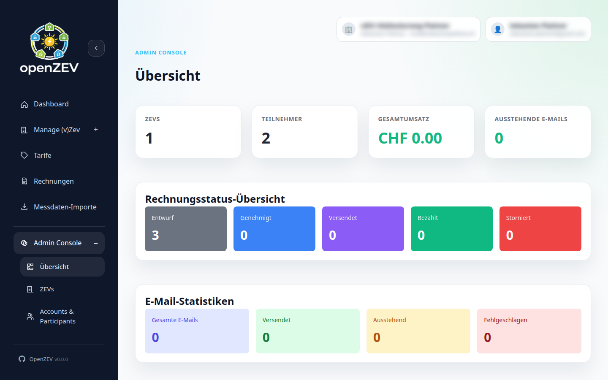
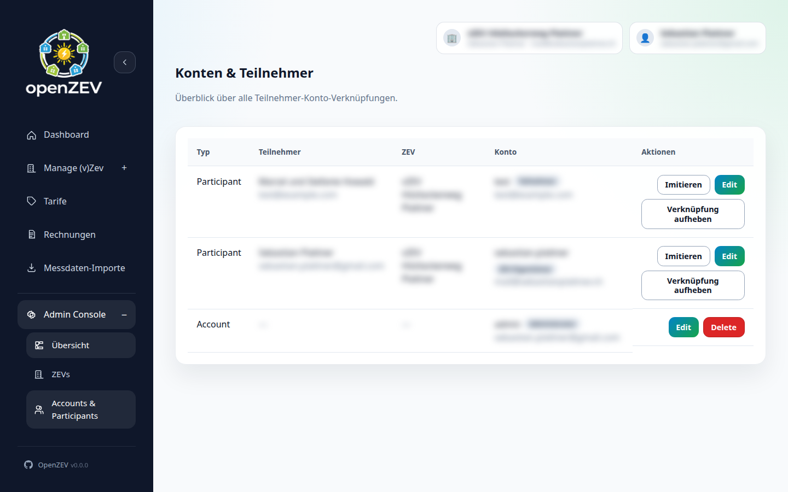

# Roles and Permissions

This guide explains user roles and access boundaries in OpenZEV.

## User Roles

OpenZEV supports three distinct roles:

| Role | Scope | Typical User | Purpose |
| --- | --- | --- | --- |
| **Admin** | Global system | Platform operator, IT | Full access to all ZEVs, settings, accounts |
| **ZEV Owner** | Single ZEV (scoped) | Community operator | Manage one or more ZEV communities |
| **Participant** | Own data only | Community member | View own consumption, download invoices |

## Admin Role

**Admins** have unrestricted access to the entire system.

### Admin Capabilities

- **Account Management:** Create, edit, remove user accounts
- **User Roles:** Assign roles and ZEV scopes to other users
- **System Settings:**
  - Regional timezone and date format
  - VAT rate configuration
  - PDF invoice templates
- **Multi-ZEV Oversight:** View and monitor all ZEVs in system
- **Analytics:** Platform-wide KPIs and operational metrics
- **Audit Logs:** View all user actions and system events

### Admin Dashboard

Accessible via **Admin Dashboard**:

- System health and status
- Account count and active users
- Total invoices generated
- Email delivery metrics
- Recent alerts and issues

### Who Should Be Admin?

- Platform owner or operator
- IT/system administrator
- Finance/compliance officer (for audit access)

> **Important:** Give admin access sparingly. It grants unrestricted power.

## ZEV Owner Role

**ZEV Owners** manage one or more energy communities (ZEVs).

### ZEV Owner Capabilities

**Per assigned ZEV:**
- Manage participants (add, edit, view)
- Configure metering points
- Import metering data
- View data quality reports
- Configure tariffs
- Generate and approve invoices
- Send invoices to participants
- Track email delivery
- Customize email templates
- Configure ZEV settings (billing interval, VAT number, etc.)

**Restrictions:**
- Cannot access other ZEVs (unless assigned to multiple)
- Cannot access admin settings
- Cannot manage global user accounts
- Cannot view other ZEV's metering data or invoices

### ZEV Scope

A ZEV Owner is **scoped** to one or more ZEVs:

- **Single ZEV:** Owner manages one community only
- **Multiple ZEVs:** Owner can switch between assigned communities via ZEV selector
- Each ZEV is isolated—data from one ZEV is not visible in another

### Who Should Be ZEV Owner?

- Community president or board representative
- Energy manager for a specific community
- Finance officer responsible for invoicing
- Metering and tariff specialist

## Participant Role

**Participants** are community members with read-only access to their own data.

### Participant Capabilities

- **Dashboard:** View own energy consumption/production overview
- **Metering Data:** View own consumption charts and trends
- **Invoices:** Download own invoices (read-only)
- **Account Profile:** Update personal information

### Participant Restrictions

- Cannot see other participants' data
- Cannot see metering data from other ZEVs
- Cannot modify tariffs, metering points, or settings
- Cannot generate or approve invoices
- Cannot access admin features

### Who Are Participants?

- Household members with metering points
- Small businesses with energy meters
- Anyone with meter(s) in a ZEV community

## Access Control Matrix

| Feature | Admin | ZEV Owner | Participant |
| --- | --- | --- | --- |
| **Participants** | View all | View own ZEV | View self |
| **Metering Points** | View all | View own ZEV | View own meters |
| **Metering Data** | View all | View own ZEV | View own readings |
| **Tariffs** | View all | Create/edit own ZEV | View only |
| **Invoices** | View all | Create own ZEV | View own only |
| **Email Templates** | Manage defaults | Customize own ZEV | — |
| **Settings** | Global settings | Own ZEV settings | Account profile |
| **Admin Panel** | Full access | — | — |

## Assigning Roles

**Only Admins** can assign roles to other users.

### Create a New User

1. Go to **Admin → Accounts**
2. Click **Create New Account**
3. Enter:
   - **Email** (login credential)
   - **First/Last Name**
   - **Role:** Admin, ZEV Owner, or Participant
   - **Assign to ZEVs** (if ZEV Owner or Participant)
4. Click **Create**

User receives invitation email with password setup link.

### Update User Role

1. Go to **Admin → Accounts**
2. Click on user name
3. Click **Edit**
4. Change **Role** or **ZEV Assignments**
5. Click **Save**

Changes take effect immediately.

### Remove User

1. Go to **Admin → Accounts**
2. Click on user
3. Click **Deactivate**

User cannot login; their account is preserved in history.

## Data Privacy and Scoping

OpenZEV enforces data boundaries:

### Participant Privacy

- Participants can **only** view their own consumption and invoices
- They cannot see other participants' data in the same ZEV
- API access is also scoped—a participant token can only fetch own data

### ZEV Isolation

- ZEV Owners assigned to ZEV A **cannot** see ZEV B's data
- Tariffs, metering points, and invoices are entirely isolated by ZEV
- Admins can view all ZEVs but typically delegate operations to ZEV Owners

### Audit Trail

All user actions are logged:
- Who did what (action)
- When (timestamp)
- What changed (old → new values)

Audit logs are visible only to admins.

## Best Practices

**Principle of Least Privilege:**
- Assign the minimum role needed for the job
- Participants should not be admins
- Limit admin accounts to platform operators

**Separate Roles:**
- Use different user accounts for different roles
- Don't share admin accounts between people
- Create audit trail by attributing actions to individuals

**Regular Reviews:**
- Periodically review who has access to what
- Remove access when people leave the organization
- Audit role assignments for compliance

**Account Security:**
- Users should use strong passwords
- Consider enabling multi-factor authentication (if available)
- Don't write passwords down

## Multi-ZEV Setups

If operating multiple communities:

**Admin perspective:**
- Can oversee all ZEVs
- Can assign ZEV Owners to specific communities
- Can monitor cross-ZEV metrics and KPIs

**ZEV Owner perspective:**
- Use **ZEV Selector** (top nav bar) to switch between assigned ZEVs
- Each ZEV has isolated data
- Can be assigned to manage 1 or many ZEVs

## Troubleshooting

### "Cannot access [feature]" (permission error)

**Check your role:**
1. Click profile icon (top right)
2. View **My Account**
3. Check **Role** and **ZEV Assignments**

If role is wrong, ask an admin to update.

### "Cannot see other ZEVs"

**Expected behavior:** ZEV Owners are scoped to assigned ZEVs.

**If you need access:**
- Ask an admin to add you to the ZEV via **Admin → Accounts**

### "User cannot login"

**Possible causes:**
- User account not yet activated (check email for invitation)
- User account deactivated
- Password not set or forgotten

**Fix:**
1. Check if user received invitation email
2. Can send password reset link from **Admin → Accounts**

## Next Steps

- **User management:** Admin controls at **Admin → Accounts**
- **ZEV settings:** [ZEV Setup and Configuration](02-zev-setup.md)
- **Participant management:** [Managing Participants](03-participant-management.md)
