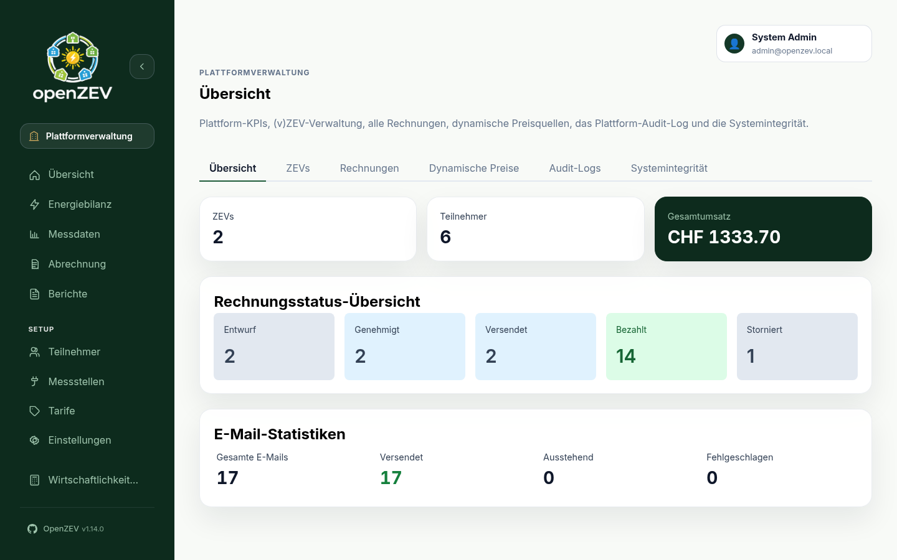
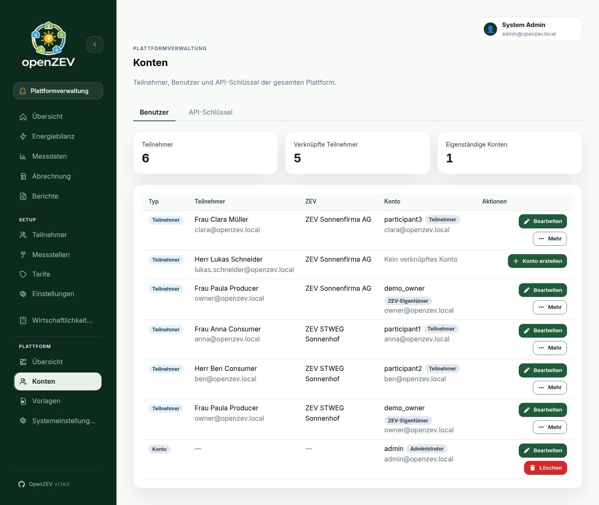
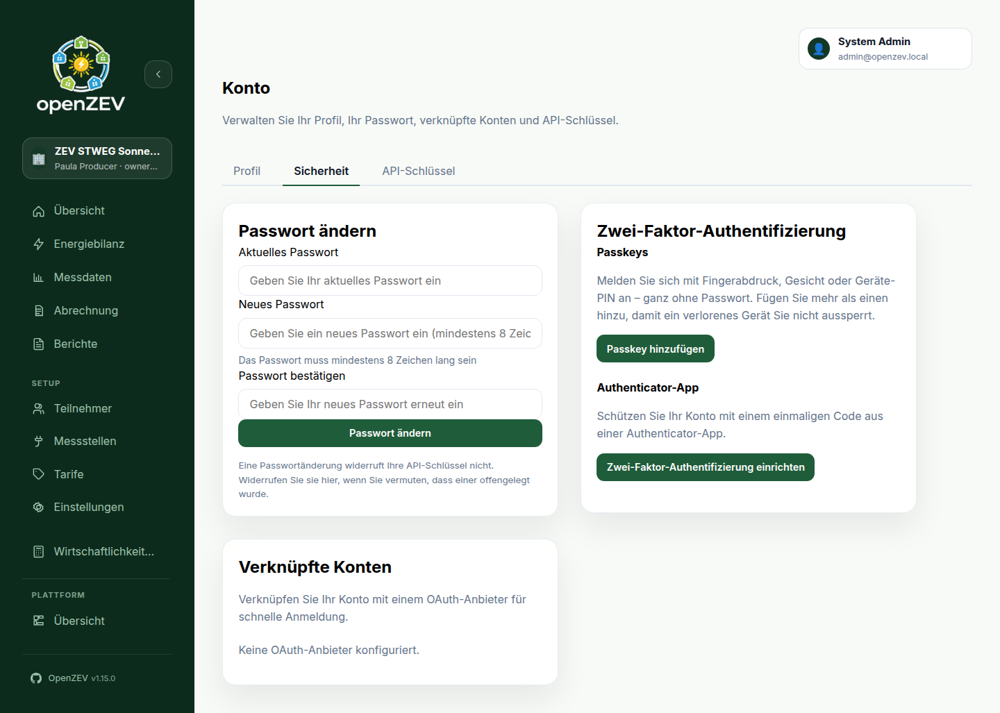

# Roles and Permissions

This guide explains user roles and access boundaries in OpenZEV.

## User Roles

OpenZEV supports four distinct roles:

| Role | Scope | Typical User | Purpose |
| --- | --- | --- | --- |
| **Admin** | Global system | Platform operator, IT | Full access to all ZEVs, settings, accounts |
| **ZEV Owner** | Single ZEV (scoped) | Community operator | Manage one or more ZEV communities |
| **Participant** | Own data only | Community member | View own consumption, download invoices |
| **Guest** | None until linked | Unlinked account | Stand-by log-in; no community access until linked to a participant |

> **Note:** The **guest** role is an internal transitional role. It normally has
> no domain access and is used when an account is not (or no longer) linked to a
> ZEV or participant.

## Admin Role

**Admins** have unrestricted access to the entire system.

### Admin Capabilities

- **Account Management:** Create, edit, remove user accounts
- **User Roles:** Assign roles and ZEV scopes to other users
- **System Settings:** regional date formats, VAT rate configuration, feature flags, and OAuth providers
- **Overview hub:** KPIs, multi-ZEV oversight, all invoices, the platform audit log, and system health
- **Accounts:** user management and platform-wide API keys
- **Templates:** PDF invoice/contract/statement templates and system-wide email defaults

### Admin Dashboard

Accessible via **Admin Dashboard**:

- System health and status
- Account count and active users
- Total invoices generated
- Email delivery metrics
- Recent alerts and issues

### Who Should Be Admin?

- Platform owner or operator
- IT/system administrator
- Finance/compliance officer (for audit access)

> **Important:** Give admin access sparingly. It grants unrestricted power.

## ZEV Owner Role

**ZEV Owners** manage one or more energy communities (ZEVs).

### ZEV Owner Capabilities

**Per assigned ZEV:**
- Manage participants (add, edit, view)
- Configure metering points
- Import metering data
- View data quality reports
- Configure tariffs
- Generate and approve invoices
- Send invoices to participants
- Track email delivery
- Customize email templates
- Configure ZEV settings (billing interval, VAT number, etc.)
- Turn participant invoice access on or off, and revoke a printed access link

**Restrictions:**
- Cannot access other ZEVs (unless assigned to multiple)
- Cannot access admin settings
- Cannot manage global user accounts
- Cannot view other ZEV's metering data or invoices

### ZEV Scope

A ZEV Owner is **scoped** to one or more ZEVs:

- **Single ZEV:** Owner manages one community only
- **Multiple ZEVs:** Owner can switch between assigned communities via ZEV selector
- Each ZEV is isolated—data from one ZEV is not visible in another

### Who Should Be ZEV Owner?

- Community president or board representative
- Energy manager for a specific community
- Finance officer responsible for invoicing
- Metering and tariff specialist

## Participant Role

**Participants** are community members with read-only access to their own data.

### Participant Capabilities

The participant sidebar shows **Dashboard**, **My invoices**, and **Annual statement**; own consumption charts and trends stay reachable through the direct `/metering/chart` route.

- **Dashboard:** View own energy consumption/production overview
- **My invoices:** View and download own invoices (read-only; shows invoices even before a PDF exists)
- **Annual statement:** View the community's annual statement
- **Metering Data:** Direct route to own consumption charts and trends
- **Account Profile:** Update personal information

### Participant Restrictions

- Cannot see other participants' data
- Cannot see metering data from other ZEVs
- Cannot modify tariffs, metering points, or settings
- Cannot generate or approve invoices
- Cannot access admin features

### Who Are Participants?

- Household members with metering points
- Small businesses with energy meters
- Anyone with meter(s) in a ZEV community

### Reaching a Participant Without an Account

Participants do not have to hold an account to see their own bill. If the ZEV
has [participant invoice access](02-zev-setup.md#participant-access-from-the-invoice)
switched on, the QR code printed on an invoice opens **that one invoice** — no
username, no password, no session.

This is not a role. Whoever holds the printed invoice can open the page, and the
page is limited to what that sheet of paper already shows: the total, whether it
is paid, the line items, the consumption figures and the charts printed on the
same insights page. It cannot reach another invoice, and it cannot change
anything.

From there, **Send me a sign-in link** emails a one-time link to the address on
file, which does start a normal participant session with the ordinary
participant scoping above. The requester never names the destination address —
the invoice identifies who they are — so there is no way to use it to find out
whether an address has an account.

A ZEV owner or admin can revoke any printed link; see
[Invoice Management → Participant access links](09-invoice-management.md#participant-access-links).

## Guest Role

A **Guest** is a log-in account that is not currently linked to a participant. It
has no access to a ZEV's data until an admin links it to a participant.

- **How a Guest is created:** when an admin **unlinks** an account from a
  participant, that account's role becomes `guest`.
- **Re-linking:** a guest account can be linked to a participant again by an
  admin (same as a participant account).
- **Restrictions:** guests cannot manage communities or settings, and cannot be
  impersonated or impersonate others.

## Access Control Matrix

| Feature | Admin | ZEV Owner | Participant |
| --- | --- | --- | --- |
| **Participants** | View all | View own ZEV | View self |
| **Metering Points** | View all | View own ZEV | View own meters |
| **Metering Data** | View all | View own ZEV | View own readings |
| **Tariffs** | View all | Create/edit own ZEV | View only |
| **Invoices** | View all | Create own ZEV | View own only |
| **Email Templates** | Manage defaults | Customize own ZEV | — |
| **Settings** | Global settings | Own ZEV settings | Account profile |
| **Admin Panel** | Full access | — | — |

> **Note:** Guest accounts have no access in any column above until they are
> linked to a participant, after which they follow the Participant rules.

## Assigning Roles

**Only Admins** can assign roles to other users.

### The Accounts list

**Platform → Accounts → Users** lists every account on the platform, one row
each:

- **Account** — name, username, email and the account's **platform role**.
- **Communities** — one chip per community the account belongs to, marked
  *Owner* or *Participant*. An account that belongs to several communities
  still has a single row. Click a chip to open that community's Participants
  page.
- **Security** — which second factors the account has (authenticator app,
  passkey), or *No two-factor*; whether it is still within its grace period or
  overdue, for an account the two-factor policy names (see below); and when it
  last signed in, or *Never signed in*.

Use **Search**, **Platform role**, **Community** and **Two-factor** to narrow
the list — the community filter finds everyone who is an owner or participant
there, and the two-factor filter narrows to accounts that still need to set it
up. The **Never signed in** stat at the top counts accounts nobody has ever
signed into — useful for spotting a stale invitation or an account that can be
cleaned up.

> **Platform role vs. community membership.** The platform role (Admin, ZEV
> Owner, Participant, Guest) belongs to the *account* and applies in every
> community. Which communities an account belongs to is set on each community's
> **Participants** page, not here.

### Change an Account's Role

1. Go to **Platform → Accounts → Users**
2. Click **Edit** on the account
3. Change the **Platform role** (and name or email if needed)
4. Click **Save account**

Changes take effect immediately. You cannot change your own role.

### Create a New Account

Click **New account** on **Platform → Accounts → Users** for an account that is
not tied to any community — a second administrator, a service account, or any
account you want ready before it is needed. Enter a username, email, first and
last name, and the platform role, then click **Create account**.

There is no password field: OpenZEV generates one and shows it once, with a
**Copy password** button — share it with the account holder however you
normally would. They set their own password the first time they sign in.

To create an account **for a specific participant**, use the community's
Participants page instead — see below.

### Give a Participant an Account

Accounts are attached to participants from the community that the participant
belongs to:

1. Switch to the community and open **Participants**
2. On the participant's card, open **More**
3. Choose **Send onboarding link** or **Copy onboarding link** (creates the
   account and gives the participant a sign-in link), or — as an admin —
   **Link existing** to attach a guest or participant account that is not yet
   linked
4. To detach an account again, choose **Unlink** (it becomes a Guest account)

### Other Account Actions

Open **More** on an account row for:

- **Impersonate** — view the platform as a participant or owner (never an
  admin).
- **Reset two-factor** — removes the account's passkeys, authenticator app and
  recovery codes, so someone locked out can sign in with their password again.
- **View activity** — opens the platform audit log filtered to this account's
  own actions.
- **Sign out everywhere** — ends every session the account holds, on every
  browser and device, so it has to sign in again. Use it when you suspect
  someone else has access. It is recorded in the audit log and is not offered
  on your own row (use **Sign out other devices** on your account page).
- **Deactivate** — the account can no longer sign in, and every session it
  holds ends immediately. Its data and history are kept, and you can
  **Activate** it again later. Not offered on your own row: OpenZEV refuses to
  let you deactivate yourself, since it would sign you out with no way back in
  except another administrator.
- **Delete** — only available for accounts that do not belong to a community.
  Unlink the account from its participant first; an owner's account cannot be
  deleted while it owns a community.

## Data Privacy and Scoping

OpenZEV enforces data boundaries:

### Participant Privacy

- Participants can **only** view their own consumption and invoices
- They cannot see other participants' data in the same ZEV
- API access is also scoped—a participant token can only fetch own data

### ZEV Isolation

- ZEV Owners assigned to ZEV A **cannot** see ZEV B's data
- Tariffs, metering points, and invoices are entirely isolated by ZEV
- Admins can view all ZEVs but typically delegate operations to ZEV Owners

### Audit Trail

Security-relevant and billing-relevant user actions are logged:
- Who did what (action)
- When (timestamp)
- What changed (old → new values)

Audit logs are visible to **admins** (all events, **Platform → Overview →
Audit log**) and to **ZEV owners** for their own communities (scoped events,
**Setup → Settings → Audit log**).

## Best Practices

**Principle of Least Privilege:**
- Assign the minimum role needed for the job
- Participants should not be admins
- Limit admin accounts to platform operators

**Separate Roles:**
- Use different user accounts for different roles
- Don't share admin accounts between people
- Create audit trail by attributing actions to individuals

**Regular Reviews:**
- Periodically review who has access to what
- Remove access when people leave the organization
- Audit role assignments for compliance

**Account Security:**
- Users should use strong passwords
- Turn on two-factor authentication under **My Account → Security** (see below)
- Don't write passwords down

## Two-Factor Authentication

Every user can protect their account with a **passkey**, an **authenticator app**, or both. Set them
up under **My Account → Security → Two-Factor Authentication**.

### Passkeys (no password needed)

A passkey lets you sign in with your fingerprint, face or device PIN — no password. It is
phishing-resistant: it only works on the real OpenZEV address.

1. Click **Add a passkey**, give it a name (for example "MacBook Touch ID"), and confirm on your device
2. Add a second one on another device, so a lost phone does not lock you out
3. Save the **recovery codes** shown once when you add your first factor

To sign in, click **Sign in with a passkey** on the login page. The button only appears in browsers
that support passkeys.

### Authenticator app

1. Click **Set up two-factor authentication**, scan the QR code with your authenticator app
   (Google Authenticator, Aegis, 1Password, …) or type the key in by hand
2. Enter the 6-digit code the app shows to confirm
3. Save the ten **recovery codes** if you have no other factor yet — each works a single time

Afterwards, signing in with your password asks for the 6-digit code as a second step. Use
**Use a recovery code instead** if you don't have your phone. The same code is asked when you sign in
through an emailed invoice link or onboarding link. Signing in through an external identity provider
is unaffected unless the administrator requires the provider to assert a second factor.

> **Note:** Adding a passkey protects your password too. Signing in with your password (or an
> emailed link) then asks for a second step: a recovery code if you only have a passkey, or the
> 6-digit code if you also have an authenticator app. The login page offers **Sign in with a passkey
> instead** at that point. Keep your recovery codes somewhere safe — they are what gets you in with a
> password if you can't use your passkey.

### Requiring it for a role (administrators)

Under **Platform administration → System Settings → Security**, choose which roles must use
two-factor authentication and set a grace period in days. Users of those roles see a reminder on their
account page and a set-up screen they can postpone until the grace period ends. The period counts from
the later of the account's creation and the day you last changed the policy, so switching it on never
locks anyone out immediately. A user whose role requires it cannot remove their last factor.

To see who has not enrolled yet, go to **Platform → Accounts → Users**: an account the policy names
gets a badge in the Security column — "2FA required · due `<date>`" during the grace period, "2FA
overdue" once it has passed — and the **Two-factor** filter narrows the list to exactly those
accounts. The "Needs two-factor" stat at the top of the page counts them.

Once the grace period ends, an account with no factor is also refused any change it tries to make
through the API, not only in the web app — so this is enforced, not just suggested. Reading data is
never affected, and neither is an API key: a key cannot complete the enrolment ceremony this policy
pushes someone toward, so it is a separate credential this policy does not reach. An account whose
day-to-day access is entirely through an API key it minted before the policy applied to it is
therefore not forced to enrol by this alone.

### Locked out?

On the second step of a password sign-in, enter one of your recovery codes. If you have lost your devices and your recovery codes, ask an
administrator: **Admin → Accounts → Reset two-factor** removes every passkey, the authenticator app
and all recovery codes for that user, and is recorded in the audit log. An administrator can never see
or recover your secrets, and cannot set up a factor on your behalf.

The server needs an encryption key (`MFA_ENCRYPTION_KEYS`) before authenticator apps can be enrolled
or a requirement can be set, and the passkey domain settings (`WEBAUTHN_RP_ID`, `WEBAUTHN_ORIGIN`)
must match the address users open OpenZEV on. See `backend/.env.example` and the Helm chart README.

## Email Address and Sessions

### Changing your email address

Your email address is what you sign in with and where sign-in links are sent, so changing
it takes a few extra steps. Under **My Account → Profile → Email address**:

1. Click **Change email**, enter the new address and your **current password**
2. Open the confirmation link OpenZEV sends to the **new** address (valid for 24 hours)
3. Sign in again with the new address — the change signs you out everywhere

The old address is emailed afterwards, so a change you did not make does not go unnoticed. The
link works once, and stops working if your password or address changes before you use it.

Accounts that have no password — participants, who sign in with emailed links, and accounts that
only use an external identity provider — cannot do this themselves. For participants the address is
maintained by the community owner on the participant record; an administrator can change any
account's address under **Platform → Accounts → Edit**.

### Signing out other devices

Under **My Account → Security → Sessions**, **Sign out other devices** ends every session except the
one you are using. Do it if you lost a device or suspect someone else has access. There is no list
of individual devices — the action always covers all of them.

OpenZEV also emails you whenever how your account is secured changes — a passkey or authenticator
app added or removed, recovery codes regenerated, your password changed, or an administrator
resetting your two-factor authentication or signing you out everywhere. It always goes to your own
address, says what happened and when, and cannot be turned off — think of it as a smoke detector for
your account. If one of these arrives and you did not do it, change your password and check with
your administrator.

Sessions on other devices also end automatically when you:

- change your password (you stay signed in on the device you used),
- confirm an email change, or
- have your two-factor authentication reset by an administrator, or your account deactivated.

**Logout** in the user menu signs the account out on every device, including
the one you are using — you will have to sign back in everywhere. API keys are separate
credentials and stay valid — see [API keys](16-api-keys.md).

## Multi-ZEV Setups

If operating multiple communities:

**Admin perspective:**
- Can oversee all ZEVs
- Can assign ZEV Owners to specific communities
- Can monitor cross-ZEV metrics and KPIs

**ZEV Owner perspective:**
- Use the ZEV switcher (sidebar top) to switch between assigned ZEVs
- Each ZEV has isolated data
- Can be assigned to manage 1 or many ZEVs

## Troubleshooting

### "Cannot access [feature]" (permission error)

**Check your role:**
1. Click profile icon (top right)
2. View **My Account**
3. Check **Role** and **ZEV Assignments**

If role is wrong, ask an admin to update.

### "Cannot see other ZEVs"

**Expected behavior:** ZEV Owners are scoped to assigned ZEVs.

**If you need access:**
- Ask an admin to add you to the ZEV via **Admin → Accounts**

### "User cannot login"

**Possible causes:**
- User account not yet activated (check email for invitation)
- User account deactivated
- Password not set or forgotten

**Fix:**
1. Check if user received invitation email
2. Can send password reset link from **Admin → Accounts**

## Next Steps

- **User management:** Admin controls at **Admin → Accounts**
- **ZEV settings:** [ZEV Setup and Configuration](02-zev-setup.md)
- **Participant management:** [Managing Participants](03-participant-management.md)
