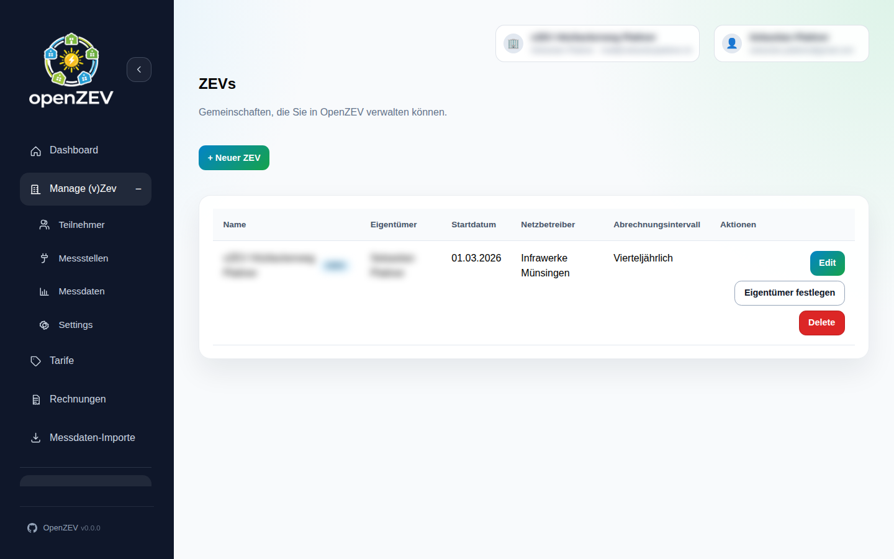
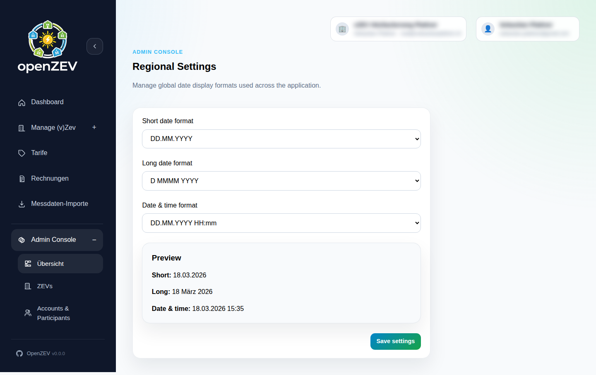
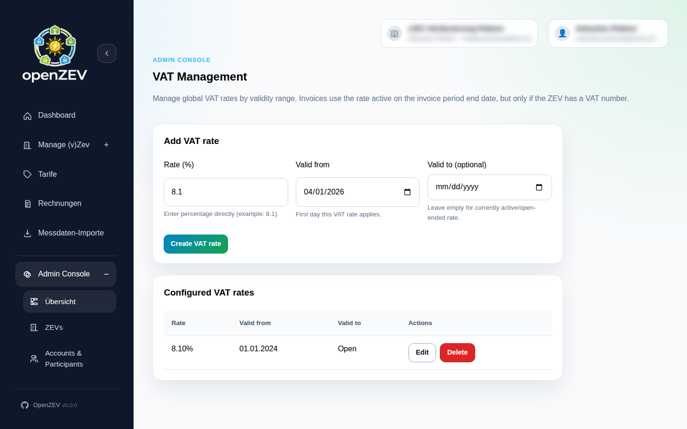
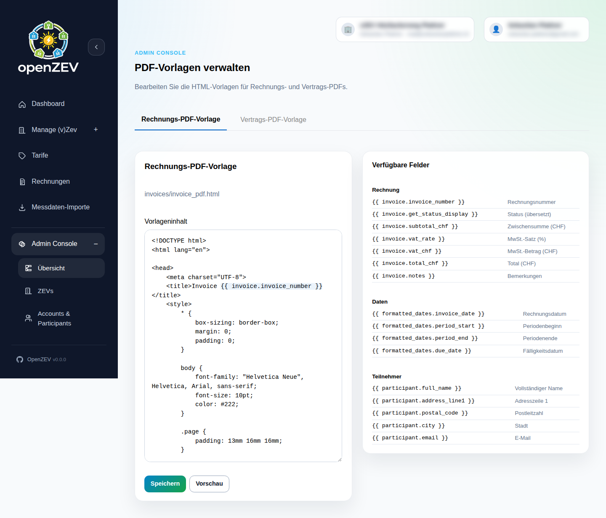
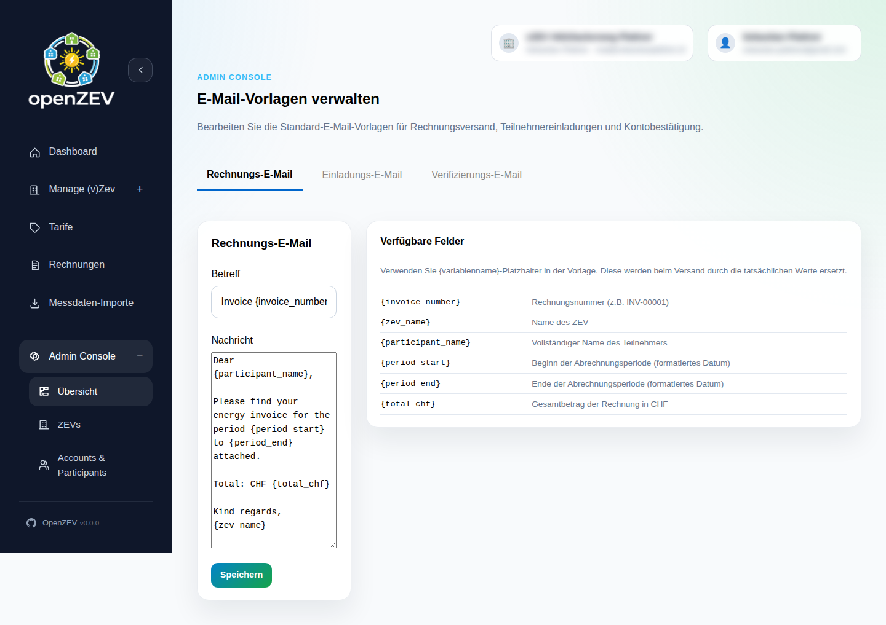

# Admin Console

This guide covers all administration features available to users with the **Admin** role. The Admin Console is accessible from the sidebar under **Admin Console**.

For general role information, see [Roles and Permissions](11-roles-and-permissions.md).

## ZEV Management

Admins can view and manage all ZEVs in the system.

1. Go to **Admin Console → ZEV Management**
2. The list shows all ZEVs with their name, type, owner, and status

### Creating a ZEV (with Owner Wizard)

Admins can create a ZEV together with a new owner account in a single step:

1. Click **Create New ZEV**
2. Fill in ZEV details (name, start date, type, billing interval, etc.)
3. Fill in the owner details (username, name, email, address)
4. Optionally add initial metering points for the owner
5. Click **Create**

The system creates the ZEV, the owner account (with a temporary password), and optionally a participant record and metering points for the owner.

Admins can also create a bare ZEV (without the wizard) via the standard CRUD interface, assigning an existing user as owner.



## Regional Settings

Configure regional defaults in **Admin Console → Regional Settings**:



- **Default Timezone** — Used for timestamp interpretation in metering imports
- **Date Format** — Display format for invoices and exports
- **Currency** — Default billing currency (currently CHF)

> **Note:** Timezone alignment is critical for accurate billing. See [Metering Data Import](05-metering-import.md) for details.

## VAT Settings

Admins configure VAT rates in **Admin Console → VAT Settings**.



VAT rates are validity-window based — you can set rates for specific time periods. The system automatically applies the correct rate based on the invoice period end date.

### How VAT Works

1. A ZEV owner enters their **VAT Number** (Swiss UID format) in [ZEV Settings](02-zev-setup.md#vat-configuration)
2. An admin configures the applicable VAT rate(s) in **Admin Console → VAT Settings**
3. When invoices are generated, the system looks up the active rate for the invoice period

If no VAT number is set on the ZEV, or no VAT rate is active for an invoice period, VAT defaults to **0%**.

## Invoice PDF Templates

Admins can manage the HTML/CSS template used for invoice PDF generation in **Admin Console → PDF Templates**.



- Edit the template used for invoice PDF rendering
- Template changes apply to **newly generated invoices only** — existing PDFs are not re-rendered

## Email Templates

Admins manage system-wide default email templates in **Admin Console → Email Templates**.

> **Note:** ZEV owners can also customize email templates for their own ZEV in **ZEV Settings → Email Templates**. See [ZEV Setup](02-zev-setup.md#email-templates) for per-ZEV customization, and [Email Configuration](10-email-configuration.md) for SMTP setup and delivery tracking.

### Overview

OpenZEV uses three email templates:

| Template | Purpose |
| --- | --- |
| **Invoice Email** | Sent to participants when invoices are delivered |
| **Invitation Email** | Sent when a participant is invited to join a ZEV |
| **Verification Email** | Sent for email address verification |

Administrators can edit the default subject and body for each template. These defaults are used unless a ZEV owner has set a custom template for their ZEV.

### Accessing Email Templates

1. Navigate to **Admin Console → Email Templates**
2. The page displays three tabs — one per template type



### Editing a Template

1. Select the tab for the template you want to edit (e.g. **Invoice Email**)
2. Edit the **Subject** and **Body** fields
3. Click **Save**

The body editor uses a monospace font to make placeholder variables easier to read and edit.

### Template Variables

Each template supports placeholder variables. Use `{variable_name}` syntax in the subject or body — they are replaced with actual values when the email is sent.

The **Available Fields** panel on the right side of the editor lists all supported variables for the currently selected template.

#### Invoice Email Variables

| Variable | Description |
| --- | --- |
| `{invoice_number}` | Invoice number (e.g. INV-00001) |
| `{zev_name}` | Name of the ZEV |
| `{participant_name}` | Full name of the participant |
| `{period_start}` | Start of the billing period (formatted date) |
| `{period_end}` | End of the billing period (formatted date) |
| `{total_chf}` | Total invoice amount in CHF |

#### Invitation Email Variables

| Variable | Description |
| --- | --- |
| `{participant_name}` | Full name of the participant |
| `{inviter_name}` | Name of the person who sent the invitation |
| `{zev_name}` | Name of the ZEV |
| `{username}` | Login username for the participant |
| `{temporary_password}` | Temporary password for first login |

#### Verification Email Variables

| Variable | Description |
| --- | --- |
| `{verify_url}` | Email verification link URL |

### Customization Indicator

When a template has been edited, a **Customized** badge appears next to the template title. This helps you see at a glance which templates have been changed from the built-in defaults.

### Resetting to Default

If a template has been customized, a **Reset to Default** button appears alongside the Save button. Clicking it restores the original built-in template for that email type.

Templates that have not been customized do not show the reset button.

## Feature Flags

Feature flags are runtime switches that allow you to enable or disable specific functionality without changing code.

Feature flags can be controlled by:

1. Code defaults (defined in backend code)
2. Environment variable overrides
3. Admin Console toggles

The backend and frontend both read the same feature flag state.

### Current Feature Flags

| Flag name | Default | Purpose |
| --- | --- | --- |
| `zev_self_registration_enabled` | `true` | Allows self-registration from the login page |

### How State Is Resolved

For each flag, OpenZEV resolves the final state in this order:

1. Environment variable `FEATURE_<FLAG_NAME_IN_UPPERCASE>`
2. Value stored in database (set via Admin Console)
3. Code default
4. `false` fallback

For `zev_self_registration_enabled`, the environment variable key is:

```dotenv
FEATURE_ZEV_SELF_REGISTRATION_ENABLED=true
```

### Admin Console Usage

Manage flags in **Admin Console → Features**.

Each flag has:

- Name
- Description
- Toggle switch (On/Off)

When you toggle a flag, OpenZEV applies the new value immediately.

### Environment Variable Override

Use environment variables when you want an ops-level override that should win over UI settings.

Example:

```dotenv
FEATURE_ZEV_SELF_REGISTRATION_ENABLED=false
```

After changing environment variables, restart the backend service (and frontend if needed):

```bash
docker compose restart backend frontend
```

### Example: Disable ZEV Self Registration

If `zev_self_registration_enabled` is disabled:

- The login page hides the "New to OpenZEV" panel
- The registration button/modal is not shown
- `POST /api/v1/auth/register/` is blocked by the backend (HTTP 403)

This ensures the feature is disabled in both UI and API layers.

### API Access

#### Read feature flags

- `GET /api/v1/auth/feature-flags/`
- Public read access (used by login page)

#### Update a feature flag

- `PATCH /api/v1/auth/feature-flags/<id>/`
- Admin only

Payload example:

```json
{
  "enabled": false
}
```

### Developer Usage

Feature flags are registered in backend code and synchronized to the database.

Add a new flag in `backend/accounts/models.py`:

```python
FeatureFlag.register(
    "my_new_feature",
    default=False,
    description="Explain what this feature controls.",
)
```

Check a flag in backend code:

```python
if FeatureFlag.is_enabled("my_new_feature"):
    # feature-on path
    ...
```

Frontend code can read current states via `GET /api/v1/auth/feature-flags/`.
