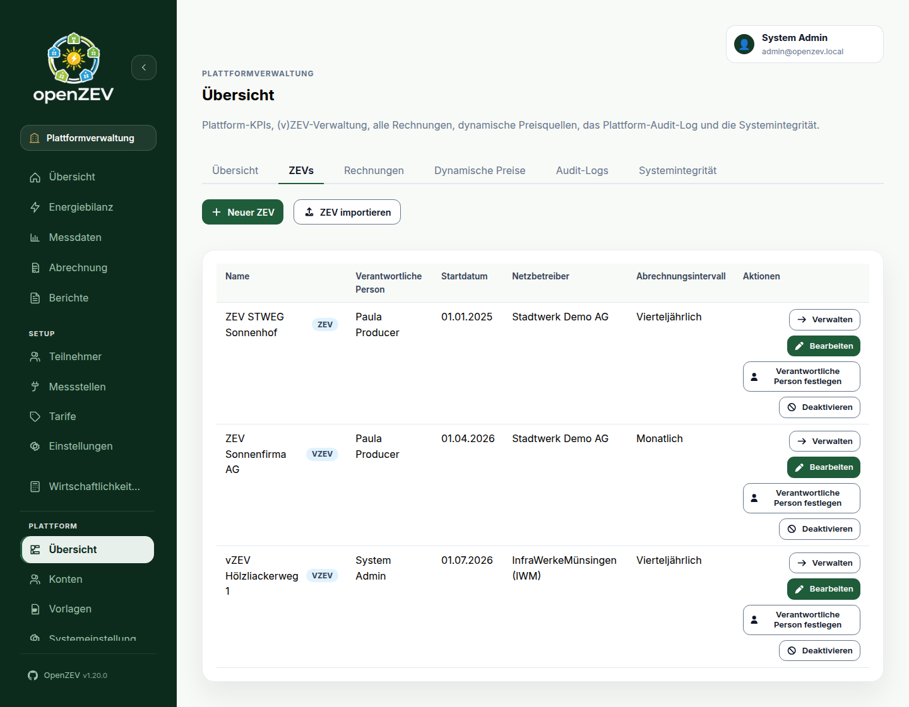
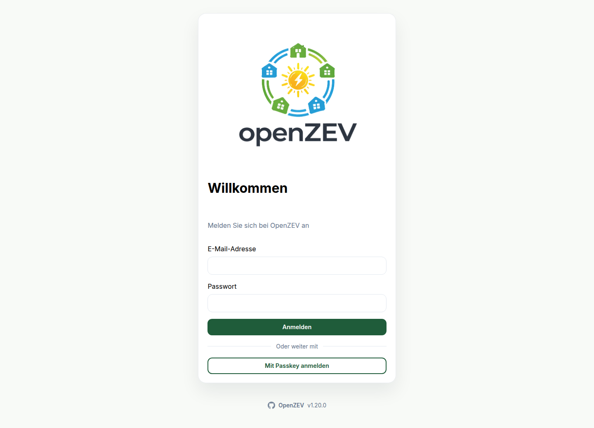
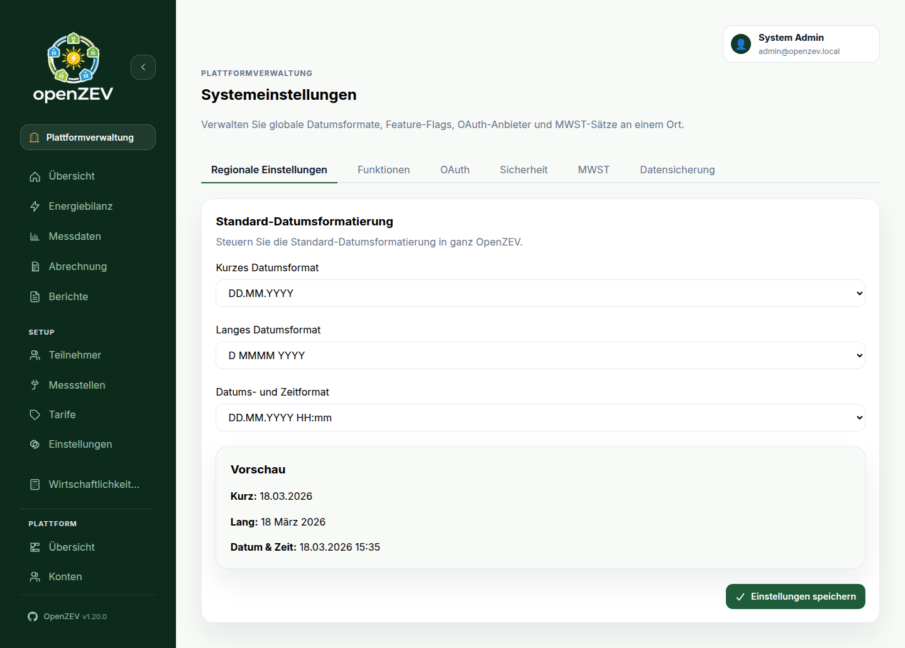
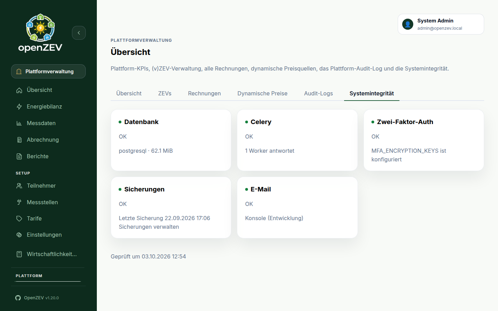
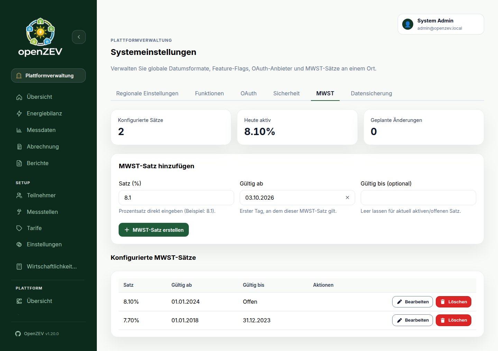
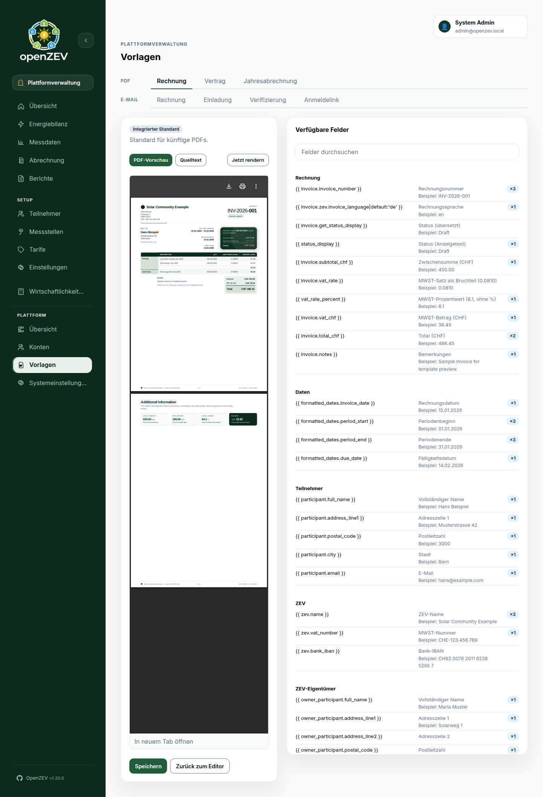
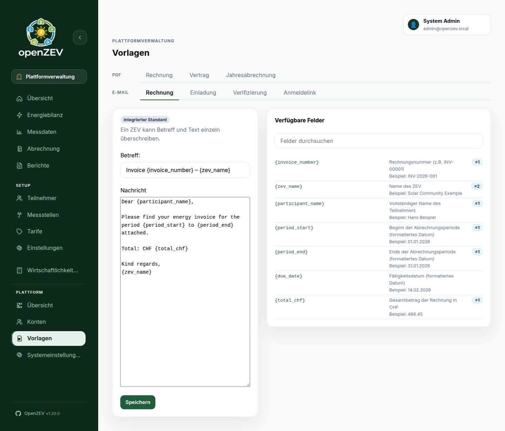
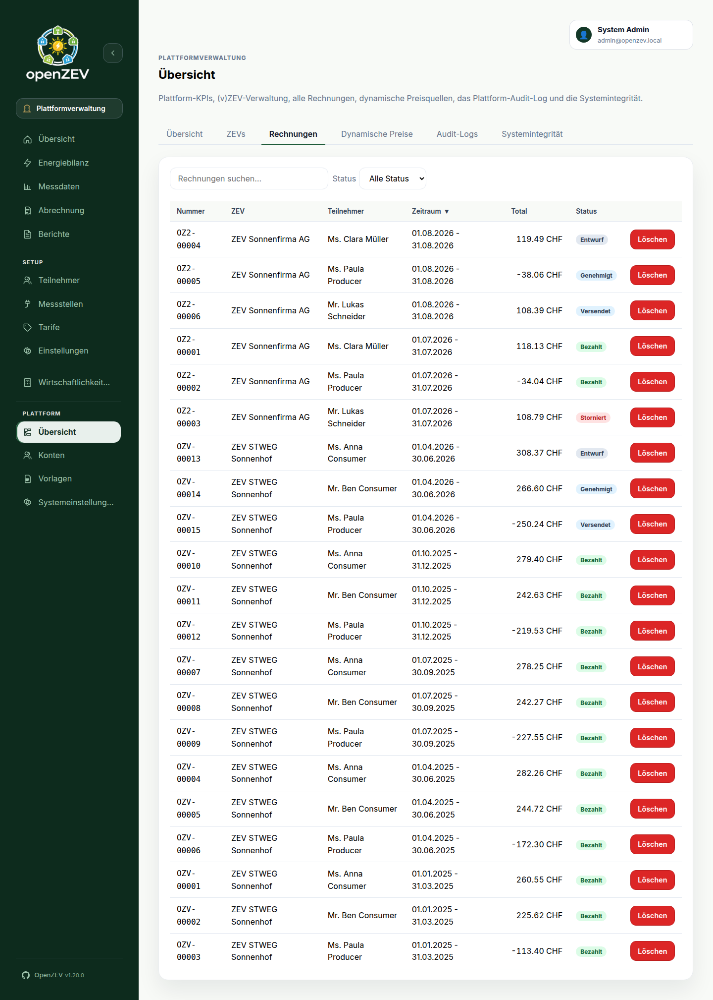

# Platform Administration

> This guide retains its historical filename (`14-admin-console.md`) and old
> anchor links; the product term is now **Platform**.

This guide covers all administration features available to users with the **Admin** role. The platform tooling lives in the sidebar under **Platform** (routes `/admin/*`). While there, every page shows **Platform administration** above its title and no community is displayed or chosen — re-enter a community via **Overview → ZEVs → Manage** (your previously selected community is preserved).

The Platform group has four entries (hubs with tabs-as-routes):

- **Overview** (`/admin`) — KPIs · ZEVs · All invoices · Dynamic price sources · Platform audit log · System health
- **Accounts** (`/admin/accounts`) — Users · API keys
- **Templates** (`/admin/templates`) — PDF templates · Email templates
- **Settings** (`/admin/system-settings`) — Regional Settings · Functions · OAuth · Security · VAT · Backup

The existing `/admin/zevs` and `/admin/invoices` addresses open their matching
Overview tabs. Legacy routes (`/admin/audit-logs`, `/admin/api-keys`,
`/admin/pdf-templates`, `/admin/email-templates`) redirect to the matching hub tab.

For general role information, see [Roles and Permissions](11-roles-and-permissions.md).

Each Overview tab describes its platform-wide scope. The invoice-status
summary links to **All invoices**, and email statistics links to **System
health**. Your selected community is preserved when you open these views.

## ZEV Management

Admins can view and manage all ZEVs in the system.

1. Go to **Platform → Overview → ZEVs**
2. The list shows all ZEVs with their name, type, responsible person, and status. A
   **Missing or invalid IBAN** badge marks ZEVs with no valid IBAN configured — billing
   cannot issue payable QR invoices for them yet. The badge reports IBAN status only,
   not overall setup or period readiness.
3. Click **Manage** on a row to enter that ZEV's working scope (selects the ZEV and opens its dashboard)

### Creating a ZEV (with Responsible Person Wizard)

Admins can create a ZEV together with a new responsible-person account in one wizard:

1. Click **New ZEV**
2. **Step 1** — fill in ZEV details (name, start date, type, billing interval, etc.).
3. **Step 2** — fill in the responsible person details (name, address, email).
   The payment section belongs with this person because the participant record
   supplies the creditor name and address on QR-Rechnungen. Enter the optional
   **Bank Name** and **Bank IBAN** for the account receiving participant payments.
   Skipping the IBAN leaves the **Missing or invalid IBAN** list
   badge and the Overview QR warning until the fields are filled under
   ZEV Settings → Billing & payment
4. **Step 3** — optionally add initial metering points for the responsible person
5. **Step 4** — review, then click **Create ZEV**

The system creates the ZEV, the responsible-person account — the ZEV's manager —
with a temporary password, its participant record (the issuer of the ZEV's
invoices and contracts), and the listed metering points. The temporary password is shown once at the end — pass it on
to the responsible person, who sets their own password at first sign-in.

Admins can also create a bare ZEV (without the wizard) through the API. Nobody
manages it until an admin grants access in **ZEV Settings → People & access**.

The ZEV list shows each community's **issuer** — whom its invoices and contracts
are from.



## Dynamic Price Sources

**Platform → Overview → Dynamic prices** (`/admin/dynamic-sources`) is the
operational console for dynamic tariff sources — the fetched, quarter-hourly
price series described in [Tariff Configuration](07-tariff-configuration.md#dynamic-tariffs).
A source is **global**: it is not owned by any one ZEV, and any number of
communities on the same operator product share one fetch, so this console is
the only place to see and manage all of them at once.

KPIs at the top show how many sources are configured, how many price points
are stored across all of them, how many sources are reused by more than one
ZEV, and how many currently have a failed fetch. The table lists every
source with its protocol version, billed component/product, current fetch
status, last fetch time, stored point count, and how many tariffs/ZEVs
reuse it.

From a tariff's details, **Manage source in platform admin**
opens this tab filtered to that source. **Show all sources** returns to the
complete list. The filter survives reload. A missing source has an explanation
and the same control to return to all sources. Usage counts are platform-wide,
not counts for the selected community.

The **View fetch log** dialog links to **View source activity**,
which opens the platform Audit tab with the source's Target type and
Target ID filled in. Those filters survive reload; **Clear filters** removes
them while keeping other bookmark context.
If activity cannot load, use **Retry**. A failed refresh keeps the last loaded
events visible with a warning.

Each row's menu offers:

- **View prices** — the fetched interval history: a date-range chart,
  interval table, min/max/average statistics, negative-price count, and any
  coverage gaps.
- **View fetch log** — audit events for this source only (fetch outcomes,
  edits, and destructive actions).
- **Fetch now** / **Fetch available history** — queue an immediate refresh,
  or a backfill of everything the endpoint still has. Backfill is disabled
  when the endpoint does not support ranged history requests.
- **Re-check capabilities** — re-probes the endpoint to correct how OpenZEV
  talks to it (in particular, whether it supports ranged/history requests)
  without changing the source's URL, protocol version, or billed component.
  Useful if backfill looked unsupported at creation but the endpoint was
  simply empty at that moment.
- **Edit** — change the source's display label. The endpoint, protocol
  version, and billed component/product cannot be changed in place; create a
  new source instead so two price series are never mixed under one label.
- **Clear fetched prices** — deletes the stored prices but keeps the source,
  which refills on the next scheduled fetch. Use this to recover from a
  wrong endpoint or product configuration.
- **Delete source** — removes the source entirely. Disabled, and labeled
  accordingly, while any tariff still uses it.

Both destructive actions ask you to type the source's own display label back
before confirming — no separate reason field, since the label has to be read
off the row you are about to affect, which is what actually prevents picking
the wrong one. Both are refused while a fetch for that source is already
running, and clearing is refused while a non-cancelled invoice was billed
from a tariff linked to that source — the fetched prices are that invoice's
supporting evidence and OpenZEV does not let you remove it out from under
one.



<span id="system-settings"></span>

## Settings

Regional display settings, feature flags, OAuth providers, and VAT rates are consolidated
under **Platform → Settings**.

Backups are configured in **Platform → Settings → Backup**; see [Backups](18-backups.md).

### Regional

Configure regional display settings in **Platform → Settings → Regional**:



- **Short Date Format** — Compact date display (e.g. `DD.MM.YYYY`)
- **Long Date Format** — Expanded date display (e.g. `D MMMM YYYY`)
- **Date/Time Format** — Combined date and time display

> **Note:** The legacy route `/admin/settings/regional` redirects here.

### Functions

Feature flags are managed in **Platform → Settings → Functions**.
See [Feature Flags](#feature-flags) below.

### OAuth

Configure external OAuth login providers in **Platform → Settings → OAuth**:

- **Name** — Provider identifier (e.g. `github`)
- **Display Name** — Human-readable label shown on the login page
- **Client ID / Client Secret** — Credentials obtained from the provider. The
  secret is never shown again after saving: enter it when creating the
  provider, and leave the field blank when editing to keep the existing secret.
- **Authorization / Token / Userinfo URLs** — Provider endpoint URLs
- **Redirect URL** — The callback URL registered with the provider (e.g.
  `https://app.example.com/api/v1/auth/oauth/callback/github/`)
- **Scope** — Space-separated OIDC scopes (default `openid email profile`)
- **Enabled** — Toggle to activate or deactivate the provider

New accounts and email-based account matching require the provider to return
`email_verified: true` by default. **Allow missing email-verification
claim** permits new accounts when a trusted provider verifies email ownership
but omits the claim. Leave it off unless that guarantee has been verified.
An explicit false claim is always refused, and the option never enables
email-based matching to an existing account. Users can instead register or
sign in through email first and link the provider from their account page.
Token and userinfo endpoints require HTTPS in production and public addresses
(operators of an in-cluster identity provider can set `OAUTH_ALLOW_PRIVATE_HOSTS=true`);
configure their final URLs because redirects are refused. The address check
happens when the request is made and cannot rule out DNS rebinding, so restrict
outbound traffic at the network level as well.

**When upgrading:** these rules can stop new provisioning through providers
that omit the verification claim, and stop login through private, HTTP, or
redirecting endpoints. Already-linked identities bypass the provisioning claim
check, but still need reachable, allowed endpoints. Review the provider's final
HTTPS URLs and the trust option before upgrading, and verify that an admin has
a working alternative login. Compose deployments pass
`OAUTH_ALLOW_PRIVATE_HOSTS=True` through `backend/.env`; Helm deployments use
`backend.extraEnv.OAUTH_ALLOW_PRIVATE_HOSTS: "True"`. The private-host option
applies to every provider and does not permit production HTTP.

The address check uses the application's DNS; an environment-configured proxy
can resolve the destination again. Use a trusted proxy and restrict outbound
traffic rather than relying on the address check alone.

> **Note:** The legacy routes `/admin/features`, `/admin/oauth`, and `/admin/settings/vat` redirect to
> the matching tab on the Settings page.

### Security

Choose whether every account must use two-factor authentication, and the grace
period they get, in **Platform → Settings → Security**. See
[Roles and Permissions → Requiring it for everyone](11-roles-and-permissions.md#requiring-it-for-everyone-administrators).

If the policy cannot be loaded initially, the controls stay disabled. Choose **Retry** in the error notice to load it again without reloading the page.

### VAT

Configure VAT rates in **Platform → Settings → VAT**. See [VAT Settings](#vat-settings) for validity-window behavior and the workflow.

## Audit Logs

The audit log is the cross-cutting, append-only event stream of privileged,
billing-relevant, and destructive actions.

- **Platform → Overview → Audit log** (`/admin/audit`) — admins can view **all**
  events across the platform.
- **Setup → Settings → Audit log** (`/zev-settings/audit`) — admins, managers
  and viewers see the events of the currently selected community.
  Managers and viewers only see events for communities they can access;
  they cannot see global or other-community events.
  There is no community selector here (it follows the community chosen above the page title) and no
  text search; the filters are date range, actor, category, action type,
  target type, target ID, and status. (The legacy route `/audit-logs` redirects here.)

**Platform → Overview → Audit log** supports the full filter set: date range,
community (ZEV) selector, actor, category, action type, target type, target ID,
status, and text
search. Text search is available only to admin users. Events are
read-only — there is no public write endpoint.
Action type, target type and target ID apply when you press **Enter** or leave
the field. Open an event by clicking its summary or focusing it and pressing
**Enter** or **Space**.

The quickest way in is from the account itself: **View activity** on a row
under **Platform → Accounts → Users** opens the audit log already filtered to
what that account has done.

For email-change delivery failures, filter action type `auth.email_change.failed`
and status **Failed**; the event metadata identifies `mail_failed`. Operators
should monitor these events and the registration issuance/send/cleanup error
logs, since public confirmation responses deliberately do not report mail failure.
Alert on registration cache-unavailable `503` responses as well.

The API is `GET /api/v1/audit/events/` (list) and
`GET /api/v1/audit/events/{id}/` (detail). See the access spec
[2026-05-audit-log-and-operational-traceability.md](../specs/2026-05-audit-log-and-operational-traceability.md)
for the data model and redaction rules.

### How long IP addresses are kept

Each event records the IP address and browser (user agent) of the request that
caused it. Those two details are personal data and are not needed once an
incident can no longer be investigated, so a daily job blanks them after 365
days. The event itself — who did what, to which record, and when — is kept.
The same job blanks the recipient address of invoice email attempts after 730
days (the delivery status stays) and deletes used, revoked or expired sign-in,
verification and onboarding links 30 days after they stopped working.

An operator sets the windows with environment variables; `0` switches a step
off:

| Setting | Purpose |
|---|---|
| `PRIVACY_AUDIT_NETWORK_RETENTION_DAYS` | Days before an audit event's IP address and user agent are blanked. Default 365. |
| `PRIVACY_EMAIL_LOG_RETENTION_DAYS` | Days before an invoice email attempt's recipient and error text are blanked. Default 730. |
| `PRIVACY_TOKEN_GRACE_DAYS` | Days after a one-time link stopped working before it is deleted. Default 30. |

To see what the windows would remove before the daily job does it, or to run
it where no scheduler is running, use `manage.py openzev_privacy_sweep
--dry-run` and `manage.py openzev_privacy_sweep`. Blanking cannot be undone.
A failed invoice email whose recipient has been blanked cannot be retried;
send the invoice again instead.

## System Health

**Platform → Overview → System health** (`/admin/health`) shows a read-only
snapshot of platform infrastructure:

- **Database** — engine (PostgreSQL/SQLite) and size; `degraded` if the probe
  fails
- **Celery** — number of workers responding to a ping and the Redis queue
  depth; `unknown` means no broker is reachable (local development without
  Redis reports unknown, which is a valid state, not an outage)
- **Email** — the configured backend mode (SMTP, console, in-memory, custom)

The snapshot is taken when the tab is opened (no auto-refresh). Probes are
best-effort — a failing probe never breaks the page.



## API Keys

Automated integrations (imports, monitoring scripts) authenticate with per-user
API keys.

- **Account Profile → API Keys** — a user manages their own keys (create with a
  name and expiry, and revoke). See [API Keys](16-api-keys.md).
- **Platform → Accounts → API keys** (`/admin/accounts/api-keys`) — admins can
  view all keys across users and **revoke** any of them. This view is
  revoke-only; keys are created by their owner. (The legacy route
  `/admin/api-keys` redirects here.)

> **Security:** API keys grant the same access as the owning account. Treat them
> like passwords, and revoke unused or exposed keys promptly.

## VAT Settings

Admins configure VAT rates in **Platform → Settings → VAT**.



The rate, **Valid from**, and optional **Valid to** fields appear together with
guidance beneath each field. Select either date field to open its calendar;
leave **Valid to** empty for an open-ended rate. On narrow screens the form wraps
the fields onto separate rows.

VAT rates are validity-window based — you can set rates for specific time periods. The system automatically applies the correct rate based on the invoice period end date.

### How VAT Works

1. A manager chooses the ZEV's **VAT treatment** in [ZEV Settings](02-zev-setup.md#vat-configuration)
   (*VAT-registered* also needs the **VAT Number**)
2. An admin configures the applicable VAT rate(s) in **Platform → Settings → VAT**
3. When invoices are generated, the system looks up the rate active on the invoice period's end date

A ZEV that is *Not VAT-registered* is billed without VAT. If no VAT rate is
active for an invoice period, VAT defaults to **0%** in every mode.

## Invoice PDF Templates

Admins can manage the HTML/CSS template used for invoice PDF generation in **Platform → Templates → PDF templates** (`/admin/templates/pdf`).



- Edit the template used for invoice PDF rendering (tabs for the invoice, participant contract, and annual statement templates)
- The **Available Fields** panel lists supported fields with preview examples. In source view, search by token or description and click a token to insert it at the caret. Shift-click keeps the caret in its original position. Loop tags insert a ready-to-fill block.
- **Preview** shows a real, sample-data PDF rendered through the same pipeline as issued documents; a source toggle reveals the raw template markup
- **Built-in default** means no platform override is saved; **Customized** means an override is saved. **Unsaved changes** describes edits in the current editor separately.
- **Reset to built-in default** appears for a saved override. Confirming removes it immediately and replaces current edits with the current shipped template. Canceling keeps the editor as it is.
- Template changes affect future PDF renders. Existing stored PDFs remain
  unchanged until **regenerated** — individual invoices can be regenerated, and
  administrators can regenerate PDFs for an entire billing period.

The default invoice PDF includes the recipient's optional second address line.
For custom templates, insert this after the first address line, or reset the
template to the default:

```html
{{ participant.address_line2 }}<br>
```

## Email Templates

Admins manage system-wide default email templates in **Platform → Templates → Email templates** (`/admin/templates/email`).

> **Note:** Managers can also customize email templates for their own ZEV in **ZEV Settings → Documents & emails**. See [ZEV Setup](02-zev-setup.md#email-templates) for per-ZEV customization, and [Email Configuration](10-email-configuration.md) for SMTP setup and delivery tracking.

### Overview

OpenZEV uses six email templates:

| Template | Purpose |
| --- | --- |
| **Invoice Email** | Sent to participants when invoices are delivered |
| **Onboarding Email** | Sent when a manager chooses **Send onboarding link** on a participant, with a reusable onboarding link |
| **Verification Email** | Sent for email address verification |
| **Sign-in Link Email** | Sent when a participant asks for a sign-in link from the QR code on their invoice (see [Participant Access from the Invoice](02-zev-setup.md#participant-access-from-the-invoice)) |
| **ZEV Access Invitation Email** | Sent when someone is given access to a community (as manager or viewer) and has no account yet; its link, valid for 7 days, activates the account and asks for a password |
| **ZEV Access Notice Email** | Sent when an existing account is given access to a community |

The sign-in link and the two access emails are sent in each community's invoice
language until you save your own text, which then replaces all four languages.

The **Sign-in Link Email** is the one template whose recipient never sees a copy
of anything else you send — it exists only to carry `{link_url}`. If your edit
uses a placeholder that does not exist, OpenZEV sends the shipped default
instead, so the link always works even when the wording is not yours.

Administrators can edit the default subject and body for each template. Managers can override the invoice-email subject and body independently for their community.

### Accessing Email Templates

1. Navigate to **Platform → Templates → Email templates**
2. The page displays six tabs — one per template type



### Editing a Template

1. Select the tab for the template you want to edit (e.g. **Invoice Email**)
2. Edit the **Subject** and **Body** fields
3. Click **Save**

The body editor uses a monospace font to make placeholder variables easier to read and edit.

### Template Variables

Each template supports placeholder variables. Use `{variable_name}` syntax in the subject or body — they are replaced with actual values when the email is sent.

The **Available Fields** panel lists the supported variables for the selected template, with translated descriptions, sample values, and a usage count. The panel is keyboard-focusable and scrollable. Use the search box to filter by token or description. Click a token to insert it at the editor caret; Shift-click keeps the caret in its original position.

#### Invoice Email Variables

See [Email Configuration → Email Templates](10-email-configuration.md#email-templates) for the invoice email placeholders.

#### Onboarding Email Variables

| Variable | Description |
| --- | --- |
| `{participant_name}` | Full name of the participant |
| `{inviter_name}` | Name of the person who added the participant |
| `{zev_name}` | Name of the ZEV |
| `{link_url}` | Reusable onboarding link |
| `{expiry_date}` | Formatted onboarding-link expiry date |

#### Verification Email Variables

| Variable | Description |
| --- | --- |
| `{verify_url}` | Email verification link URL |

#### Sign-in Link Email Variables

| Variable | Description |
| --- | --- |
| `{participant_name}` | Full name of the participant |
| `{zev_name}` | Name of the ZEV |
| `{link_url}` | One-time sign-in link |
| `{valid_minutes}` | Sign-in-link lifetime in minutes |

If saving fails, the editor keeps your changes and shows the server’s validation
message when available, so you can correct the template and retry.

### Customization Indicator

Each editor shows **Built-in default** when no platform override is saved or **Customized** when one is saved. **Unsaved changes** marks local edits; typing alone does not change the saved source.

### Resetting to Default

If a template has a saved override, **Reset to built-in default** appears alongside Save. A confirmation names the selected template. Confirming removes that platform override immediately, discards current edits, and loads the current built-in text. It does not clear a ZEV's own invoice-email overrides or change messages already sent.

Templates that have not been customized do not show the reset button.

## Invoice Management

Admins can view and manage all invoices across all ZEVs in **Platform → Overview → Invoices** (`/admin/invoices`).



### Overview

The admin invoice page provides a searchable, sortable table of **every invoice in the system**, regardless of which ZEV it belongs to.

| Column | Description |
|---|---|
| **Number** | Linked invoice number (e.g. `INV-00001`); details return to the platform invoice tab |
| **ZEV** | The ZEV the invoice belongs to |
| **Participant** | Participant name |
| **Period** | Billing period date range |
| **Total** | Invoice total in CHF |
| **Status** | Badge showing `Draft`, `Approved`, `Sent`, `Paid`, or `Cancelled` |
| **Actions** | Delete button |

### Searching and Filtering

- Use the **quick filter** search bar in the toolbar to search across all columns.
- Click on a column header to **sort** by that column.
- Use column-level filters for more targeted searching (e.g., filter by status using the dropdown).

### Deleting Invoices

Admins can delete any invoice directly from this page:

1. Click the **Delete** button in the Actions column.
2. Confirm the deletion in the confirmation dialog.

> **Warning:** Deleting an invoice is permanent and cannot be undone. The invoice and its associated PDF are removed.

## Feature Flags

Feature flags are runtime switches that allow you to enable or disable specific functionality without changing code.

Feature flags can be controlled by:

1. Code defaults (defined in backend code)
2. Environment variable overrides
3. Platform toggles (Settings → Functions)

The backend and frontend both read the same feature flag state.

### Current Feature Flags

| Flag name | Default | Purpose |
| --- | --- | --- |
| `zev_self_registration_enabled` | `true` | Allows self-registration (setting up one's own ZEV) from the login page |
| `feasibility_calculator_enabled` | `false` | Shows the [feasibility calculator](13-feasibility-calculator.md) to admins and managers |
| `participant_geocoding_enabled` | `false` | Looks up building outlines on OpenStreetMap for the [participants map](03-participant-management.md#map); sends building addresses to the public Nominatim service |
| `supplementary_energy_data_enabled` | `false` | Lets participants with a PV system behind their meter connect their [own energy data](20-energy-data.md) (Solar Manager, push or file) for statistics, never for billing; Solar Manager sources call the vendor's cloud and need `INTEGRATION_ENCRYPTION_KEYS` |
| `mcp_server_enabled` | `false` | Lets AI assistants read OpenZEV data through the [MCP endpoint](19-ai-assistants.md) using a user's API key; answers are sent to the assistant's LLM provider |

### How State Is Resolved

For each flag, OpenZEV resolves the final state in this order:

1. Environment variable `FEATURE_<FLAG_NAME_IN_UPPERCASE>`
2. Value stored in database (set via Platform → Settings → Functions)
3. Code default
4. `false` fallback

For `zev_self_registration_enabled`, the environment variable key is:

```dotenv
FEATURE_ZEV_SELF_REGISTRATION_ENABLED=true
```

### Managing flags via the UI

Manage flags in **Platform → Settings → Functions**.

Each flag has:

- Name
- Description
- Toggle switch (On/Off)

When you toggle a flag, OpenZEV applies the new value immediately.

### Environment Variable Override

Use environment variables when you want an ops-level override that should win over UI settings.

Example:

```dotenv
FEATURE_ZEV_SELF_REGISTRATION_ENABLED=false
```

After changing environment variables, restart the backend service (and frontend if needed):

```bash
docker compose restart backend frontend
```

### Example: Disable ZEV Self Registration

If `zev_self_registration_enabled` is disabled:

- The login page hides the "New to OpenZEV" panel
- The registration button/modal is not shown
- `POST /api/v1/auth/register/` is blocked by the backend (HTTP 403)

This ensures the feature is disabled in both UI and API layers.

### API Access

#### Read feature flags

- `GET /api/v1/auth/feature-flags/`
- Admin only (returns the full flag list; used by the Platform system settings)

#### Read self-registration status (public)

- `GET /api/v1/auth/registration-enabled/`
- Public, returns only `{"enabled": bool}` (used by the login page; does not
  enumerate the flag table)

#### Update a feature flag

- `PATCH /api/v1/auth/feature-flags/<id>/`
- Admin only

Payload example:

```json
{
  "enabled": false
}
```

### Developer Usage

Feature flags are registered in backend code and synchronized to the database.

Add a new flag in `backend/accounts/models.py`:

```python
FeatureFlag.register(
    "my_new_feature",
    default=False,
    description="Explain what this feature controls.",
)
```

Check a flag in backend code:

```python
if FeatureFlag.is_enabled("my_new_feature"):
    # feature-on path
    ...
```

Frontend admin pages read the full list via `GET /api/v1/auth/feature-flags/`
(admin only). Public, unauthenticated code (e.g. the login page) must use the
minimal `GET /api/v1/auth/registration-enabled/` endpoint instead.
